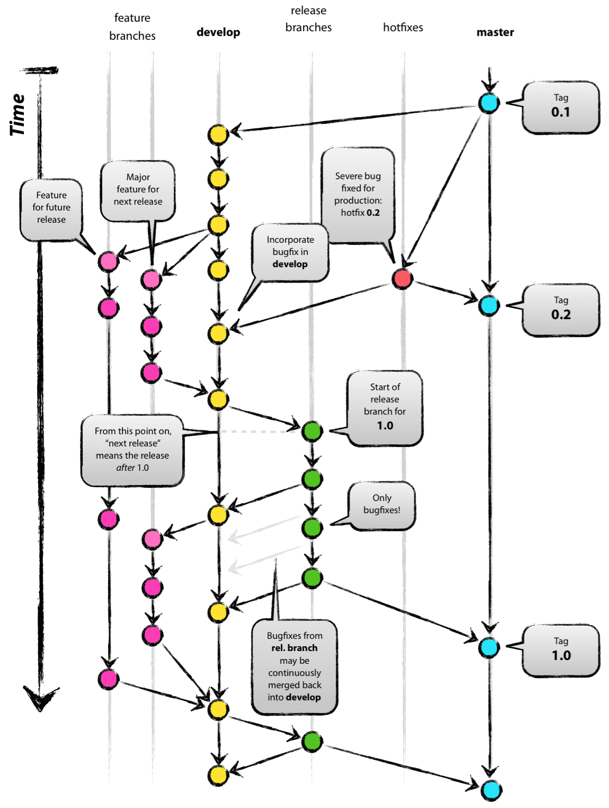

.. _github_workflow:

在 GitHub 上使用 OpenFAST
===============================
OpenFAST 的大部分协作和开发都发生
在 `GitHub 仓库 <http://github.com/openfast/openfast>`__ 上。在那里，
`Issues <http://github.com/openfast/openfast/issues>`__ 和
`Pull Requests <http://github.com/openfast/openfast/pulls>`__
被讨论，新版本被发布。这是
与 NLR OpenFAST 团队以及整个 OpenFAST 社区的其他开发者
互动的最佳机制。

Issues 和工作分配
--------------------------
Issues 应以适当的文档和数据来充分描述
问题或功能缺口。在此应就新开发的进行中的工作进行沟通和协调，
开发者应明确完成某项任务的意图。

.. _pull_requests:

Pull Requests
-------------
当代码修改准备好审查时，应提交
Pull Request 以及所有适当的文档和测试。NLR OpenFAST
团队成员将指定审查者并与开发者合作将
代码合并到主仓库中。

新的 Pull Request 应包含以下内容：

- 修改需求的描述

  - 如果 Pull Request 修复了 bug，
    应引用相应的 GitHub Issue

- 所实施工作的摘要
- 回归测试结果

  - 如果所有测试均通过，应提供摘要输出
  - 如果任何测试失败，应包括失败
    用例的解释以及如图表等支持数据

- 更新的单元测试（如适用）
- 更新的文档，涵盖相应的章节，准备好编译并
  部署到 `readthedocs <http://openfast.readthedocs.io>`__。

Git 工作流程及与主仓库的交互
-----------------------------------------------------
OpenFAST 开发在与 GitHub 仓库交互时应遵循 "Git Flow"。
Git Flow 是一个定义明确且被广泛采用的 Git 使用工作流程，
概述了向共享仓库推送和拉取提交的安全方法。
维护 Git Flow 对于防止远程更改
阻塞本地开发至关重要。此工作流程在
`此处 <http://nvie.com/posts/a-successful-git-branching-model>`__ 有详细描述，
下图提供了高层次的视角。

参考：http://nvie.com/posts/a-successful-git-branching-model

OpenFAST 特定的 Git Flow
--------------------------
重要的是要考虑您当前的工作将如何受到其他
开发者提交的影响，以及您的提交将如何影响其他开发者。
在公共分支上，避免使用
`git rebase <https://git-scm.com/book/en/v2/Git-Branching-Rebasing>`__
并永远不要 `force push <https://git-scm.com/docs/git-push#git-push---force>`__。

在 OpenFAST 开发中，典型的工作流程遵循以下步骤：

1. 在 GitHub 上 Fork OpenFAST 仓库

2. 克隆您的新 Fork

.. code-block:: bash

    git clone https://github.com/<youruser>/OpenFAST

3. 将 OpenFAST/OpenFAST 添加为名为 ``upstream`` 的远程仓库

.. code-block:: bash

    # 添加远程仓库
    git remote add upstream https://github.com/OpenFAST/OpenFAST

    # 下载远程仓库中的所有信息，但不更改
    # 本地源代码
    git fetch --all

4. 从 OpenFAST ``dev`` 分支创建用于活跃开发的功能分支
   并切换到该分支

.. code-block:: bash

    git branch feature/a_great_feature upstream/dev
    git checkout feature/a_great_feature

5. 在 ``feature/a_great_feature`` 上添加新开发内容

.. code-block:: bash

    git add a_file.f90
    git commit -m "A message"
    git push origin feature/a_great_feature

6. 使用 ``upstream`` 更新您的功能分支

.. code-block:: bash

    git pull upstream dev
    git push origin feature/a_great_feature

7. 发起新的 `Pull Request <https://github.com/OpenFAST/openfast/compare>`__
   将 ``<youruser>/OpenFAST/feature/a_great_feature`` 合并到
   ``OpenFAST/OpenFAST/dev``
