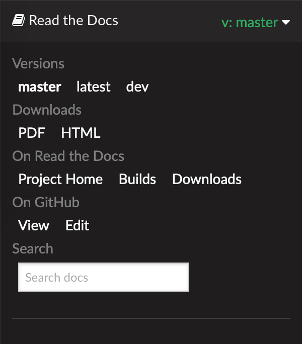

.. _this_doc:

本文档
==================

OpenFAST 文档托管于
`readthedocs <http://readthedocs.org/>`_，
每当有新的提交时，会自动从
`main <http://github.com/openfast/openfast/tree/main/>`_ 和
`dev <http://github.com/openfast/openfast/tree/dev/>`_ 分支生成。
点击页面左下角的横条会显示一个面板（见下图），其中包含选择仓库分支、
以下载其他格式（PDF、HTML、EPub）的文档以及链接到其他相关网站的选项。

虽然 OpenFAST 开发者文档正在此处不断完善，但也鼓励开发者查阅旧版 FAST v8
:download:`NWTC 程序员手册 <../OtherSupporting/NWTC_Programmers_Handbook.pdf>`。
有关获取和安装 OpenFAST 的说明，请参见
:ref:`installation`；有关使用自动化测试验证安装的文档，请参见 :ref:`testing`。

本文档的主体分为两部分：

:ref:`user_guide`

   面向最终用户，本部分提供有关 OpenFAST 及其底层模块使用的详细文档，
   以及理论和验证文档。

:ref:`dev_guide`

   开发者指南面向希望扩展 OpenFAST 功能的用户。此处可找到有关代码结构、
   各类支持的 API 以及使用 Doxygen 提取的源代码文档链接的详细信息。
