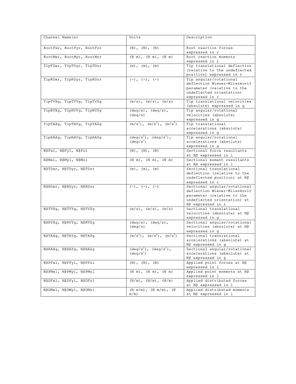

.. _bd_appendix:

附录
====

.. _bd_input_files:

BeamDyn 输入文件
-----------------

在本附录中，我们描述 BeamDyn 输入文件的结构，并提供 NREL 5MW 参考风力机的示例。

OpenFAST+BeamDyn 和独立 BeamDyn（静态和动态）仿真都需要两个文件：

1) BeamDyn 主输入文件 :download:`(NREL 5MW 静态示例) <examples/bd_primary_nrel_5mw.inp>`：该文件包含数值求解参数的信息（例如数值阻尼、求积规则），以及通过"构件"和"关键点"定义的梁参考线几何信息。该文件还指定了"叶片输入文件"。

2) BeamDyn 叶片输入文件 :download:`(NREL 5MW 示例) <examples/nrel_5mw_blade.inp>`：该文件指定沿叶片不同截面处的叶片截面特性。文件包括每个截面处的刚度和质量矩阵，以及阻尼参数。请注意，示例文件使用刚度比例阻尼（damp_flag = 1）。对于模态阻尼（damp_flag = 2），n_modes 参数应设置为非零值，后跟相应的模态阻尼比（zeta 值），表示为临界阻尼的分数。

独立 BeamDyn 仿真还需要一个驱动输入文件；我们在此列出静态和动态仿真的示例：

3a) 用于动态仿真的 BeamDyn 驱动文件 :download:`(NREL 5MW 示例) <examples/bd_driver_dynamic_nrel_5mw.inp>`：该文件指定单个叶片的输入（例如力、方向、根部速度），并指定 BeamDyn 主输入文件。

3b) 用于静态仿真的 BeamDyn 驱动文件 :download:`(NREL 5MW 示例) <examples/bd_driver_static_nrel_5mw.inp>`：与上述类似，但用于静态分析。

.. _app-output-channel:

BeamDyn 输出通道列表
---------------------

这是 BeamDyn 模块所有可能输出参数的列表。名称按含义分组，但用户可以根据需要在 BeamDyn 主输入文件的 OUTPUTS 部分任意排序。N\ :math:`\beta` 指输出节点 :math:`\beta`，其中 :math:`\beta` 是 [1,9] 范围内的数字，对应于 ``OutNd`` 列表中的第 :math:`\beta` 项。当耦合到 FAST 时，每个输出名称前会加上":math:`B\alpha`"前缀，其中 :math:`\alpha` 是 [1,3] 范围内的数字，对应于叶片编号。输出在以下三种坐标系之一中表示：

- **r**：固定在运动梁根部的浮动参考坐标系；当耦合到 FAST 用于叶片时，这等价于 IEC 叶片（b）坐标系。
- **l**：偏转梁局部的浮动坐标系。
- **g**：全局惯性坐标系；当耦合到 FAST 时，这等价于 FAST 的全局惯性（i）坐标系。

.. _bd-output-channel:

   BeamDyn 输出通道列表

.. note::

   **新输出通道（v5.0 及更高版本）：**

   BeamDyn 现在包含了映射到根节点的施加载荷的额外输出通道。这些通道提供了分解到叶片根部的总施加载荷（包括分布载荷和点载荷），用根部坐标系（r）和全局惯性系（g）两种方式表示：

   - **RootAppliedFxr, RootAppliedFyr, RootAppliedFzr**：r 坐标系中的施加力分量
   - **RootAppliedMxr, RootAppliedMyr, RootAppliedMzr**：r 坐标系中的施加力矩分量
   - **RootAppliedFxg, RootAppliedFyg, RootAppliedFzg**：g 坐标系中的施加力分量
   - **RootAppliedMxg, RootAppliedMyg, RootAppliedMzg**：g 坐标系中的施加力矩分量

   这些输出有助于理解作用在叶片上的总气动载荷和其他外部载荷，特别是在诊断载荷不平衡或验证力分布时非常有用。
