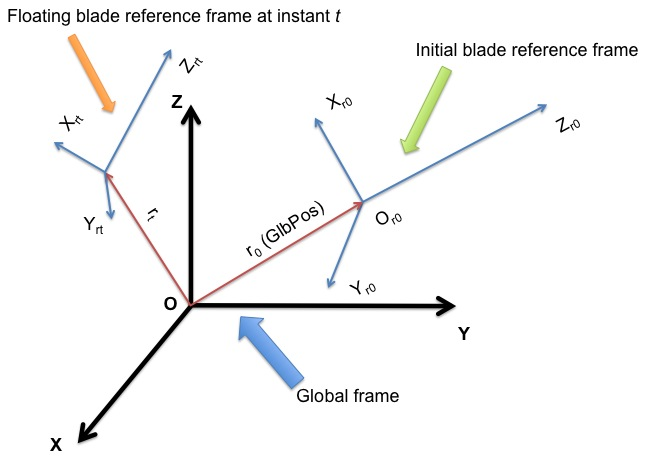
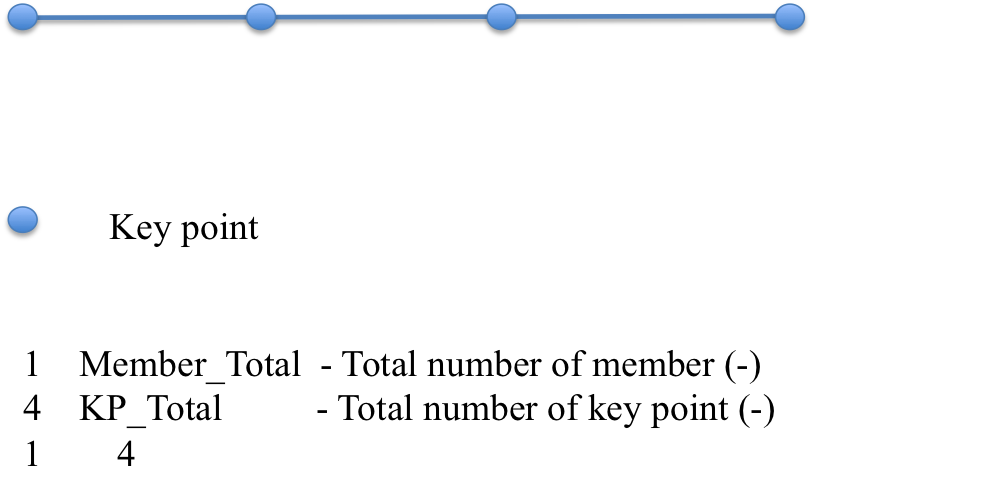
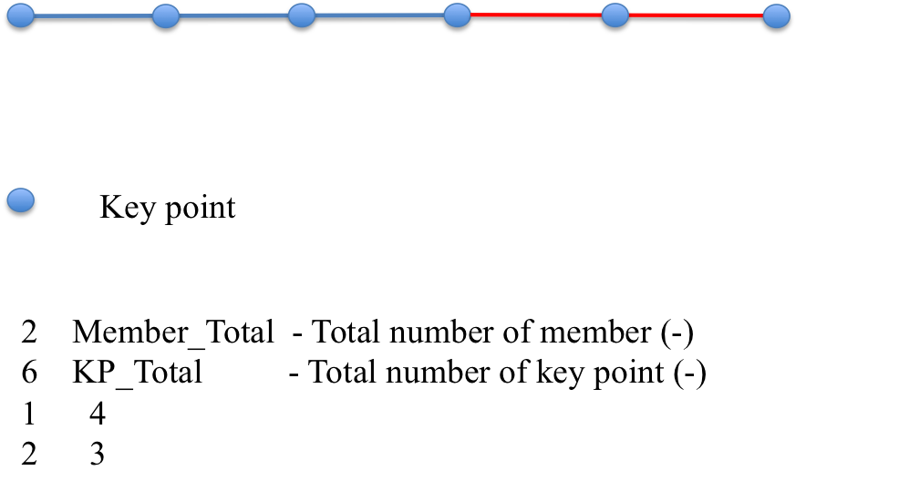
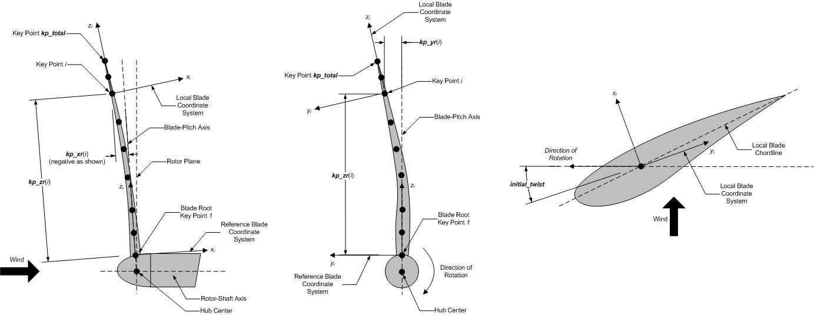

.. _bd-input-files:

输入文件
========

用户通过 BeamDyn 主输入文件和叶片属性输入文件指定叶片模型参数，包括其几何形状、截面特性、有限元和输出控制参数。当在独立模式下使用时，还需要额外的驱动输入文件。该驱动文件指定了通常由 FAST 提供给 BeamDyn 的输入，包括仿真范围、根运动和外加载荷。

除非在指定行数的表格中，否则不应在输入文件中添加或删除任何行。

单位
----

BeamDyn 使用国际单位制（kg, m, s, N）。除非另有说明，否则角度假定为弧度。

.. _driver-input-file:

BeamDyn 驱动输入文件
--------------------

驱动输入文件仅适用于独立版本的 BeamDyn。它包含通常由 FAST 设置的输入，这些输入对于控制非耦合模型的仿真是必要的。

驱动输入文件以两行头信息开头，这些信息供用户使用，但软件不使用。如果以独立模式运行 BeamDyn，结果输出文件将使用与此驱动输入文件相同的名称作为前缀。

:numref:`bd_input_files` 中给出了示例 BeamDyn 驱动输入文件。

仿真控制参数
~~~~~~~~~~~~

``DynamicSolve`` 是一个逻辑变量，指定 BeamDyn 应使用动态分析（``DynamicSolve = true``）还是静态分析（``DynamicSolve = false``）。
``t_initial`` 和 ``t_final`` 分别指定仿真的开始时间和结束时间。
``dt`` 指定时间步长。

重力参数
~~~~~~~~

``Gx``、``Gy`` 和 ``Gz`` 分别指定重力矢量在全局坐标系中沿 :math:`X`、:math:`Y` 和 :math:`Z` 方向的分量。
在 FAST 中，这通常是 0、0 和 -9.80665。

惯性系参数
~~~~~~~~~~

本节定义了两个惯性系之间的关系：全局坐标系和初始叶片参考坐标系。
``GlbPos(1)``、``GlbPos(2)`` 和 ``GlbPos(3)`` 指定初始全局位置矢量在全局坐标系中沿 :math:`X`、:math:`Y` 和 :math:`Z` 方向的三个分量，参见图 :numref:`frame`。
接下来的 :math:`3 \times 3` 方向余弦矩阵（``GlbDCM``）描述了从全局坐标系到初始叶片参考坐标系的旋转关系。

.. _frame:

   BeamDyn 中的全局坐标系和叶片坐标系。

叶片浮动参考系参数
~~~~~~~~~~~~~~~~~~

本节指定定义叶片浮动参考系的参数，这是一个附着在物体上的浮动参考系；叶片根部悬臂固定在该参考系的原点。
根据驱动输入文件，浮动叶片参考系假定处于绕全局坐标系原点的恒定刚体旋转模式，即：

.. math::
   :label: rootvelocity

   v_{rt} = \omega_r \times r_t

其中 :math:`v_{rt}` 是根（浮动叶片参考系的原点）平移速度矢量；:math:`\omega_r` 是恒定的根（浮动叶片参考系的原点）角速度矢量；:math:`r_t` 是上一节中介绍的时刻 :math:`t` 的全局位置矢量，参见 :numref:`frame`。
在初始时刻 :math:`t=0`，浮动叶片参考系与初始浮动叶片参考系重合。
``RootVel(4)``、``RootVel(5)`` 和 ``RootVel(6)`` 分别指定恒定根角速度矢量在全局坐标系中绕 :math:`X`、:math:`Y` 和 :math:`Z` 轴的三个分量。
``RootVel(1)``、``RootVel(2)`` 和 ``RootVel(3)`` 是根平移速度矢量在全局坐标系中沿 :math:`X`、:math:`Y` 和 :math:`Z` 方向的三个分量，基于方程 :eq:`rootvelocity` 计算。

BeamDyn 可以通过修改例如 ``Driver_Beam.f90`` 中的 ``BD_InputSolve`` 子程序来处理更复杂的根运动（需要重新编译独立版 BeamDyn）。

叶片以刚体运动模式初始化，即，基于本节定义的根速度信息和上一节定义的位置信息，沿叶片其他点的运动初始化为：

.. math::
    :label: ini-rootacct-travel-angvel

    a_{0} &= \omega_r \times (\omega_r \times (r_0 + P)) \\
    v_0 &= v_{r0} + \omega_r \times P \\
    \omega_0 &= \omega_r

其中 :math:`a_{0}` 是沿叶片的初始平移加速度矢量；:math:`v_0` 和 :math:`\omega_0` 分别是沿叶片的初始平移和角速度矢量；:math:`P` 是沿叶片相对于根的位置矢量。
请注意，这些方程实际上是通过调用 NWTC 库的网格映射例程实现的。

施加载荷
~~~~~~~~

本节为独立分析定义施加载荷，包括分布载荷、点（集中）载荷和叶尖集中载荷。

前六个条目 ``DistrLoad(i)``，:math:`i \in [1,6]`，分别指定全局坐标系中均匀分布力矢量的三个分量和均匀分布力矩矢量的三个分量。

接下来的六个条目 ``TipLoad(i)``，:math:`i \in [1,6]`，分别指定全局坐标系中集中叶尖力矢量的三个分量和集中叶尖力矩矢量的三个分量。

``NumPointLoads`` 定义沿叶片施加的点载荷数量。此输入后的表格包含两行标题，共七列和 ``NumPointLoads`` 行。
第一列是沿局部叶片参考轴的无量纲距离，范围为 :math:`[0.0,1.0]`。接下来的三列 ``Fx``、``Fy`` 和 ``Fz`` 指定点力矢量的三个分量。剩余的三列 ``Mx``、``My`` 和 ``Mz`` 指定力矩矢量的三个分量。

本节定义的分布载荷假定沿叶片均匀分布，并且在整个仿真过程中保持恒定。叶尖载荷是施加在叶片尖部的恒定集中载荷。

需要注意的是，本节定义的所有载荷都是静载荷，即它们不会随着上一节定义的刚体旋转而随叶片一起旋转。

BeamDyn 能够通过自定义源代码处理更复杂的载荷情况，例如随时间变化的载荷（需要重新编译独立版 BeamDyn）。用户可以在 ``Driver_Beam.f90`` 文件的 ``BD_InputSolve`` 子程序中定义此类载荷，该子程序在每个时间步被调用。可以修改以下部分来定义每个有限元节点的集中载荷：

.. code-block:: fortran

       u%PointLoad%Force(1:3,u%PointLoad%NNodes)  = u%PointLoad%Force(1:3,u%PointLoad%NNodes)  + DvrData%TipLoad(1:3)
       u%PointLoad%Moment(1:3,u%PointLoad%NNodes) = u%PointLoad%Moment(1:3,u%PointLoad%NNodes) + DvrData%TipLoad(4:6)

其中每个数组的第一个索引范围为 1 到 3，表示沿三个全局方向的载荷矢量分量，每个数组的第二个索引范围为 1 到 ``u%PointLoad%NNodes``，后者是有限元节点的总数。请注意，在子程序早些时候调用 ``Transfer_Point_to_Point`` 时，``u%PointLoad%Force(1:3,:)`` 和 ``u%PointLoad%Moment(1:3,:)`` 已经填充了从 BeamDyn 驱动输入文件读取的点载荷。

例如，作用在第 2 个有限元节点上沿 :math:`X` 方向的随时间变化的正弦力可以定义为：

.. code-block:: fortran

       u%PointLoad%Force(:,:) = 0.0D0
       u%PointLoad%Force(1,2)  = 1.0D+03*SIN((2.0*pi)*t/6.0 )
       u%PointLoad%Moment(:,:) = 0.0D0

其中 ``1.0D+03`` 是振幅，``6.0`` 是周期。请注意，此特定实现会覆盖驱动输入文件中定义的叶尖载荷和点载荷。

与集中载荷类似，分布载荷可以在同一个子程序中定义：

.. code-block:: fortran

       DO i=1,u%DistrLoad%NNodes
          u%DistrLoad%Force(1:3,i) = DvrData%DistrLoad(1:3)
          u%DistrLoad%Moment(1:3,i)= DvrData%DistrLoad(4:6)
       ENDDO

其中 ``u%DistrLoad%NNodes`` 是输入到 BeamDyn 的节点数（在求积点上），``DvrData%DistrLoad(:)`` 是 BeamDyn 从驱动输入文件读取的恒定均匀分布载荷。用户可以根据需要修改 ``DvrData%DistrLoad(:)`` 来定义载荷。

我们注意到分布载荷定义在求积点上用于数值积分。例如，如果选择高斯求积，则分布载荷定义在高斯点加上梁的两个端点（根和尖）。对于梯形求积，``p%ngp`` 存储梯形求积点的数量。

主输入文件
~~~~~~~~~~

``InputFile`` 是 BeamDyn 主输入文件的文件名。此名称应放在引号中，可以包含绝对路径或相对路径。

BeamDyn 主输入文件
-------------------

BeamDyn 主输入文件定义了叶片几何形状、LSFE 离散化和仿真选项、输出通道以及叶片输入文件的名称。叶片的几何形状由叶片局部坐标系（IEC 标准叶片系统，其中 :math:`Z_r` 沿叶片轴从根到尖，:math:`X_r` 垂直指向吸力面，:math:`Y_r` 垂直指向后缘）中的关键点坐标和初始扭转角（以度为单位）定义。

该文件分为几个功能部分。每个部分对应于 BeamDyn 模型的一个方面。

:numref:`bd_appendix` 中给出了示例 BeamDyn 主输入文件。

主输入文件以两行头信息开头，这些信息供用户使用，但软件不使用。

仿真控制
~~~~~~~~

用户可以将 ``Echo`` 标志设置为 ``TRUE``，让 BeamDyn 回显 BeamDyn 输入文件的内容（对于调试输入文件中的错误很有用）。

``QuasiStaticInit`` 标志指示 BeamDyn 是否应在初始化时执行准静态求解，以更好地初始化其状态。此选项仅在耦合到 OpenFAST 且启用动态分析时可用。当设置为 ``TRUE`` 时，BeamDyn 将执行包含向心加速度的稳态启动（SSS）求解，以减少启动瞬态并提高数值性能。这对于旋转叶片仿真特别有用，否则初始条件会导致虚假瞬态。关键字 "DEFAULT" 将其设置为 ``FALSE``。

``rhoinf`` 指定在 BeamDyn 中实现的用于动态分析的广义-α 时间积分器中使用的数值阻尼参数（放大矩阵的谱半径），范围为 :math:`[0.0,1.0]`。**注意：此参数仅在 BeamDyn 以松耦合模式运行时使用（例如，带驱动的独立版本或在 OpenFAST 中明确选择松耦合时）。当在 OpenFAST 中使用紧耦合时，时间积分由耦合代码处理，此参数被忽略。**
对于 ``rhoinf = 1.0``，不引入数值阻尼，广义-α 方案与 Newmark 方案相同；对于 ``rhoinf = 0.0``，引入最大数值阻尼。数值阻尼可能有助于产生数值稳定的解。

``Quadrature`` 指定空间数值积分方案。有两个选项：1）高斯求积；2）梯形求积。我们注意到，在当前版本中，高斯求积以简化形式实现，以提高效率并避免剪切锁定。在梯形求积中，主输入文件的以下几何部分中只能定义一个构件（有限元单元）。当"叶片输入站"（如下所述）的数量明显大于 LSFE 的阶数时，梯形求积是合适的。

``Refine`` 指定梯形求积中使用的细化参数。大于 1 的整数值会将两个输入站之间的空间划分为"细化因子"个段。关键字 "DEFAULT" 可用于将其设置为 1，即不需要细化。此条目在高斯求积中不使用。

``N_Fact`` 指定修改的 Newton-Raphson 方案中使用的参数。**注意：此参数仅在 BeamDyn 以松耦合模式运行时使用（带驱动的独立版本或在 OpenFAST 中明确选择松耦合时）。当在 OpenFAST 中使用紧耦合时，此参数被忽略。**
如果 ``N_Fact = 1``，则使用完全 Newton 迭代方案，即在每次迭代时计算并分解全局切线刚度矩阵；如果 ``N_Fact > 1``，则使用修改的 Newton 迭代方案，即在每个时间步内每 ``N_Fact`` 次迭代计算并分解全局刚度矩阵。关键字 "DEFAULT" 设置 ``N_Fact = 5``。

``DTBeam`` 指定时间积分的恒定时间增量，以秒为单位。关键字 "DEFAULT" 可用于指示模块应使用驱动代码（FAST/独立驱动程序）规定的时间增量。

``load_retries`` 指定允许的最大载荷重试次数。此选项目前仅适用于静态分析。对于每次载荷重试，施加载荷减半，以促进 Newton-Raphson 方案在较小载荷步迭代中的收敛，而不是使用可能导致 Newton-Raphson 方案发散的单个大载荷步。关键字 "DEFAULT" 设置 ``load_retries = 20``。

``NRMax`` 指定 Newton-Raphson 方案中每个时间步的最大迭代次数。**注意：此参数仅在 BeamDyn 以松耦合模式运行时使用（带驱动的独立版本或在 OpenFAST 中明确选择松耦合时）。当在 OpenFAST 中使用紧耦合时，此参数被忽略。**
如果在此迭代次数内未达到收敛，BeamDyn 将返回错误消息并终止仿真。关键字 "DEFAULT" 设置 ``NRMax = 10``。

``Stop_Tol`` 指定非线性解的收敛准则中使用的容差参数，用于终止迭代。**注意：此参数仅在 BeamDyn 以松耦合模式运行时使用（带驱动的独立版本或在 OpenFAST 中明确选择松耦合时）。当在 OpenFAST 中使用紧耦合时，此参数被忽略。**
关键字 "DEFAULT" 设置 ``Stop_Tol = 1.0E-05``。有关更多详细信息，请参见 :numref:`convergence-criterion`。

``tngt_stf_fd`` 是一个布尔值，设置使用有限差分而不是解析微分计算切线刚度矩阵的标志。有限差分使用中心方案执行。关键字 "DEFAULT" 设置 ``tngt_stf_fd = FALSE``。

``tngt_stf_comp`` 是一个布尔值，设置比较解析切线刚度矩阵和有限差分切线刚度矩阵的标志。有关观察到最大差异的自由度的信息将写入终端。如果 ``tngt_stf_fd = FALSE`` 且 ``tngt_stf_comp = TRUE``，则使用解析切线刚度矩阵求解方程组，而有限差分切线刚度矩阵仅用于执行两个矩阵的比较。关键字 "DEFAULT" 设置 ``tngt_stf_comp = FALSE``。

``tngt_stf_pert`` 设置有限差分的扰动大小。基于经验的 "DEFAULT" 值设置为 ``1e-06``。

``tngt_stf_difftol`` 是解析和有限差分切线刚度矩阵之间的最大允许相对差。如果矩阵中的任何条目相对差超过此值，仿真将终止。"DEFAULT" 值目前设置为 ``1e-01``。

``RotStates`` 是一个标志，指示在耦合到 OpenFAST 进行线性化分析时，BeamDyn 的连续状态是否应在旋转坐标系中定向。如果执行多叶片坐标（MBC3）分析，``RotStates`` 必须为 ``true``。

几何参数
~~~~~~~~

叶片几何形状由曲线局部叶片参考轴定义。叶片参考轴确定每个局部坐标系的原点和方向，BeamDyn 叶片输入文件中的截面 6x6 刚度和质量矩阵在该局部坐标系中定义。只要参考轴定义一致并紧密遵循叶片的自然几何形状，6x6 刚度和质量矩阵相对于截面中的哪个位置定义并不重要。

叶片梁模型由几个连续串联的 *构件* 组成，每个构件在 BeamDyn 中由至少三个关键点定义。BeamDyn 中实现的三次样条拟合预处理器根据关键点自动生成构件，然后将构件互连为叶片。相邻构件之间始终有一个共享关键点；因此，关键点的总数与构件数量和每个构件中的关键点数量相关。

``member_total`` 指定结构中使用的梁构件总数。使用 LSFE 离散化时，单个构件和足够高的单元阶数（如下所述的 ``order_elem``）可能就足够了。

``kp_total`` 指定用于定义梁构件的关键点总数。

以下部分包含 ``member_total`` 行。每行有两个整数，分别提供构件编号（必须按顺序为 1、2、3 等）和该构件中的关键点数量。需要注意的是，每个构件中的关键点数量与关键点总数不是独立的，它们应满足以下等式：

.. math::
   :label: keypoint

   kp\_total = \sum_{i=1}^{member\_total} n_i - member\_total +1

其中 :math:`n_i` 是第 :math:`i^{th}` 构件中的关键点数量。由于 BeamDyn 中实现了三次样条，:math:`n_i` 必须大于或等于 3。图 :numref:`geometry1-case1` 和 :numref:`geometry1-case2` 显示了构件和关键点定义的两种情况。

.. _geometry1-case1:

   构件和关键点定义：由四个关键点定义的一个构件；

.. _geometry1-case2:

   构件和关键点定义：由六个关键点定义的两个构件。

下一部分定义关键点信息，前面有两行标题。每个关键点由 IEC 标准叶片坐标系（叶片参考坐标系）中的三个物理坐标（``kp_xr``、``kp_yr``、``kp_zr``）以及结构扭转角（``initial_twist``）定义，单位为度。结构扭转角也遵循 IEC 标准，定义为绕负 :math:`Z_l` 轴的扭转。关键点按顺序输入（从根到尖），在两行标题之后，应该共有 ``kp_total`` 行供 BeamDyn 读取信息。有关叶片几何定义的更多详细信息，请参见 :numref:`blade-geometry`。

.. _blade-geometry:

   BeamDyn 叶片几何形状 - 上图：侧视图；中图：前视图（顺风看）；下图：截面图（从根向尖看）

网格参数
~~~~~~~~

``Order_Elem`` 指定每个有限元的形函数阶数。每个 LSFE 将有 ``Order_Elem`` +1 个节点，位于 GLL 求积点。所有 LSFE 具有相同的阶数。使用 LSFE 离散化时，通常通过增加 ``Order_Elem``（即 :math:`p` 细化）比增加构件数量（即 :math:`h` 细化）能更好地提高精度。对于高斯求积，``Order_Elem`` 应大于 1。

材料参数
~~~~~~~~

``BldFile`` 是叶片输入文件的文件名。此名称应放在引号中，可以包含绝对路径或相对路径。

.. _BD-Outputs:

输出
~~~~

在主输入文件的这一部分，用户设置所需输出行为的标志和开关。

指定 ``SumPrint = TRUE`` 会使 BeamDyn 生成名为 ``InputFile.sum`` 的摘要文件。有关摘要文件的详细信息，请参见 :numref:`sum-file`。

``OutFmt`` 参数控制独立 BeamDyn 输出文件中结果的格式。它需要是有效的 Fortran 格式字符串，但 BeamDyn 目前不检查其有效性。当 BeamDyn 耦合到 FAST 使用时，此输入未被使用。

``NNodeOuts`` 指定可以写入文件的节点数量。目前，BeamDyn 最多可以在九个节点上输出物理量。

``OutNd`` 是一个长度为 ``NNodeOuts`` 的节点编号列表，编号范围为 1 到输出网格上的节点数，用逗号、分号、空格和/或制表符的任意组合分隔。如果输出摘要文件，节点位置会在摘要文件中给出。
对于高斯求积，输出网格上的节点数是有限元节点的总数；对于梯形求积，这是求积节点的数量。

``OutList`` 块包含输出参数列表。输入一行或多行包含引号的字符串，这些字符串又包含一个或多个输出参数名称。输出参数名称之间用逗号、分号、空格和/或制表符的任意组合分隔。如果在参数名称前加上减号 "-"、下划线 "_" 或字符 "m" 或 "M"，BeamDyn 会在写入数据前将该通道的值乘以 -1。参数按输入文件中列出的顺序写入。BeamDyn 允许使用多行，以便将列表分成有意义的组，并使行更短。您可以在任何行的结束引号后输入注释。如果在行首或行首引号字符串的开头输入字符串 "END"，将导致 BeamDyn 停止扫描更多通道名称行。节点相关量是为上面通过 OutNd 列表标识的请求节点生成的。如果 BeamDyn 遇到未知/无效的通道名称，它会警告用户，但会从输出文件中删除可疑通道。有关可能的输出参数及其名称的完整列表，请参见附录 :numref:`app-output-channel`。

.. _BD-Nodal-Outputs:

.. include:: BDNodalOutputs.rst

叶片输入文件
------------

叶片输入文件定义了沿叶片各个站的截面特性以及整个叶片的六个阻尼系数。:numref:`bd_appendix` 中给出了示例 BeamDyn 叶片输入文件。叶片输入文件以两行头信息开头，这些信息供用户使用，但软件不使用。

叶片参数
~~~~~~~~

``Station_Total`` 指定分析中使用的沿叶片轴的截面站数量。

``damp_type`` 指定分析中使用的结构阻尼类型。有三个选项：

- ``damp_type = 0``：分析中不考虑阻尼。以下部分的阻尼系数将被忽略。
- ``damp_type = 1``：应用刚度比例阻尼。刚度比例阻尼部分的六个阻尼系数（``beta``）用于缩放每个截面的 6x6 刚度矩阵。
- ``damp_type = 2``：应用模态阻尼。使用前 ``n_modes`` 阶模态的临界阻尼比例（``zeta``）。BeamDyn 内部计算模态特性并在模态坐标中应用阻尼。

刚度比例阻尼系数
~~~~~~~~~~~~~~~~

本节指定六个自由度（三个平移和三个旋转）的六个阻尼系数 :math:`\mu_{ii}`（也称为 ``beta``），其中 :math:`i \in [1,6]`。这些系数仅在 ``damp_flag = 1`` 时使用。

BeamDyn 中实现了粘性阻尼，其中阻尼力与应变率成正比。这些是刚度比例阻尼系数，由此，每个截面的 :math:`6\times6` 阻尼矩阵由 :math:`6 \times 6` 刚度矩阵通过 :math:`6 \times 6` 比例矩阵的这些对角条目缩放得到：

.. math::
   :label: damping-force

   \mathcal{\underline{F}}^{Damp} = \underline{\underline{\mu}}~\underline{\underline{S}}~\dot{\underline{\epsilon}}

其中 :math:`\mathcal{\underline{F}}^{Damp}` 是阻尼力，:math:`\underline{\underline{S}}` 是 :math:`6 \times 6` 截面刚度矩阵，:math:`\dot{\underline{\epsilon}}` 是应变率，:math:`\underline{\underline{\mu}}` 是阻尼系数矩阵，定义为：

.. math::
   :label: damp-matrix

   \underline{\underline{\mu}} =
   \begin{bmatrix}
       \mu_{11} & 0 & 0 & 0 & 0 & 0 \\
       0 & \mu_{22} & 0 & 0 & 0 & 0 \\
       0 & 0 & \mu_{33} & 0 & 0 & 0 \\
       0 & 0 & 0 & \mu_{44} & 0 & 0 \\
       0 & 0 & 0 & 0 & \mu_{55} & 0 \\
       0 & 0 & 0 & 0 & 0 & \mu_{66} \\
   \end{bmatrix}

模态阻尼系数
~~~~~~~~~~~~

本节指定模态阻尼参数，仅在 ``damp_flag = 2`` 时使用。

``n_modes`` 指定提供模态阻尼系数的模态数量。BeamDyn 将计算叶片的固有频率和振型，并在模态坐标中应用阻尼。

``zeta`` 是一个包含 ``n_modes`` 个模态阻尼比的数组，每个模态对应一个值。每个值通常应在 0.0（无阻尼）和 1.0（临界阻尼）之间，尽管允许更高的值。复合材料叶片结构的常见值小于 0.05（小于临界阻尼的 5%）。阻尼比按频率递增顺序应用于第 1 到第 ``n_modes`` 阶模态。

在指定了 ``n_modes`` 个阻尼值之后，阻尼值将与模态固有频率成比例增长。这种比例关系被设置为与最后一个指定阻尼的模态的 ``zeta`` 值匹配。

如果选择模态阻尼，BeamDyn 会根据节点速度（旋转到初始节点方向）和经过准静态初始化（如果请求）后的振型计算节点阻尼力。然后将这些节点阻尼力转换回当前节点方向。

使用模态阻尼时，需要在 ElastoDyn 中将 ``PitchDOF`` 设置为 ``TRUE``，以向 BeamDyn 提供正确的根变桨速度。否则，叶片变桨会导致虚假的阻尼行为。

建议：

- 建议在到达第一阶轴向模态（通常约为 18 阶模态）之前停止输入 zeta 值。用户可以尝试包含更多或更少的模态，以观察对结果的影响。
- 避免将最终 zeta 值设置为 1.0（例如，不要指定 18 个具有实际 zeta 值的模态，然后第 19 阶模态的 zeta=1.0），因为这会显著降低结果质量。
- 当尝试匹配刚度比例阻尼（:math:`\mu`）时，一旦某些模态变为临界阻尼，OpenFAST 工具箱可能无法提供与模态编号匹配的可靠阻尼值。如果高阶模态索引不正确，减少模态数量（例如从 40 减少到 30）可能会有所帮助。
- 在某些情况下，轴向载荷似乎由非轴向模态的轴向运动驱动。
- 验证 ``InputFile.BD.R*.B*.modes.csv`` 文件中输出的模态频率和模态参与因子是否与预期模态一致。此文件仅在使用模态阻尼时输出。该文件中输出的模态数量等于叶片的自由度数量。然而，超过某类模态的前几阶之后，模态往往会成为数值伪影。

注意：

- 模态阻尼在 OpenFAST 5.0 中是实验性的，因此应谨慎使用。
- 模态阻尼主要支持与 OpenFAST 的紧耦合。
- 在某些情况下，当与松耦合或 BeamDyn Driver 一起使用时，可能需要更小的时间步才能使反作用力与紧耦合情况和/或刚度比例阻尼（:math:`\mu`）情况收敛。
- BeamDyn 在求积点输出的内力不包含模态阻尼力的贡献。

分布特性
~~~~~~~~

本节指定 ``Station_Total`` 个站中每个站的截面特性。对于每个站，无量纲参数 :math:`\eta` 指定沿局部叶片参考轴的站位置，范围为 :math:`[0.0,1.0]`。第一个和最后一个站参数必须分别设置为 :math:`0.0`（叶片根）和 :math:`1.0`（叶片尖）。

在站位置参数 :math:`\eta` 之后，有两个 :math:`6 \times 6` 矩阵，提供该截面的结构和惯性特性。首先是刚度矩阵，然后是质量矩阵。我们注意到这些矩阵定义在沿叶片轴的局部坐标系中，其中 :math:`Z_{l}` 指向叶片参考轴的单位切向量。例如，对于没有耦合效应的截面，刚度矩阵如下：

.. math::
   :label: Stiffness

   \begin{bmatrix}
   K_{ShrFlp} & 0 & 0 & 0 & 0 & 0 \\
   0 & K_{ShrEdg} & 0 & 0 & 0 & 0 \\
   0 & 0& EA & 0 & 0 & 0 \\
   0 & 0 & 0 & EI_{Edg} & 0 & 0 \\
   0 & 0 & 0 & 0 & EI_{Flp} & 0 \\
   0 & 0 & 0 & 0 & 0 & GJ
   \end{bmatrix}

其中 :math:`K_{ShrEdg}` 和 :math:`K_{ShrFlp}` 分别是边缘和挥舞剪切刚度；:math:`EA` 是拉伸刚度；:math:`EI_{Edg}` 和 :math:`EI_{Flp}` 分别是边缘和挥舞刚度；:math:`GJ` 是扭转刚度。需要指出的是，对于通用截面，截面特性矩阵可以从截面分析工具导出，例如 VABS、BECAS 或 NuMAD/BPE。

广义截面质量矩阵如下：

.. math::
   :label: Mass

   \begin{bmatrix}
   m & 0 & 0 & 0 & 0 & -m Y_{cm} \\
   0 & m & 0 & 0 & 0 & m X_{cm}\\
   0 & 0& m & m Y_{cm} & -m X_{cm} & 0 \\
   0 & 0 & m Y_{cm} & i_{Edg} & -i_{cp} & 0 \\
   0 & 0 &-m X_{cm} & -i_{cp} & i_{Flp} & 0 \\
   -m Y_{cm} & m X_{cm} & 0 & 0 & 0 & i_{plr}
   \end{bmatrix}

其中 :math:`m` 是单位展向质量密度；:math:`X_{cm}` 和 :math:`Y_{cm}` 分别是截面质心的局部坐标；:math:`i_{Edg}` 和 :math:`i_{Flp}` 分别是单位展向边缘和挥舞质量惯性矩；:math:`i_{plr}` 是单位展向极惯性矩；:math:`i_{cp}` 是单位展向截面惯性叉积。我们注意到对于梁结构，:math:`i_{plr}` 由下式给出（尽管 BeamDyn 不检查此关系）：

.. math::
   :label: PolarMOI

   i_{plr} = i_{Edg} + i_{Flp}
