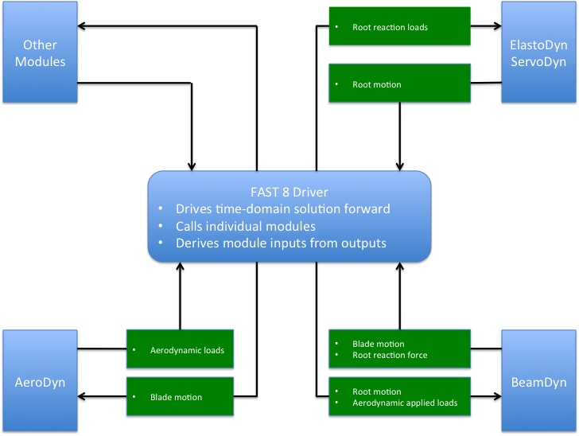

.. _bd_intro:

介绍
====

BeamDyn 是由落基山国家实验室（NLR）开发的细长结构时域结构动力学模块，开发得到了美国能源部风能和水电计划以及 NLR 实验室自主研究与开发（LDRD）计划通过"风力机结构动力学高保真计算建模"项目的支持，参见参考文献 :cite:`Wang:SFE2013,Wang:GEBT2013,Wang:GEBT2014,Wang:2015`。该模块已耦合到 FAST 气动-水动-伺服-弹性风力机多物理场工程工具中，用于建模叶片结构动力学。BeamDyn 模块遵循 FAST 模块化框架的要求，参见参考文献 :cite:`Jonkman:2013`; :cite:`Sprague:2013,Sprague:2014,website:FASTModularizationFramework`，耦合到 FAST 版本 8，并为建模经历大变形的初始弯曲和扭转复合材料风力机叶片提供了新功能。BeamDyn 也可以作为独立代码运行，在规定的边界条件和施加载荷条件下计算细长结构（叶片或其他结构）的静态和动态响应，无需与 FAST 耦合。

BeamDyn 的基础模型是几何精确梁理论（GEBT）:cite:`HodgesBeamBook`。GEBT 支持完全几何非线性和大变形，包含弯曲、扭转、剪切和拉伸自由度（DOFs）；各向异性复合材料耦合（使用完整的 :math:`6 \times 6` 质量和刚度矩阵，包括弯扭耦合）；以及允许非直叶片的参考轴（支持内置曲率、掠和截面偏移）。GEBT 梁方程使用勒让德谱有限元（LSFEs）进行空间离散。LSFEs 是 *p* 型单元，结合了全局谱方法的精度和 *h* 型有限元（FEs）的几何建模灵活性 :cite:`Patera:1984`。对于光滑解，与具有代数收敛性的低阶单元相比，LSFEs 具有指数收敛速率 :cite:`Sprague:2003,Wang:SFE2013`。为有限元内积实现了两种空间数值积分方案：简化高斯求积和梯形法则积分。当沿梁轴指定大量截面特性时，例如在长度方向上材料特性变化很大的长风力机叶片，梯形法则积分是合适的。BeamDyn 运动方程的时间积分通过隐式广义-:math:`\alpha` 求解器实现，用户可以指定数值阻尼。GEBT-LSFE 组合方法允许用户使用单个高阶单元为长、柔性复合材料风力机叶片建模。基于上述理论基础和强大的数值工具，BeamDyn 可以高效地解决复杂的非线性复合材料梁问题。例如，最近的研究表明，对于一个具有几十个截面站的 50 米复合材料风力机叶片，使用单个 7 阶 LSFE 就可以获得网格无关的动态解 :cite:`Wang:2016`。

当与 FAST 耦合时，载荷和响应通过 FAST 驱动程序（耦合代码）在 BeamDyn、ElastoDyn、ServoDyn 和 AeroDyn 之间传递，以在每个耦合时间步实现气动-弹性-伺服相互作用。每个叶片有一个单独的 BeamDyn 实例。在根节点，BeamDyn 的输入是六个位移（三个平移和三个旋转）、六个速度和六个加速度；BeamDyn 的根节点输出是六个反作用力载荷（三个平移力和三个力矩）。BeamDyn 还输出沿梁长度的叶片位移、速度和加速度，AeroDyn 使用这些输出来计算用作 BeamDyn 输入的局部气动载荷（沿长度分布）。此外，BeamDyn 可以根据用户请求计算构件内部反作用力载荷。BeamDyn 与 FAST 中其他模块之间的耦合相互作用请参见图 [fig:FlowChart]。当与 FAST 耦合时，BeamDyn 替代了 ElastoDyn 中更简化的叶片结构模型，后者仍然作为选项可用，但仅适用于以弯曲为主的直的各向同性叶片。当不与 FAST 耦合时，根运动（边界条件）和施加载荷通过独立的 BeamDyn 驱动代码指定。

.. _flow-chart:

   BeamDyn 与 FAST 之间的耦合相互作用

BeamDyn 输入文件定义了叶片几何形状；截面材料质量、刚度和阻尼特性；有限元分辨率；以及其他仿真和输出控制参数。叶片几何形状通过曲线叶片参考轴定义，该参考轴由三维（3D）空间中的一系列关键点以及这些点处的初始扭转角定义。每个 *构件* 至少包含三个关键点，用于 BeamDyn 中实现的三次样条拟合；每个构件使用单个 LSFE 离散化，并有一个参数定义单元的阶数。注意，定义构件的关键点数量和 LSFE 的阶数（:math:`N`）是独立的。LSFE 节点位于 :math:`N+1` 个 Gauss-Legendre-Lobatto 点，沿单元不是均匀分布的；节点位置由模块根据网格信息生成。叶片特性在沿叶片参考轴的 0.0 到 1.0 范围内的无量纲坐标中指定，如果空间积分方法需要，会在两个站之间进行线性插值。BeamDyn 的施加载荷可以是在求积点指定的分布载荷、在有限元节点指定的集中载荷，或者两者的组合。当 BeamDyn 与 FAST 耦合时，BeamDyn 和 AeroDyn 之间的叶片分析节点离散化可以是独立的。

本文档的组织结构如下。第 :ref:`running-beamdyn` 节详细介绍如何获取 BeamDyn 和 FAST 软件包，以及如何运行独立版本的 BeamDyn 或耦合到 FAST 的 BeamDyn。第 :ref:`bd-input-files` 节描述了 BeamDyn 输入文件。第 :ref:`bd-output-files` 节讨论了 BeamDyn 生成的输出文件。第 :ref:`beamdyn-theory` 节总结了 BeamDyn 理论。第 :ref:`bd-future-work` 节概述了潜在的未来工作。附录 :numref:`bd_input_files` 中展示了示例输入文件。附录 :ref:`app-output-channel` 中提供了可用输出通道的摘要。
