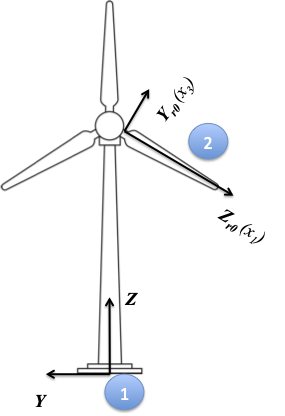
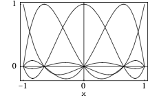
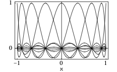

.. _beamdyn-theory:

BeamDyn 理论
============

本节重点介绍 BeamDyn 模块背后的理论。将介绍理论基础、数值工具以及实现中的一些特殊处理。每节都会提供参考文献，详细说明理论和数值工具。

在本章中，矩阵符号用于表示矢量或类矢量量。例如，下划线表示矢量 :math:`\underline{u}`，上划线表示单位矢量 :math:`\bar{n}`，双下划线表示张量 :math:`\underline{\underline{\Delta}}`。请注意，有时下划线仅表示对应矩阵的维度。

坐标系
------

:numref:`blade-geometry`（在 :numref:`bd-input-files` 中）和 :numref:`bd-frame` 展示了 BeamDyn 中使用的坐标系。

.. _bd-frame:

   BeamDyn 中的全局坐标系、叶片参考坐标系和内部坐标系。插图由 Al Hicks, NLR 提供。

全局坐标系
~~~~~~~~~~

全局坐标系在 :numref:`bd-frame` 中表示为 ``X``、``Y`` 和 ``Z``。这是一个惯性系，在 FAST 中，其原点通常放置在塔筒底部，如图所示。

BD 坐标系
~~~~~~~~~

BD 坐标系在 :numref:`bd-frame` 中分别表示为 :math:`x_1`、:math:`x_2` 和 :math:`x_3`。这是 BeamDyn 内部使用的惯性系（即不随转子旋转），其原点位于叶片根点的初始位置。

叶片参考坐标系
~~~~~~~~~~~~~~

叶片参考坐标系在初始化 (:math:`t = 0`) 时在 :numref:`bd-frame` 中表示为 :math:`X_{rt}`、:math:`Y_{rt}` 和 :math:`Z_{rt}`。叶片参考坐标系是一个浮动框架，附着在叶片根部并随叶片旋转。其原点位于叶片根部，轴方向遵循 IEC 标准，即 :math:`Z_r` 沿叶片轴从根部指向尖部；:math:`Y_r` 名义上指向叶片后缘，并与零扭转叶片截面处的弦线平行；:math:`X_r` 与 :math:`Y_r` 和 :math:`Z_r` 轴正交，形成右手坐标系（名义上指向下风方向）。我们注意到，由下标 :math:`r0` 表示的初始叶片参考坐标系与上节介绍的 BeamDyn 内部使用的 BD 坐标系重合。初始叶片参考坐标系和 BD 坐标系之间的轴转换关系见 :numref:`IECBD`。

.. _IECBD:

.. table:: 叶片坐标系与 BD 坐标系之间的转换。

   +---------------+------------------+------------------+------------------+
   | 叶片坐标系     | :math:`X_{r0}`   | :math:`Y_{r0}`   | :math:`Z_{r0}`   |
   +---------------+------------------+------------------+------------------+
   | BD 坐标系      | :math:`x_2`      | :math:`x_3`      | :math:`x_1`      |
   +---------------+------------------+------------------+------------------+

局部叶片坐标系
~~~~~~~~~~~~~~

局部叶片坐标系用于某些输入和输出量，例如截面质量和刚度矩阵以及截面力和力矩合力。该坐标系与叶片参考坐标系的不同之处在于，其 :math:`Z_l` 轴始终与叶片偏转时的叶片轴相切。请注意，下标 :math:`l` 表示局部叶片坐标系。

几何精确梁理论
--------------

BeamDyn 的理论基础是几何精确梁理论。该理论的特点是能够处理初始弯曲和扭转、承受大位移和大旋转的梁。结合适当的二维（2D）截面分析，GEBT 还可以捕捉所有六个自由度之间的耦合效应，包括拉伸、弯曲、剪切和扭转。"几何精确"一词指的是在公式推导中，没有对几何形状（包括初始几何形状和变形后几何形状）进行任何近似 :cite:`HodgesBeamBook`。

几何精确梁理论的控制运动方程可以写成 :cite:`Bauchau:2010`

.. math::
   	:label: GovernGEBT-1-2

   	\dot{\underline{h}} - \underline{F}^\prime &= \underline{f} \\
   	\dot{\underline{g}} + \dot{\tilde{u}} \underline{h} - \underline{M}^\prime + (\tilde{x}_0^\prime + \tilde{u}^\prime)^T \underline{F} &= \underline{m}

其中 :math:`{\underline{h}}` 和 :math:`{\underline{g}}` 分别是在惯性坐标系中分解的线动量和角动量；:math:`{\underline{F}}` 和 :math:`{\underline{M}}` 分别是梁的截面力和力矩合力；:math:`{\underline{u}}` 是参考线上一点的一维（1D）位移；:math:`{\underline{x}}_0` 是沿梁参考线的点的位置矢量；:math:`{\underline{f}}` 和 :math:`{\underline{m}}` 是施加到梁结构上的分布力和力矩。符号 :math:`(\bullet)^\prime` 表示对梁轴 :math:`x_1` 的导数，:math:`\dot{(\bullet)}` 表示对时间的导数。波浪号运算符 :math:`({\widetilde{\bullet}})` 定义了与给定向量对应的反对称张量。在文献中，它也被称为"叉乘矩阵"。例如，

.. math::

   {\widetilde{n}} =
   		\begin{bmatrix}
		0 & -n_3 & n_2 \\
		n_3 & 0 & -n_1 \\
		-n_2 & n_1 & 0\\
		\end{bmatrix}

本构方程将速度与动量联系起来，将一维应变度量与截面合力联系起来，如下所示

.. math::
   	:label: ConstitutiveMass-Stiff

   	\begin{Bmatrix}
   	\underline{h} \\
   	\underline{g}
   	\end{Bmatrix}
   	= \underline{\underline{\mathcal{M}}} \begin{Bmatrix}
   	\dot{\underline{u}} \\
   	\underline{\omega}
   	\end{Bmatrix} \\

   	\begin{Bmatrix}
   	\underline{F} \\
   	\underline{M}
   	\end{Bmatrix}
   	= \underline{\underline{\mathcal{C}}} \begin{Bmatrix}
   	\underline{\epsilon} \\
   	\underline{\kappa}
   	\end{Bmatrix}

其中 :math:`\underline{\underline{\mathcal{M}}}` 和 :math:`\underline{\underline{\mathcal{C}}}` 分别是 :math:`6 \times 6` 的截面质量和刚度矩阵（请注意，它们实际上不是张量）；:math:`\underline{\epsilon}` 和 :math:`\underline{\kappa}` 分别是一维应变和曲率；:math:`\underline{\omega}` 是由旋转张量 :math:`\underline{\underline{R}}` 定义的角速度矢量，即 :math:`\underline{\omega} = axial(\dot{\underline{\underline{R}}}~\underline{\underline{R}}^T)`。与二阶张量 :math:`{\underline{\underline{A}}}` 相关的轴矢量 :math:`{\underline{a}}` 表示为 :math:`{\underline{a}}=axial({\underline{\underline{A}}})`，其分量定义为

.. math::
   :label: axial

   {\underline{a}} = axial({\underline{\underline{A}}})=\begin{Bmatrix}
   a_1 \\
   a_2 \\
   a_3 \\
   \end{Bmatrix}
   =\frac{1}{2}
   \begin{Bmatrix}
   A_{32}-A_{23} \\
   A_{13}-A_{31} \\
   A_{21}-A_{12} \\
   \end{Bmatrix}

一维应变量度定义为

.. math::
   :label: 1DStrain

   \begin{Bmatrix}
      {\underline{\epsilon}} \\
      {\underline{\kappa}} \\
   \end{Bmatrix}
   =
   \begin{Bmatrix}
           {\underline{x}}^\prime_0 + {\underline{u}}^\prime - ({\underline{\underline{R}}} ~{\underline{\underline{R}}}_0) \bar{\imath}_1 \\
           {\underline{k}} \\
   \end{Bmatrix}

其中 :math:`{\underline{k}} = axial [({\underline{\underline{R R_0}}})^\prime ({\underline{\underline{R R_0}}})^T]` 是在惯性基中分解的截面曲率矢量；:math:`{\underline{\underline{R}}}_0` 是初始旋转张量；:math:`\bar{\imath}_1` 是惯性基中沿 :math:`x_1` 方向的单位矢量。这三组方程，包括运动方程 :eq:`GovernGEBT-1-2`、本构方程 :eq:`ConstitutiveMass-Stiff` 和运动学方程 :eq:`1DStrain`，提供了梁弹性问题的完整数学描述。

.. _num-imp:

勒让德谱有限元的数值实现
--------------------------

对于基于位移的有限元实现，每个节点有六个自由度：三个位移分量和三个旋转分量。这里我们用 :math:`{\underline{q}}` 表示单元位移数组，即 :math:`\underline{q}=\left[ \underline{u}^T~~\underline{c}^T\right]`，其中 :math:`{\underline{u}}` 是位移，:math:`{\underline{c}}` 是旋转参数矢量。因此，加速度数组可以定义为 :math:`\underline{a}=\left[ \ddot{\underline{u}}^T~~ \dot{\underline{\omega}}^T \right]`。对于非线性有限元分析，位移、速度和加速度的离散化和增量形式写为

.. math::
     :label: Discretized

     \underline{q} (x_1) &= \underline{\underline{N}} ~\hat{\underline{q}}~~~~\Delta \underline{q}^T = \left[ \Delta \underline{u}^T~~\Delta \underline{c}^T \right] \\
     \underline{v}(x_1) &= \underline{\underline{N}}~\hat{\underline{v}}~~~~\Delta \underline{v}^T = \left[\Delta \underline{\dot{u}}^T~~\Delta \underline{\omega}^T \right] \\
     \underline{a}(x_1) &= \underline{\underline{N}}~ \hat{\underline{a}}~~~~\Delta \underline{a}^T = \left[ \Delta \ddot{\underline{u}}^T~~\Delta \dot{\underline{\omega}}^T \right]

其中 :math:`{\underline{\underline{N}}}` 是形函数矩阵，:math:`(\hat{\cdot})` 表示节点值的列矩阵。

单元中的位移场近似为

.. math::
       :label: InterpolateDisp

       {\underline{u}}(\xi) &=  h^k(\xi) {\underline{\hat{u}}}^k \\
       {\underline{u}}^\prime(\xi) &=  h^{k\prime}(\xi) {\underline{\hat{u}}}^k

其中 :math:`h^k(\xi)` 是形函数矩阵 :math:`{\underline{\underline{N}}}` 的分量，是节点 :math:`k` 的 :math:`p^{th}` 阶拉格朗日插值形函数，:math:`k=\{1,2,...,p+1\}`，:math:`{\underline{\hat{u}}}^k` 是第 :math:`k^{th}` 个节点值，:math:`\xi \in \left[-1,1\right]` 是单元自然坐标。然而，如 :cite:`Bauchau-etal:2008` 中所讨论的，3D 旋转场不能简单地像位移场那样以下面的形式插值

.. math::
       :label: InterpolateRot

       {\underline{c}}(\xi) &= h^k(\xi) {\underline{\hat{c}}}^k \\
       {\underline{c}}^\prime(\xi) &= h^{k \prime}(\xi) {\underline{\hat{c}}}^k

其中 :math:`{\underline{c}}` 是单元中的旋转场，:math:`{\underline{\hat{c}}}^k` 是第 :math:`k^{th}` 个节点处的节点值，原因有三：

1) 旋转不构成线性空间，因此它们必须"组合"而不是相加；
2) 需要重缩放操作来消除矢量旋转参数中存在的奇异性；
3) 旋转场缺乏客观性，正如 :cite:`Crisfield1999` 所定义的，客观性指的是通过插值计算的应变度量对于刚体运动的加法是不变的。

因此，我们采用 :cite:`Crisfield1999` 提出的更鲁棒的插值方法来处理有限旋转。我们的方法描述如下：

步骤 1:
    通过从每个节点的有限旋转中移除参考旋转 :math:`{\underline{\hat{c}}}^1`，计算节点相对旋转 :math:`{\underline{\hat{r}}}^k`，即 :math:`{\underline{\hat{r}}}^k = ({\underline{\hat{c}}}^{1-}) \oplus {\underline{\hat{c}}}^k`。注意，:math:`{\underline{\hat{c}}}^1` 上的减号表示通过从每个节点中移除参考旋转来计算相对旋转。该方程中的组合等价于 :math:`{\underline{\underline{R}}}({\underline{\hat{r}}}^k) = {\underline{\underline{R}}}^T({\underline{\hat{c}}}^1)~{\underline{\underline{R}}}({\underline{{\underline{c}}}}^k).`

步骤 2:
    插值相对旋转场：:math:`{\underline{r}}(\xi) = h^k(\xi) {\underline{\hat{r}}}^k` 和 :math:`{\underline{r}}^\prime(\xi) = h^{k \prime}(\xi) {\underline{\hat{r}}}^k`。求曲率场 :math:`{\underline{\kappa}}(\xi) = {\underline{\underline{R}}}({\underline{\hat{c}}}^1) {\underline{\underline{H}}}({\underline{r}}) {\underline{r}}^\prime`，其中 :math:`{\underline{\underline{H}}}` 是将曲率矢量 :math:`{\underline{k}}` 和旋转矢量 :math:`{\underline{c}}` 联系起来的切线张量，如下所示

    .. math::
       :label: Tensor

           {\underline{k}} = {\underline{\underline{H}}}~ {\underline{c}}^\prime

步骤 3:
    恢复步骤 1 中移除的刚体旋转：:math:`{\underline{c}}(\xi) = {\underline{\hat{c}}}^1 \oplus {\underline{r}}(\xi)`。

注意，相对旋转场可以相对于单元的任何节点计算；为方便起见，我们选择节点 1 作为参考节点。在 LSFE 方法中，形函数（即组成 :math:`{\underline{\underline{N}}}` 的函数）是 :math:`p^{th}` 阶拉格朗日插值函数，其中节点位于 :math:`[-1,1]` 单元自然坐标域内的 :math:`p+1` 个高斯-勒让德-洛巴托（GLL）点上。:numref:`N4_lsfe` 显示了四阶和八阶单元的代表性 LSFE 基函数。注意，节点在单元端点附近聚集。有关 LSFE 及其应用的更多细节，请参见参考文献 :cite:`Patera:1984,Ronquist:1987,Sprague:2003,Sprague:2004`。

.. _N4_lsfe:

   四阶 LSFE 单元自然坐标下的代表性 :math:`p+1` 拉格朗日插值形函数，节点位于高斯-洛巴托-勒让德点上。

.. _N8_lsfe:

   八阶 LSFE 单元自然坐标下的代表性 :math:`p+1` 拉格朗日插值形函数，节点位于高斯-洛巴托-勒让德点上。

Wiener-Milenković 旋转参数
---------------------------

在 BeamDyn 中，3D 旋转由以下方程定义的 Wiener-Milenković 参数表示：

.. math::
   :label: WMParameter

   {\underline{c}} = 4 \tan\left(\frac{\phi}{4} \right) \bar{n}

其中 :math:`\phi` 是旋转角，:math:`\bar{n}` 是旋转轴的单位矢量。可以看出，该参数的有效范围是 :math:`|\phi| < 2 \pi`。存在于 :math:`\pm 2 \pi` 整数倍处的奇异性可以通过在 :math:`\pi` 处的重缩放操作来消除：

.. math::
   :label: RescaledWM

   {\underline{r}} = \begin{cases}
   4(q_0{\underline{p}} + p_0 {\underline{q}} + \tilde{p} {\underline{q}} ) / (\Delta_1 + \Delta_2), & \text{if } \Delta_2 \geq 0 \\
   -4(q_0{\underline{p}} + p_0 {\underline{q}} + \tilde{p} {\underline{q}} ) / (\Delta_1 - \Delta_2), & \text{if } \Delta_2 < 0
   \end{cases}

其中 :math:`{\underline{p}}`、:math:`{\underline{q}}` 和 :math:`{\underline{r}}` 是三个有限旋转的矢量参数化，满足 :math:`{\underline{\underline{R}}}({\underline{r}}) = {\underline{\underline{R}}}({\underline{p}}) {\underline{\underline{R}}}({\underline{q}})`，:math:`p_0 = 2 - {\underline{p}}^T {\underline{p}}/8`，:math:`q_0 = 2 - {\underline{q}}^T {\underline{q}}/8`，:math:`\Delta_1 = (4-p_0)(4-q_0)`，:math:`\Delta_2 = p_0 q_0 - {\underline{p}}^T {\underline{q}}`。需要注意的是，重缩放操作可能会导致插值旋转场的不连续；因此，在第 :ref:`num-imp` 节中引入了更鲁棒的插值算法，其中对与重缩放无关的相对旋转场进行插值。

用 Wiener-Milenković 参数表示的旋转张量为

.. math::
      :label: eqn:RotTensorWM

      {\underline{\underline{R}}} ({\underline{c}}) = \frac{1}{(4-c_0)^2}
      \begin{bmatrix}
      c_0^2 + c_1^2 - c_2^2 - c_3^2 & 2(c_1 c_2 - c_0 c_3) & 2(c_1 c_3 + c_0 c_2) \\
      2(c_1 c_2 + c_0 c_3) & c_0^2 - c_1^2 + c_2^2 - c_3^2 & 2(c_2 c_3 - c_0 c_1) \\
      2(c_1 c_3 - c_0 c_2)  & 2(c_2 c_3 + c_0 c_1) & c_0^2 - c_1^2 - c_2^2 + c_3^2 \\
      \end{bmatrix}

其中 :math:`{\underline{c}} = \left[ c_1~~c_2~~c_3\right]^T` 是 Wiener-Milenković 参数，:math:`c_0 = 2 - \frac{1}{8}{\underline{c}}^T {\underline{c}}`。旋转张量与方向余弦矩阵（DCM）之间的关系为

.. math::
   :label: RT2DCM

   {\underline{\underline{R}}} = ({\underline{\underline{DCM}}})^T

有兴趣的用户可以参考 :cite:`Bauchau-etal:2008` 和 :cite:`Wang:GEBT2013` 了解更多关于旋转参数及其在 GEBT 中实现的细节。

线性化过程
----------

上节介绍的非线性控制方程通过 Newton-Raphson 方法求解，其中需要线性化过程。本节介绍控制方程中每个项的线性化。

根据 :cite:`Bauchau:2010`，方程 :eq:`GovernGEBT-1-2` 中的线性化控制方程形式为

.. math::
   :label: LinearizedEqn

   \hat{\underline{\underline{M}}} \Delta \hat{\underline{a}} +\hat{\underline{\underline{G}}} \Delta \hat{\underline{v}}+ \hat{\underline{\underline{K}}} \Delta \hat{\underline{q}} = \hat{\underline{F}}^{ext} - \hat{\underline{F}}

其中 :math:`\hat{{\underline{\underline{M}}}}`、:math:`\hat{{\underline{\underline{G}}}}` 和 :math:`\hat{{\underline{\underline{K}}}}` 分别是单元质量矩阵、陀螺矩阵和刚度矩阵；:math:`\hat{{\underline{F}}}` 和 :math:`\hat{{\underline{F}}}^{ext}` 分别是单元力和外加载荷。它们对于沿 :math:`x_1` 长度为 :math:`l` 的单元定义如下

.. math::
   	:label: hatMGKFFext

   	\hat{{\underline{\underline{M}}}}&= \int_0^l \underline{\underline{N}}^T \mathcal{\underline{\underline{M}}} ~\underline{\underline{N}} dx_1 \\
   	\hat{{\underline{\underline{G}}}} &= \int_0^l {\underline{\underline{N}}}^T {\underline{\underline{\mathcal{G}}}}^I~{\underline{\underline{N}}} dx_1\\
   	\hat{{\underline{\underline{K}}}}&=\int_0^l \left[ {\underline{\underline{N}}}^T ({\underline{\underline{\mathcal{K}}}}^I + \mathcal{{\underline{\underline{Q}}}})~ {\underline{\underline{N}}} + {\underline{\underline{N}}}^T \mathcal{{\underline{\underline{P}}}}~ {\underline{\underline{N}}}^\prime + {\underline{\underline{N}}}^{\prime T} \mathcal{{\underline{\underline{C}}}}~ {\underline{\underline{N}}}^\prime + {\underline{\underline{N}}}^{\prime T} \mathcal{{\underline{\underline{O}}}}~ {\underline{\underline{N}}} \right] d x_1 \\
   	\hat{{\underline{F}}} &= \int_0^l ({\underline{\underline{N}}}^T {\underline{\mathcal{F}}}^I + {\underline{\underline{N}}}^T \mathcal{{\underline{F}}}^D + {\underline{\underline{N}}}^{\prime T} \mathcal{{\underline{F}}}^C)dx_1 \\
   	\hat{{\underline{F}}}^{ext}& = \int_0^l {\underline{\underline{N}}}^T \mathcal{{\underline{F}}}^{ext} dx_1

其中 :math:`\mathcal{{\underline{F}}}^{ext}` 是施加载荷矢量。这里简要介绍方程 :eq:`hatMGKFFext` 中的新矩阵符号。:math:`\mathcal{{\underline{F}}}^C` 和 :math:`\mathcal{{\underline{F}}}^D` 是从方程 :eq:`GovernGEBT-1-2` 得到的弹性力，如下

.. math::
   	:label: FCD

   	\mathcal{{\underline{F}}}^C &= \begin{Bmatrix}
            {\underline{F}} \\
   	{\underline{M}}
   	\end{Bmatrix} = {\underline{\underline{\mathcal{C}}}} \begin{Bmatrix}
   	{\underline{\epsilon}} \\
   	{\underline{\kappa}}
   	\end{Bmatrix} \\
   	\mathcal{{\underline{F}}}^D & = \begin{bmatrix}
   	\underline{\underline{0}} & \underline{\underline{0}}\\
   	(\tilde{x}_0^\prime+\tilde{u}^\prime)^T & \underline{\underline{0}}
   	\end{bmatrix}
   	\mathcal{{\underline{F}}}^C \equiv {\underline{\underline{\Upsilon}}}~ \mathcal{{\underline{F}}}^C

其中 :math:`\underline{\underline{0}}` 表示 :math:`3 \times 3` 零矩阵。方程 :eq:`hatMGKFFext` 中的 :math:`{\underline{\underline{\mathcal{G}}}}^I`、:math:`{\underline{\underline{\mathcal{K}}}}^I`、:math:`\mathcal{{\underline{\underline{O}}}}`、:math:`\mathcal{{\underline{\underline{P}}}}`、:math:`\mathcal{{\underline{\underline{Q}}}}` 和 :math:`{\underline{\mathcal{F}}}^I` 定义为

.. math::
      :label: mathcalGKOPFI

      {\underline{\underline{\mathcal{G}}}}^I &= \begin{bmatrix}
      {\underline{\underline{0}}} & (\widetilde{\tilde{\omega} m {\underline{\eta}}})^T+\tilde{\omega} m \tilde{\eta}^T  \\
      {\underline{\underline{0}}} & \tilde{\omega} {\underline{\underline{\varrho}}}-\widetilde{{\underline{\underline{\varrho}}} {\underline{\omega}}}
      \end{bmatrix} \\
      {\underline{\underline{\mathcal{K}}}}^I &= \begin{bmatrix}
      {\underline{\underline{0}}} & \dot{\tilde{\omega}}m\tilde{\eta}^T + \tilde{\omega} \tilde{\omega}m\tilde{\eta}^T  \\
      {\underline{\underline{0}}} & \ddot{\tilde{u}}m\tilde{\eta} + {\underline{\underline{\varrho}}} \dot{\tilde{\omega}}-\widetilde{{\underline{\underline{\varrho}}} {\underline{\dot{\omega}}}}+\tilde{\omega} {\underline{\underline{\varrho}}} \tilde{\omega} - \tilde{\omega}  \widetilde{{\underline{\underline{\varrho}}} {\underline{\omega}}}
      \end{bmatrix}\\
      \mathcal{{\underline{\underline{O}}}} &= \begin{bmatrix}
      {\underline{\underline{0}}} & {\underline{\underline{C}}}_{11} \tilde{E_1} - \tilde{F} \\
      {\underline{\underline{0}}}& {\underline{\underline{C}}}_{21} \tilde{E_1} - \tilde{M}
      \end{bmatrix} \\
      \mathcal{{\underline{\underline{P}}}} &= \begin{bmatrix}
      {\underline{\underline{0}}} & {\underline{\underline{0}}} \\
      \tilde{F} +  ({\underline{\underline{C}}}_{11} \tilde{E_1})^T & ({\underline{\underline{C}}}_{21} \tilde{E_1})^T
      \end{bmatrix}  \\
      \mathcal{{\underline{\underline{Q}}}} &= {\underline{\underline{\Upsilon}}}~ \mathcal{{\underline{\underline{O}}}} \\
      {\underline{\mathcal{F}}}^I &= \begin{Bmatrix}
      m \ddot{{\underline{u}}} + (\dot{\tilde{\omega}} + \tilde{\omega} \tilde{\omega})m {\underline{\eta}} \\
      m \tilde{\eta} \ddot{{\underline{u}}} +{\underline{\underline{\varrho}}}\dot{{\underline{\omega}}}+\tilde{\omega}{\underline{\underline{\varrho}}}{\underline{\omega}}
      \end{Bmatrix}

其中 :math:`m` 是单位长度的质量密度，:math:`{\underline{\eta}}` 是截面质心的位置，:math:`{\underline{\underline{\varrho}}}` 是转动惯量张量，引入以下符号以简化上述表达式

.. math::
       :label: E1-PartC

       {\underline{E}}_1 &= {\underline{x}}_0^\prime + {\underline{u}}^\prime \\
       {\underline{\underline{\mathcal{C}}}} &= \begin{bmatrix}
       {\underline{\underline{C}}}_{11} & {\underline{\underline{C}}}_{12} \\
       {\underline{\underline{C}}}_{21} & {\underline{\underline{C}}}_{22}
       \end{bmatrix}

阻尼力及其线性化
----------------

BeamDyn 中实现了粘性阻尼模型，以考虑结构阻尼效应。阻尼力定义为

.. math::
      :label: Damping

      {\underline{f}}_d = {\underline{\underline{\mu}}}~ {\underline{\underline{\mathcal{C}}}} \begin{Bmatrix}
      \dot{\epsilon} \\
      \dot{\kappa}
      \end{Bmatrix}

其中 :math:`{\underline{\underline{\mu}}}` 是用户定义的阻尼系数对角矩阵。阻尼力可以像弹性力中的 :math:`{\underline{\mathcal{F}}}^C` 和 :math:`{\underline{\mathcal{F}}}^D` 一样分为两个独立部分，如下

.. math::
      :label: DampingForce-1-2

      {\underline{\mathcal{F}}}^C_d &= \begin{Bmatrix}
      {\underline{F}}_d \\
      {\underline{M}}_d
      \end{Bmatrix} \\
      {\underline{\mathcal{F}}}^D_d &= \begin{Bmatrix}
       {\underline{0}} \\
       (\tilde{x}^\prime_0 + \tilde{u}^\prime)^T \underline{F}_d
       \end{Bmatrix}

结构阻尼力的线性化如下：

.. math::
       :label: DampingForceLinear-1-2

       \Delta {\underline{\mathcal{F}}}^C_d &= {\underline{\underline{\mathcal{S}}}}_d \begin{Bmatrix}
       \Delta {\underline{u}}^\prime \\
       \Delta {\underline{c}}^\prime
       \end{Bmatrix} + {\underline{\underline{\mathcal{O}}}}_d \begin{Bmatrix}
       \Delta {\underline{u}} \\
       \Delta {\underline{c}}
       \end{Bmatrix} + {\underline{\underline{\mathcal{G}}}}_d \begin{Bmatrix}
       \Delta {\underline{\dot{u}}} \\
       \Delta {\underline{\omega}}
       \end{Bmatrix}     + {\underline{\underline{\mu}}} ~{\underline{\underline{C}}} \begin{Bmatrix}
       \Delta {\underline{\dot{u}}}^\prime \\
       \Delta {\underline{\omega}}^\prime
       \end{Bmatrix} \\
       \Delta {\underline{\mathcal{F}}}^D_d &= {\underline{\underline{\mathcal{P}}}}_d \begin{Bmatrix}
       \Delta {\underline{u}}^\prime \\
       \Delta {\underline{c}}^\prime
       \end{Bmatrix} + {\underline{\underline{\mathcal{Q}}}}_d \begin{Bmatrix}
       \Delta {\underline{u}} \\
       \Delta {\underline{c}}
       \end{Bmatrix} + {\underline{\underline{\mathcal{X}}}}_d \begin{Bmatrix}
       \Delta {\underline{\dot{u}}} \\
       \Delta {\underline{\omega}}
       \end{Bmatrix}     + {\underline{\underline{\mathcal{Y}}}}_d \begin{Bmatrix}
       \Delta {\underline{\dot{u}}}^\prime \\
       \Delta {\underline{\omega}}^\prime
       \end{Bmatrix}

其中新引入的矩阵定义为

.. math::
       :label: DampingSd-Od-Gd-Pd-Qd-Xd-Yd

       {\underline{\underline{\mathcal{S}}}}_d &=
       {\underline{\underline{\mu}}} {\underline{\underline{\mathcal{C}}}} \begin{bmatrix}
       \tilde{\omega}^T & {\underline{\underline{0}}} \\
       {\underline{\underline{0}}} & \tilde{\omega}^T
       \end{bmatrix} \\
       {\underline{\underline{\mathcal{O}}}}_d &=
       \begin{bmatrix}
       {\underline{\underline{0}}} & {\underline{\underline{\mu}}} {\underline{\underline{C}}}_{11} (\dot{\tilde{u}}^\prime - \tilde{\omega} \tilde{E}_1) - \tilde{F}_d \\
       {\underline{\underline{0}}} &{\underline{\underline{\mu}}} {\underline{\underline{C}}}_{21} (\dot{\tilde{u}}^\prime - \tilde{\omega} \tilde{E}_1) - \tilde{M}_d
       \end{bmatrix} \\
       {\underline{\underline{\mathcal{G}}}}_d &=
       \begin{bmatrix}
       {\underline{\underline{0}}} & {\underline{\underline{C}}}_{11}^T {\underline{\underline{\mu}}}^T \tilde{E}_1 \\
       {\underline{\underline{0}}} & {\underline{\underline{C}}}_{12}^T {\underline{\underline{\mu}}}^T \tilde{E}_1
       \end{bmatrix} \\
       {\underline{\underline{\mathcal{P}}}}_d &=
       \begin{bmatrix}
       {\underline{\underline{0}}} & {\underline{\underline{0}}}  \\
       \tilde{F}_d + \tilde{E}_1^T {\underline{\underline{\mu}}} {\underline{\underline{C}}}_{11} \tilde{\omega}^T &  \tilde{E}_1^T {\underline{\underline{\mu}}} {\underline{\underline{C}}}_{12} \tilde{\omega}^T
       \end{bmatrix} \\
       {\underline{\underline{\mathcal{Q}}}}_d &=
       \begin{bmatrix}
       {\underline{\underline{0}}} & {\underline{\underline{0}}}  \\
       {\underline{\underline{0}}} &  \tilde{E}_1^T {\underline{\underline{O}}}_{12}
       \end{bmatrix} \\
       {\underline{\underline{\mathcal{X}}}}_d &=
       \begin{bmatrix}
       {\underline{\underline{0}}} & {\underline{\underline{0}}}  \\
        {\underline{\underline{0}}} &  \tilde{E}_1^T {\underline{\underline{G}}}_{12}
       \end{bmatrix} \\
       {\underline{\underline{\mathcal{Y}}}}_d &=
       \begin{bmatrix}
       {\underline{\underline{0}}} & {\underline{\underline{0}}}  \\
         \tilde{E}_1^T {\underline{\underline{\mu}}} {\underline{\underline{C}}}_{11} &   \tilde{E}_1^T {\underline{\underline{\mu}}} {\underline{\underline{C}}}_{12}
       \end{bmatrix} \\

其中 :math:`{\underline{\underline{O}}}_{12}` 和 :math:`{\underline{\underline{G}}}_{12}` 是 :math:`\mathcal{{\underline{\underline{O}}}}` 和 :math:`\mathcal{{\underline{\underline{G}}}}` 的 :math:`3 \times 3` 子矩阵，如方程 :eq:`E1-PartC` 中的 :math:`{\underline{\underline{C}}}_{12}`。

模态阻尼
--------

除了上述刚度比例粘性阻尼外，BeamDyn 还支持模态阻尼。目前仅在与 OpenFAST 紧耦合运行时支持模态阻尼。当选择模态阻尼时（``damp_flag = 2``），BeamDyn 计算叶片的固有频率和振型，并在模态坐标中应用阻尼。

模态阻尼方法基于用户指定的模态阻尼比 :math:`\zeta_i`（对于模态 :math:`i = 1, 2, \ldots, n_{modes}`）构造阻尼矩阵 :math:`{\underline{\underline{C}}}_{modal}`。超过用户指定的 :math:`n_{modes}` 后，BeamDyn 分配的 :math:`\zeta_i` 与模态固有频率成比例增长，并匹配最后指定的 :math:`\zeta_i` 值。模态阻尼矩阵根据模态特性定义：

.. math::
       :label: ModalDamping

       {\underline{\underline{C}}}_{modal} = {\underline{\underline{\Phi}}}^{-T} {\underline{\underline{Z}}} {\underline{\underline{\Phi}}}^{-1}
       = {\underline{\underline{M}}} {\underline{\underline{\Phi}}} {\underline{\underline{Z}}} {\underline{\underline{\Phi}}}^T {\underline{\underline{M}}}

其中 :math:`\underline{\underline{Z}}` 是对角矩阵，第 :math:`i` 个对角项等于 :math:`2 \omega_i \zeta_i`，其中 :math:`\omega_i` 是固有频率，单位为 rad/s。此外，:math:`\underline{\underline{\Phi}}` 是质量归一化振型矩阵（每个振型为一列）。:math:`\underline{\underline{M}}` 是准静态初始化后的质量矩阵。

在每个时间步，通过减去根部的刚体运动来计算节点速度矢量。这个速度矢量在每个节点处旋转，以与初始时的梁对齐。然后，节点处的阻尼力就是阻尼矩阵与速度矢量的乘积。这些力随后通过速度旋转的逆变换旋转回全局坐标系。与在根框架中固定阻尼矩阵相比，额外的旋转似乎能提供更好的模态阻尼结果。

模态阻尼使用户能够按模态控制阻尼水平，以更好地匹配实验或理论阻尼预测。此外，模态阻尼不需要随频率成比例增长（如刚度比例阻尼所规定的那样）。相反，可以使用在一些实验和模型预测中观察到的跨频率更恒定的阻尼因子。

.. _convergence-criterion:

收敛准则与广义-α时间积分器
---------------------------

方程 :eq:`GovernGEBT-1-2` 中的非线性方程组使用 Newton-Raphson 方法求解，线性化形式如方程 :eq:`LinearizedEqn`。在当前实现中，选择了类似能量的停止准则，其计算方式为

.. math::
       :label: StoppingCriterion

       | \Delta \mathbf{U}^{(i)T} \left( {^{t+\Delta t}} \mathbf{R} -  {^{t+\Delta t}} \mathbf{F}^{(i-1)}  \right) | \leq | \epsilon_E \left( \Delta \mathbf{U}^{(1)T} \left( {^{t+\Delta t}} \mathbf{R} - {^t}\mathbf{F} \right) \right) |

其中 :math:`|\cdot|` 表示绝对值，:math:`\Delta \mathbf{U}` 是增量位移矢量，:math:`\mathbf{R}` 是外施加节点载荷矢量，:math:`\mathbf{F}` 是与单元内应力对应的节点力矢量，:math:`\epsilon_E` 是用户定义的能量容差。变量左侧的上标表示（动态分析中的）时间步编号，而右侧的上标表示 Newton-Raphson 迭代次数。正如 :cite:`Bathe-Cimento:1980` 所指出的，该准则提供了位移和力都接近平衡值时的度量。

BeamDyn 使用广义-α 方案进行时间积分，这是一种（对于线性系统）无条件稳定的二阶精确算法。该方案允许用户选择引入高频数值耗散的积分参数。数值耗散量由用户指定的无穷远处谱半径 :math:`\rho_{\infty}` 控制。有关广义-α 方法的更多细节，请参见 :cite:`Chung-Hulbert:1993,Bauchau:2010`。

反作用力计算
------------

由于风力机叶片的根部运动，包括位移和旋转、平移和角速度以及平移和角加速度，都是作为输入提供给 BeamDyn 的，无论是由驱动程序（在独立模式下）还是由 FAST 耦合代码（在 FAST 耦合模式下）提供，根部的反作用力需要满足控制方程的等式。根部的反作用力也是完整涡轮机分析中从叶片传递到轮毂的载荷。

方程 :eq:`GovernGEBT-1-2` 中的控制方程可以重写成紧凑形式

.. math::
   :label: CompactGovern

   {\underline{\mathcal{F}}}^I - {\underline{\mathcal{F}}}^{C\prime} + {\underline{\mathcal{F}}}^D = {\underline{\mathcal{F}}}^{ext}

所有矢量的定义见第 [sec:LinearProcess] 节。在叶片根部，控制方程修正为

.. math::
   :label: CompactGovernRoot

   {\underline{\mathcal{F}}}^I - {\underline{\mathcal{F}}}^{C\prime} + {\underline{\mathcal{F}}}^D = {\underline{\mathcal{F}}}^{ext}+{\underline{\mathcal{F}}}^R

其中 :math:`{\underline{\mathcal{F}}}^R = \left[ {\underline{F}}^R~~~{\underline{M}}^R\right]^T` 是反作用力矢量，鉴于此时运动场已知，可以从方程 :eq:`CompactGovernRoot` 求解得到。

叶片载荷计算
------------

BeamDyn 还可以计算沿叶片轴每个有限元节点处的叶片载荷。方程 :eq:`CompactGovern` 中的控制方程重写为

.. math::
   :label: GovernBF

   {\underline{\mathcal{F}}}^A + {\underline{\mathcal{F}}}^V - {\underline{\mathcal{F}}}^{C\prime} + {\underline{\mathcal{F}}}^D = {\underline{\mathcal{F}}}^{ext}

其中惯性力矢量 :math:`{\underline{\mathcal{F}}}^I` 被拆分为 :math:`{\underline{\mathcal{F}}}^A` 和 :math:`{\underline{\mathcal{F}}}^V`：

.. math::
       :label: mathcalFA-FV

       {\underline{\mathcal{F}}}^A &= \begin{Bmatrix}
       m \ddot{{\underline{u}}} + \dot{\tilde{\omega}}m {\underline{\eta}}\\
       m \tilde{\eta} \ddot{{\underline{u}}} + {\underline{\underline{\rho}}} \dot{{\underline{\omega}}}
       \end{Bmatrix} \\
       {\underline{\mathcal{F}}}^V &= \begin{Bmatrix}
       \tilde{\omega} \tilde{\omega} m {\underline{\eta}}\\
        \tilde{\omega} {\underline{\underline{\rho}}} {\underline{\omega}}
       \end{Bmatrix} \\

因此，叶片载荷定义为

.. math::
   :label: BladeForce

   {\underline{\mathcal{F}}}^{BF} \equiv {\underline{\mathcal{F}}}^V - {\underline{\mathcal{F}}}^{C\prime} + {\underline{\mathcal{F}}}^D

我们注意到，如果在分析中考虑结构阻尼，:math:`{\underline{\mathcal{F}}}^{C}_d` 和 :math:`{\underline{\mathcal{F}}}^D_d` 将被纳入内部弹性力 :math:`{\underline{\mathcal{F}}}^C` 和 :math:`{\underline{\mathcal{F}}}^D` 中进行计算。
