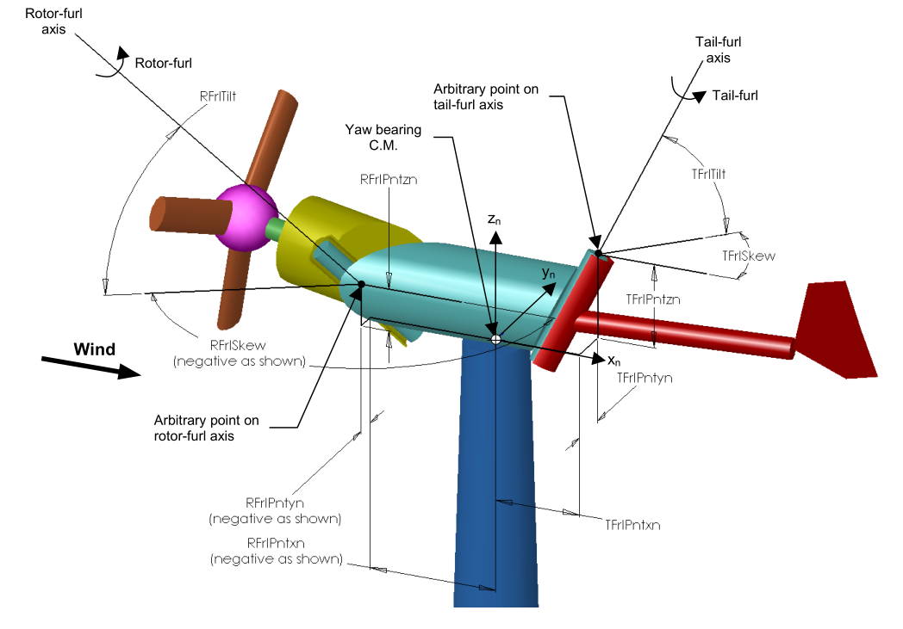
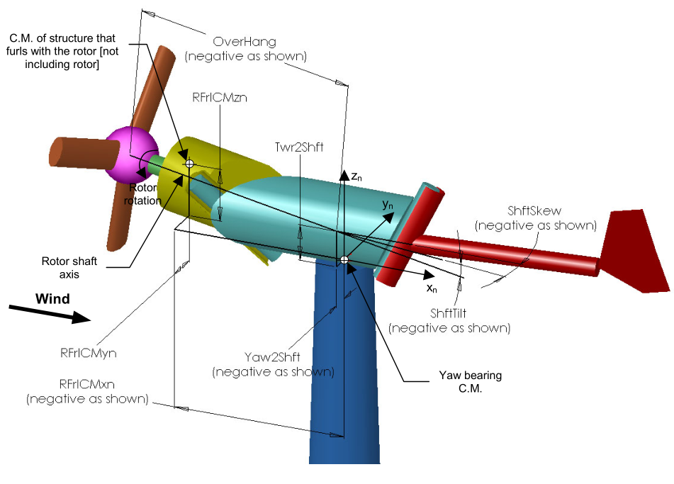
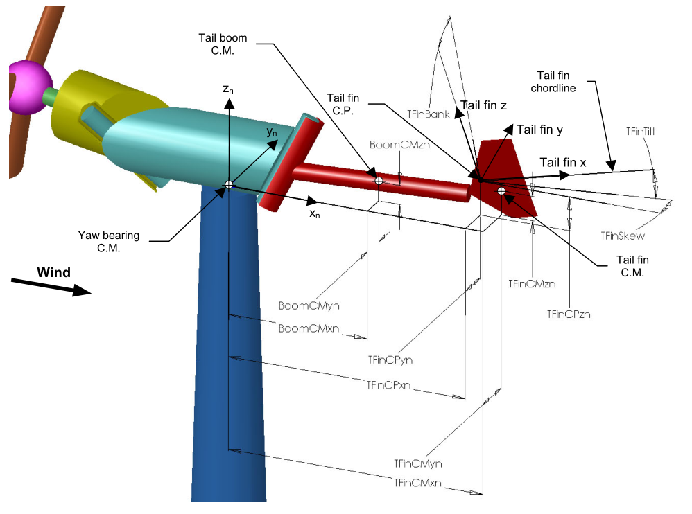

.. _ed_coordsys:

坐标系
======

对于以下小节中未详细说明的坐标系，请参考以下文献：

- :download:`OpenFAST_coords.pdf <../../../OtherSupporting/OpenFAST_coords.pdf>`：2024 年的演示文稿，概述了 OpenFAST 中的一些坐标系。
- `FAST 7 手册 <https://www.nlr.gov/docs/fy06osti/38230.pdf>`_
- 关于 FAST_AD 和阿联酋风力机建模的技术报告（第 3 节）<https://www.nlr.gov/docs/fy04osti/34755.pdf>`_
- :download:`FASTCoordinateSystems.doc <../../../OtherSupporting/ElastoDyn/FASTCoordinateSystems.doc>`：记录了 OpenFAST 中每个坐标系之间的变换矩阵。遗憾的是，本文档中没有绘制这些坐标系的图表。希望可以通过变换矩阵来可视化它们。

.. _ed_rfrl_coordsys:

风轮折叠坐标系
--------------

风轮折叠自由度允许用户对特殊的轴承构型进行建模，该轴承允许风轮和传动链绕塔筒顶部结构的偏航部分旋转。如果风轮折叠轴与风轮主轴对齐，风轮折叠自由度也可以用来建模齿轮箱安装的扭转柔性。为了在模型中包含风轮折叠功能，用户必须在主输入文件中将输入参数 ``Furling`` 设置为 True，以将风力机指定为折叠式机型。然后，用户必须创建折叠输入文件 ``FurlFile``，并使用风轮折叠标志 ``RFrlDOF`` 启用此功能。

风轮的角折叠运动绕风轮折叠轴进行，该轴由 ``FurlFile`` 中的输入参数 ``RFrlPnt_n``、``RFrlSkew`` 和 ``RFrlTilt`` 定义。输入参数 ``RFrlPnt_n`` 确定风轮折叠轴上相对于塔筒顶部的任意一点。输入参数 ``RFrlSkew`` 和 ``RFrlTilt`` 定义了通过该点的风轮折叠轴的角度方向。示意图见 :numref:`figTFAxes`。

轮毂和风轮折叠结构质心的几何参数都是折叠风轮组件的组成部分，它们相对于塔筒顶部定义，如 :numref:`figTFFurl` 所示。选择这种定义方式是为了避免在折叠风轮组件中定义坐标系，因为这样的坐标系很可能具有难以理解的方向，使用户难以输入相对于它的配置信息。这种定义方式还避免了根据风轮折叠组件是否与机舱分开存在而需要不同定义几何参数的复杂性，而这又取决于风力机是否存在风轮折叠功能。

由于折叠风轮组件的部件几何参数是相对于塔筒顶部定义的，因此这些几何参数自然会随风轮折叠角变化。为了避免为不同的风轮折叠位置定义不同的几何参数（例如，初始风轮折叠角的变化），ElastoDyn 要求折叠风轮组件的部件几何参数在风轮折叠角为零时定义/输入。因此，初始风轮折叠角不会影响任何其他风轮折叠几何参数的指定。换句话说，无论初始风轮折叠位置如何，风轮折叠组件部件的输入几何参数定义的是风轮折叠角为零时的风轮配置。用户在创建折叠输入文件时应清楚这一约定。

.. _ed_tfrl_coordsys:

尾翼折叠坐标系
--------------

尾翼折叠自由度允许用户对特殊的轴承构型进行建模，该轴承允许尾翼绕塔筒顶部结构的偏航部分旋转。为了在模型中包含尾翼折叠功能，用户必须在 ElastoDyn 输入文件中将输入参数 ``Furling`` 设置为 True，以将风力机指定为折叠式机型。然后，用户必须创建折叠输入文件 ``FurlFile``，并使用尾翼折叠标志 ``TFrlDOF`` 启用此功能。

尾翼的角折叠运动绕尾翼折叠轴进行，该轴由 ``FurlFile`` 中的输入参数 ``TFrlPnt_n``、``TFrlSkew`` 和 ``TFrlTilt`` 定义。输入参数 ``TFrlPnt_n`` 确定尾翼折叠轴上相对于塔筒顶部的任意一点。示意图见 :numref:`figTFAxes`。

尾梁质心、尾翼质心和尾翼气动表面的几何参数都是折叠尾翼组件的组成部分，它们相对于塔筒顶部定义，如 :numref:`figTFGeom` 所示。选择这种定义方式是为了避免在折叠尾翼组件中定义坐标系，因为这样的坐标系很可能具有难以理解的方向，使用户难以输入相对于它的配置信息。这种定义方式还避免了根据尾翼折叠组件是否与机舱分开存在而需要不同定义几何参数的复杂性，而这又取决于风力机是否存在尾翼折叠功能。

由于折叠尾翼组件的部件几何参数是相对于塔筒顶部定义的，因此这些几何参数自然会随尾翼折叠角变化。为了避免为不同的尾翼折叠位置定义不同的几何参数（例如，初始尾翼折叠角的变化），ElastoDyn 要求折叠尾翼组件的部件几何参数在尾翼折叠角为零时定义/输入。因此，初始尾翼折叠角不会影响任何其他尾翼折叠几何参数的指定。换句话说，无论初始尾翼折叠位置如何，尾翼折叠组件部件的输入几何参数定义的是尾翼折叠角为零时的尾翼配置。用户在创建折叠输入文件时应清楚这一约定。上文的风轮折叠部分提供了关于此折叠几何约定的进一步说明。

.. _figTFAxes:

   三叶片上风式折叠风力机布局：折叠轴

.. _figTFFurl:

   三叶片上风式折叠风力机布局：风轮折叠结构

.. _figTFGeom:

   三叶片上风式折叠风力机布局：尾翼折叠结构。
   注意：尾翼"CP"（压力中心）参数现在已被参考点位置取代。
