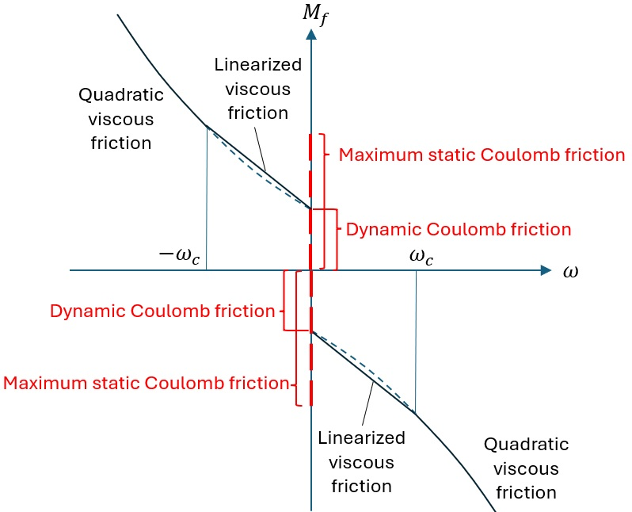

.. _ed_theory:

ElastoDyn 理论
==============

注意：本文档仍在编写中，内容很不完整。本文档最初是为了记录 ElastoDyn 中尾翼折叠和风轮折叠部分的代码更改而编写的。更多文档请参考 :numref:`ed_intro` 中提供的各种资源。

符号约定
--------

**点**

ElastoDyn 定义了以下（部分）点：

- ``Z``：平台参考点
- ``O``：塔筒顶部/底板点
- ``W``：尾翼折叠轴上的指定点
- ``I``：尾梁质心
- ``J``：尾翼质心

**物体**

ElastoDyn 定义了以下（部分）物体：

- ``E``：地球/惯性系
- ``X``：平台体
- ``N``：机舱体
- ``A``：尾翼折叠体

运动学
------

ElastoDyn 从平台参考点 `Z` 开始，沿结构向上计算结构关键点的位置、速度和加速度。

不同的位置向量存储在数据结构 ``RtHSdat`` 中。例如，点 J 的全局位置由下式给出：

.. math::  :label: TFPointJPos

   \boldsymbol{r}_J =  \boldsymbol{r}_Z +  \boldsymbol{r}_{ZO} +  \boldsymbol{r}_{OW} +  \boldsymbol{r}_{WJ}

平移位移向量（一个点相对于其参考位置的移动量）计算如下：:math:`\boldsymbol{r}_J-\boldsymbol{r}_{J,\text{ref}}`。

ElastoDyn 的坐标系存储在变量 ``CoordSys`` 中。给定坐标系的方向矩阵可以使用在惯性系中表示的该坐标系的单位向量（假设为列向量）构建。例如，对于尾翼坐标系：

.. math::  :label: TFPointJOrientation

   \boldsymbol{R}_{Ai} = \begin{bmatrix}
      \left.\boldsymbol{\hat{x}_\text{tf}^t}\right|_i \\
      \left.\boldsymbol{\hat{y}_\text{tf}^t}\right|_i \\
      \left.\boldsymbol{\hat{z}_\text{tf}^t}\right|_i \\
   \end{bmatrix}

角速度存储在变量 ``RtHSdat%AngVelE*`` 中，相对于初始坐标系（"地球"，`E`）。例如，尾翼折叠体（体 `A`）的角速度为：

.. math::  :label: TFPointJAngVel

   \boldsymbol{\omega}_{A/E} =  \boldsymbol{\omega}_{X/E} + \boldsymbol{\omega}_{N/X} + \boldsymbol{\omega}_{A/N}

其中 :math:`\boldsymbol{\omega}_{N/X}=\boldsymbol{\omega}_{B/X}+\boldsymbol{\omega}_{N/B}`

不同点的线（平移）速度可以在变量 ``RtHSdat%LinVelE*`` 中找到，它们是基于凯恩偏速度（速度相对于自由度时间导数的雅可比矩阵）计算的。例如，点 J 的线速度计算为：

.. math:: :label: TFPointJVel

    \boldsymbol{v}_J = \sum_{j} \frac{\partial v_J}{\partial \dot{q}_j} \dot{q}_j

其中雅可比矩阵 :math:`\frac{\partial v_J}{\partial \dot{q}_j}` 存储在 ``RtHSdat%PLinVelEJ(:,0)`` 中。

平移加速度计算为自由度一阶和二阶时间导数贡献的总和。例如，点 `J` 的加速度计算为：

.. math:: :label: TFPointJAng

    \boldsymbol{\tilde{a}}_J &= \sum_{j\in PA} \frac{\partial a_J}{\partial \dot{q}_j} \dot{q}_j
    \boldsymbol{a}_J &= \boldsymbol{\tilde{a}}_J + \sum_{j\in PA} \frac{\partial v_J}{\partial \dot{q}_j} \ddot{q}_j

其中 :math:`\frac{\partial a_J}{\partial \dot{q}_j}` 存储在 ``RtHSdat%PLinVelEJ(:,1)`` 中。

角加速度需要类似的计算，目前尚未记录。

.. _ed_rtfrl_theory:

风轮和尾翼折叠
--------------

用户可以选择线性弹簧和阻尼模型，以及上/下止动弹簧和上/下止动阻尼器。

线性弹簧和阻尼施加的扭矩为：

.. math::  :label: TFLinTorque

   Q_\text{lin} = - k \theta  - d \dot{\theta}

其中 :math:`\theta` 是自由度（风轮或尾翼折叠），
:math:`k` 是线性弹簧常数（``RFrlSpr`` 或 ``TFrlSpr``），
:math:`d` 是线性阻尼常数（``RFrlDmp`` 或 ``TFrlDmp``）。

上/下止动弹簧扭矩定义为：

.. math::  :label: TFStopTorqueSpring

   Q_\text{stop, spr} = \begin{cases}
      - k_{US} (\theta-\theta_{k_{US}}),&\text{如果 } \theta>\theta_{k_{US}}  \\
      - k_{DS} (\theta-\theta_{k_{DS}}),&\text{如果 } \theta<\theta_{k_{DS}}  \\
        0 ,&\text{其他情况}
        \end{cases}

其中：
:math:`k_{US}` 是上止动弹簧常数（``RFrlUSSpr`` 或 ``TFrlUSSpr``），
:math:`\theta_{k_{US}}` 是上止动弹簧角度（``RFrlUSSP`` 或 ``TFrlUSSP``），
下止动弹簧使用类似的符号。

上/下止动阻尼扭矩定义为：

.. math::  :label: TFStopTorqueDamp

   Q_\text{stop, dmp} = \begin{cases}
      - d_{US} \dot{\theta},&\text{如果 } \theta>\theta_{d_{US}}  \\
      - d_{DS} \dot{\theta},&\text{如果 } \theta<\theta_{d_{DS}}  \\
        0 ,&\text{其他情况}
        \end{cases}

使用类似的符号表示。
给定自由度上的总力矩为：

.. math::  :label: TFTotTorque

   Q = Q_\text{lin} + Q_\text{stop,spr} + Q_\text{stop,dmp}

.. _ed_yawfriction_theory:

偏航摩擦模型
------------

ElastoDyn 中基于库仑-粘性方法实现了偏航摩擦模型。偏航摩擦力矩作为偏航速率 (:math:`\omega`) 的函数如下 :numref:`figYawFriction` 所示。

.. _figYawFriction:

   偏航摩擦模型

当 ``YawFrctMod`` = 1 时，最大静库仑摩擦或动库仑摩擦不依赖于偏航轴承上的外部载荷。偏航摩擦力矩 :math:`M_f` 可以按如下方式计算。
如果 :math:`\omega\neq0`，则动摩擦形式为：

.. math::
   M_f = -(\mu_d\bar{D})\cdot\textrm{sign}(\omega) - M_{f,vis},

其中 :math:`\bar{D}` 是有效偏航轴承直径，:math:`\mu_d` 是动库仑摩擦系数。它们的乘积 :math:`\mu_d\bar{D}` 通过输入文件中的 ``M_CD`` 指定。右侧第一项是动库仑摩擦。
粘性摩擦 :math:`M_{f,vis}` 的形式为：

.. math::
   M_{f,vis} = \sigma_v\omega + \sigma_{v2}\omega\left|\omega\right|\qquad\qquad\text{当}~\left|\omega\right|\ge\omega_c,

或：

.. math::
   M_{f,vis} = (\sigma_v + \sigma_{v2}\omega_c)\omega\qquad\qquad\text{当}~\left|\omega\right|\le\omega_c,

其中 :math:`\sigma_v` 和 :math:`\sigma_{v2}` 是线性和二次粘性摩擦系数，:math:`\omega_c` 是截止偏航速率，低于该值时粘性摩擦被线性化。设置 :math:`\omega_c=0` 会禁用粘性摩擦的线性化。

如果 :math:`\omega=0` 且 :math:`\dot{\omega}\neq 0`，则使用略微修改的动库仑摩擦形式：

.. math::
   M_f = -\textrm{min}\!\left(\mu_d\bar{D},\left|M_z\right|\right)\cdot\textrm{sign}(M_z),

其中 :math:`M_z` 是外部偏航扭矩。
如果 :math:`\omega=0` 且 :math:`\dot{\omega}=0`，则静库仑摩擦形式为：

.. math::
   M_f = -\textrm{min}\!\left(\mu_s\bar{D},\left|M_z\right|\right)\cdot\textrm{sign}(M_z),

其中 :math:`\mu_s` 是静库仑摩擦系数。乘积 :math:`\mu_s\bar{D}` 通过输入文件中的 ``M_CSmax`` 指定。

当 ``YawFrctMod`` = 2 时，最大静库仑摩擦或动库仑摩擦取决于偏航轴承上的外部载荷，包括以下比例贡献：轴承轴向载荷的大小 :math:`\left|F_z\right|`（如果 :math:`F_z<0`）、轴承剪切力大小 :math:`\sqrt{F_x^2+F_y^2}` 以及轴承弯矩大小 :math:`\sqrt{M_x^2+M_y^2}`。
如果 :math:`\omega\neq0`，则动摩擦形式为：

.. math::
   M_f = \left(\mu_d\bar{D}\cdot\textrm{min}\!\left(0,F_z\right)-\mu_{df}\bar{D}\sqrt{F_x^2+F_y^2}-\mu_{dm}\sqrt{M_x^2+M_y^2}\right)\cdot\textrm{sign}(\omega) - M_{f,vis},

其中 :math:`M_{f,vis}` 的定义与 ``YawFrctMod`` = 1 时相同。乘积 :math:`\mu_{df}\bar{D}` 和 :math:`\mu_{dm}` 分别通过输入文件中的 ``M_FCD`` 和 ``M_MCD`` 指定。
如果 :math:`\omega=0` 且 :math:`\dot{\omega}\neq 0`，则使用修改后的动库仑摩擦形式：

.. math::
   M_f = -\textrm{min}\!\left(\mu_d\bar{D}\left|\textrm{min}(0,F_z)\right| + \mu_{df}\bar{D}\sqrt{F_x^2+F_y^2} + \mu_{dm}\sqrt{M_x^2+M_y^2},\left|M_z\right|\right)\cdot\textrm{sign}(M_z).

如果 :math:`\omega=0` 且 :math:`\dot{\omega}=0`，则静库仑摩擦形式为：

.. math::
   M_f = -\textrm{min}\!\left(\mu_s\bar{D}\left|\textrm{min}(0,F_z)\right| + \mu_{sf}\bar{D}\sqrt{F_x^2+F_y^2} + \mu_{sm}\sqrt{M_x^2+M_y^2},\left|M_z\right|\right)\cdot\textrm{sign}(M_z),

其中乘积 :math:`\mu_{sf}\bar{D}` 和 :math:`\mu_{sm}` 分别通过输入文件中的 ``M_FCSmax`` 和 ``M_MCSmax`` 指定。

只有当当前时间步的偏航旋转速度和加速度均为零时，才会应用静"粘滞摩擦"（静态贡献超过动库仑摩擦）。如果旋转加速度不为零，则会省略摩擦的静态部分。这是为了说明这样一个事实：在动态情况下，"热"的关节在穿过零速度时可能不会感受到粘滞摩擦 :cite:`ed-hammam2023`。
当 :math:`\omega=0` 时，偏航轴承静摩擦或动摩擦的公式使得摩擦阻力与外部施加的力矩 :math:`M_z` 方向相反，但不会超过它。

叶片桨距动力学
--------------

在 OpenFAST v5 之前，叶片桨距角要么是固定的，要么是根据 ServoDyn 的桨距命令给定的。尽管桨距角可能会根据 ServoDyn 的桨距命令而变化，但叶片根桨距速度和加速度始终为零。如果在 ElastoDyn 中建模叶片，也不会有由于叶片桨距惯性引起的桨距力矩。请注意，当使用 BeamDyn 建模叶片时，只有叶片根节点的桨距速度和加速度为零。根节点之后其余叶片的桨距惯性和扭转仍然被考虑，部分捕获了叶片桨距动力学。

在 OpenFAST v5 中，ElastoDyn 引入了新的叶片桨距自由度 ``PitchDOF``。通过将 ``PitchDOF`` 设置为 true，现在可以在 ElastoDyn 中动态模拟叶片变桨。要使用此功能，用户需要通过 ElastoDyn 输入文件中新增的 ``PBrIner(I)`` 输入提供桨距执行器/轴承绕桨距轴的转动惯量。如果叶片也在 ElastoDyn 中建模（而不是 BeamDyn），则还需要通过新增的 ``BlPIner(I)`` 输入提供未变形叶片绕桨距轴的总转动惯量。请注意，由于 ElastoDyn 不模拟叶片扭转，因此不需要指定分布式叶片桨距惯性。此外，由于叶片弯曲带来的额外贡献，仿真期间的有效叶片桨距转动惯量可能高于 ``BlPIner(I)``。当使用 ElastoDyn 建模叶片时，只需将 ``PBrIner(I)`` 和 ``BlPIner(I)`` 相加即可得到运动方程所需的总桨距转动惯量。只要 ``PBrIner(I)`` 和 ``BlPIner(I)`` 的和保持不变，仿真结果就会相同。当使用 BeamDyn 建模叶片时，``BlPIner(I)`` 会被忽略，因为 BeamDyn 考虑了桨距转动惯量沿叶片的分布，并且也建模了叶片扭转。但是，ElastoDyn 中的 ``PBrIner(I)`` 仍然需要设置合理的值。将 ``PBrIner(I)`` 设置为零或接近零会导致 ElastoDyn 出现数值问题。

当 ``PitchDOF`` 为 true 时，叶片根桨距角是动态求解的，而不是给定的。在这种情况下，ServoDyn 为每个叶片计算桨距执行器扭矩，如下所示：

``BlPitchMom = - PitSpr  * ( BlPitch - BlPitchCom ) - PitDamp * ( BlPRate - BlPRateCom )``

每个叶片的桨距执行器刚度/弹簧常数 ``PitSpr`` 和阻尼 ``PitDamp`` 都在 ServoDyn 输入文件中定义。该执行器扭矩施加在叶片根部。一个大小相等、方向相反的扭矩施加在轮毂上。当 ``PitchDOF`` 为 true 时，ElastoDyn 不直接使用桨距命令 ``BlPitchCom`` 和桨距速率命令 ``BlPRateCom``。（无论 ElastoDyn 中的 ``PitchDOF`` 是否为 true，ServoDyn 都会计算并输出桨距执行器扭矩。但是，当 ``PitchDOF`` 为 false 时，执行器扭矩不会被使用。）

当 ServoDyn 中的主动叶片桨距控制开启时，``BlPitchCom`` 由风力机控制器计算。当主动叶片桨距控制关闭时（``PCMode=0``，或当 ``PCMode>0`` 且 ``t<TPCOn`` 时），``BlPitchCom`` 由 ServoDyn 输入文件中的中性叶片桨距位置 ``PitNeut(I)`` 给出。最后，在桨距机动期间，``BlPitchCom`` 以 ServoDyn 输入文件中给定的恒定速率 ``PitManRat(I)`` 趋近最终桨距位置。

除了桨距位置命令外，ServoDyn 中还增加了桨距速率命令 ``BlPRateCom``。目前，``BlPRateCom`` 仅在 DLL 控制器（``PCMode=5``）或覆盖桨距机动期间可用。在正常运行期间，桨距速率命令基于两个连续控制器步长的桨距设定值使用有限差分估计。在桨距机动期间，桨距速率命令直接设置为 ServoDyn 输入文件中的 ``PitManRat(I)``，直到达到最终桨距位置。当 ``PCMode`` 为 0、3、4 时，或桨距机动完成后，``BlPRateCom`` 为零。

当 ElastoDyn 中的 ``PitchDOF`` 为 true 时，建议使用以下 ServoDyn 设置：

* 当使用 DLL 控制器（``PCMode=5``）时，将 ``BPCutoff`` 设置为适当的值（根据风力机情况约 1 Hz），以避免桨距速率命令中的不连续性。这有助于减少执行器扭矩的大幅波动。相同的低通滤波器会同时应用于桨距命令和桨距速率命令。

* 为了与使用有限差分估计的桨距速率命令保持一致，将 ``DLL_Ramp`` 设置为 true。当 ``DLL_DT`` 大于仿真时间步长时，这可以减少执行器力矩的微小抖动。

* 最后，必须适当设置桨距执行器刚度和阻尼，以获得合理的时间常数（约四分之一秒）和阻尼比（约 0.7）。更高的 ``PitSpr(I)`` 和 ``PitDamp(I)`` 需要更小的时间步长来保证数值稳定性。要获得给定的阻尼周期 ``Td`` 和阻尼比 ``zeta``，可以使用以下方程来获得 ``PitSpr(I)`` 和 ``PitDamp(I)`` 的初始估计值：

``PitSpr  = 4 * pi^2 * ( PBrIner + BlPIner ) / ( Td^2 * ( 1 - zeta^2 ) )``

``PitDamp = 2 * zeta * sqrt( PitSpr * ( PBrIner + BlPIner ) )``

当 ``PitchDOF`` 为 true 时，ElastoDyn 提供以下新的输出通道：

* ``BldPRate1`` - 叶片 1 桨距速率 (deg/s)
* ``BldPRate2`` - 叶片 2 桨距速率 (deg/s)
* ``BldPRate3`` - 叶片 3 桨距速率 (deg/s)
* ``BldPAcc1`` - 叶片 1 桨距加速度 (deg/s^2)
* ``BldPAcc2`` - 叶片 2 桨距加速度 (deg/s^2)
* ``BldPAcc3`` - 叶片 3 桨距加速度 (deg/s^2)

这些输出通道仅在 ``PitchDOF`` 为 true 时有效，正值表示朝向顺桨位置。

如果 ElastoDyn 中的 ``PitchDOF`` 为 false，OpenFAST 将像以前一样运行，当 ServoDyn 禁用时，叶片根桨距角固定为 ElastoDyn 中定义的初始位置，或者设置为 ServoDyn 的桨距命令。将 ``PitchDOF`` 设置为 false 并不意味着叶片桨距角将保持恒定。当 ``PitchDOF`` 为 false 时，ElastoDyn 输入文件中的 ``PBrIner(I)`` 和 ``BlPIner(I)`` 都会被忽略。ServoDyn 输出的桨距执行器扭矩也会被 ElastoDyn 忽略。最后请注意，如果 ServoDyn 已启用但主动叶片桨距控制关闭（``PCMode=0``，或当 ``PCMode>0`` 且 ``t<TPCOn`` 时），ElastoDyn 中指定的初始叶片桨距位置将被 ServoDyn 中的 ``PitNeut(I)`` 取代。

**使用指南**

当在 ElastoDyn 中建模叶片时，启用 ``PitchDOF`` 对叶片根载荷的影响往往更为显著。这是因为否则 ElastoDyn 会完全忽略叶片桨距惯性。当在 BeamDyn 中建模叶片时，影响往往较小，因为（除了根节点的）叶片桨距惯性和叶片扭转始终会被考虑。在这种情况下，在 ElastoDyn 中启用 ``PitchDOF`` 可以让整个叶片（包括根节点）的桨距惯性被包含在动力学中。

此外，``PitchDOF`` 的影响在叶片变桨突然启动或停止后往往更为显著。例如，这可能发生在正常运行期间叶片桨距角饱和时（如果桨距命令没有如上建议进行低通滤波），或者在紧急停机期间，叶片需要快速变桨到顺桨位置并停止。在这些情况下，启用 ``PitchDOF`` 允许 OpenFAST 捕获叶片根部的大桨距力矩，如果在 ElastoDyn 中建模叶片，这些力矩否则会被遗漏。或者，如果在 BeamDyn 中建模叶片，它可以防止叶片根处的桨距速率不连续，并有助于在脉冲式启动或突然停止后立即平滑根力矩的大幅波动。

.. _ed_dev_notes:

开发者注释
==========

**内部坐标系**

ElastoDyn 的不同坐标系存储在变量 ``CoordSys`` 中。ElastoDyn 内部使用的坐标系采用与 OpenFAST 输入/输出坐标系不同的约定。

例如，对于机舱坐标系，在 OpenFAST 中单位轴记为 :math:`x_n,y_n,z_n`，在 ElastoDyn 中记为 :math:`d_1,d_2,d_3`，适用以下转换：
:math:`d_1 = x_n`,
:math:`d_2 =z_n`,
:math:`d_3 =-y_n`。

ElastoDyn 内部定义了以下（部分）坐标系：

- `z`：惯性坐标系
- `a`：塔筒底部坐标系
- `t`：塔筒节点坐标系（每个节点一个）
- `d`：机舱坐标系
- `c`：轴倾斜坐标系
- `rf`：风轮折叠坐标系
- `tf`：尾翼折叠坐标系
- `g`：轮毂坐标系
