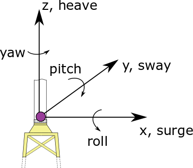

.. _ep-theory:

理论
----

本节介绍 ExtPtfm 模块背后的理论。
该理论发表在以下文章 :cite:`ep-Branlard:2020superelement`
（`在此处访问文章 <https://iopscience.iop.org/article/10.1088/1742-6596/1452/1/012033>`_），可作为本文档的参考。

ExtPtfm 依赖于通过 Craig-Bampton (C-B) 方法进行的动力学系统降阶 :cite:`ep-CraigBampton:1968`。

运动方程的降阶
~~~~~~~~~~~~~~

结构的动力学由以下方程定义：
:math:`\boldsymbol{M}\boldsymbol{\ddot{x}}+\boldsymbol{C}\boldsymbol{\dot{x}}+\boldsymbol{K}\boldsymbol{x}=\boldsymbol{f}`，
其中 :math:`\boldsymbol{M}`、:math:`\boldsymbol{C}`、:math:`\boldsymbol{K}` 是质量、阻尼和刚度矩阵；
:math:`\boldsymbol{x}` 是自由度向量；:math:`\boldsymbol{f}` 是作用在自由度上的载荷向量。
该方程组通常由商用软件为支撑结构建立。
导管架子结构的典型自由度数量约为 :math:`10^3` 到 :math:`10^4`。自由度首先被划分并重排为主导自由度和从属自由度，分别用下标 :math:`l` 和 :math:`f` 标记。对于子结构，选择子结构与塔筒之间界面点的三个平移和三个旋转对应的六个自由度作为主导自由度。假设系统矩阵是对称的，重排后的运动方程为：

.. math:: :label: ReductionGeneralEq

   \begin{aligned}
       \begin{bmatrix}
           \boldsymbol{M}_{{\ell\!\ell}}   & \boldsymbol{M}_{{\ell\!f}} \\
           \boldsymbol{M}_{{\ell\!f}}^t & \boldsymbol{M}_{{\!f\!f}} \\
       \end{bmatrix}
       \begin{bmatrix}
           \boldsymbol{\ddot{x}}_{\ell}\\
           \boldsymbol{\ddot{x}}_{\!f}\\
       \end{bmatrix}
       +
       \begin{bmatrix}
           \boldsymbol{C}_{{\ell\!\ell}}   & \boldsymbol{C}_{{\ell\!f}} \\
           \boldsymbol{C}_{{\ell\!f}}^t & \boldsymbol{C}_{{\!f\!f}} \\
       \end{bmatrix}
       \begin{bmatrix}
           \boldsymbol{\dot{x}}_{\ell}\\
           \boldsymbol{\dot{x}}_{\!f}\\
       \end{bmatrix}
       +
       \begin{bmatrix}
           \boldsymbol{K}_{{\ell\!\ell}}   & \boldsymbol{K}_{{\ell\!f}} \\
           \boldsymbol{K}_{{\ell\!f}}^t & \boldsymbol{K}_{{\!f\!f}} \\
       \end{bmatrix}
       \begin{bmatrix}
           \boldsymbol{x}_{\ell}\\
           \boldsymbol{x}_{\!f}\\
       \end{bmatrix}
       =
       \begin{bmatrix}
           \boldsymbol{f}_{\ell}\\
           \boldsymbol{f}_{\!f}\\
       \end{bmatrix}
   \end{aligned}

CB 降阶假设从属自由度的运动由两部分组成：(1) 如果忽略从属自由度的惯性和外力，响应主导自由度运动的弹性运动；(2) 由外力直接激励内部自由度产生的内部运动。第一部分可以通过假设静力学并求解 :math:`\boldsymbol{x}_{\!f}` 从公式 :eq:`ReductionGeneralEq` 中有效获得，得到：

.. math:: :label: FollowMotion

   \begin{aligned}
       \boldsymbol{x}_{{\!f},\text{Guyan}}
       =  -\boldsymbol{K}_{{\!f\!f}}^{-1} \boldsymbol{K}_{{\ell\!f}}^t\,  \boldsymbol{x}_{{\ell},\text{Guyan}}
       =  \boldsymbol{\Phi}_1  \boldsymbol{x}_{{\ell},\text{Guyan}}
       ,\quad
           \text{where}
       \quad
   \boldsymbol{\Phi}_1 =-\boldsymbol{K}_{{\!f\!f}}^{-1} \boldsymbol{K}_{{\ell\!f}}^t
   \end{aligned}

公式 :eq:`FollowMotion` 在 Guyan 降阶的假设下，给出了从属自由度运动与主导自由度运动的函数关系 :cite:`ep-Guyan:1965`。

CB 方法进一步考虑从属自由度的孤立无阻尼特征值问题：
:math:`\left(\boldsymbol{K}_{{\!f\!f}}-\nu_i^2 \boldsymbol{M}_{\text{ff}}\right) \boldsymbol{\phi}_i=0`，
其中 :math:`\nu_i` 和 :math:`\boldsymbol{\phi}_i` 分别是第 :math:`i` 个角频率和振型；这个问题是"受约束"的，因为它固有地假设主导自由度是固定的（即零）。该方法接下来选择 :math:`n_\text{CB}` 个振型，将它们作为列向量收集到矩阵 :math:`\boldsymbol{\Phi}_2` 中。这些振型可以选择为频率最低的，或者低频和高频振型的混合。通常，:math:`n_\text{CB}` 比原始自由度数量小几个数量级，对于风力机子结构，从约 :math:`10^3` 个自由度减少到约 20 个模态。模态的缩放选择使得 :math:`\boldsymbol{\Phi}_2^t\boldsymbol{M}_{{\!f\!f}}\boldsymbol{\Phi}_2 = \boldsymbol{I}`，其中 :math:`\boldsymbol{I}` 是单位矩阵。实际上，CB 方法执行从完整集合 :math:`\boldsymbol{x}=[\boldsymbol{x}_l\ \boldsymbol{x}_{\!f}]^t` 到降阶集合 :math:`\boldsymbol{x}_r=[\boldsymbol{x}_{r1}\ \boldsymbol{x}_{r2}]^t` 的坐标变换，其中 :math:`\boldsymbol{x}_{r1}` 直接对应于主导自由度，而 :math:`\boldsymbol{x}_{r2}` 是定义所选每个振型振幅的模态坐标。变量变换的正式表达式为：

.. math:: :label: CraigBampton

   \begin{aligned}
       \begin{bmatrix}
       \boldsymbol{x}_l \\
       \boldsymbol{x}_{\!f}\\
       \end{bmatrix}
       \approx
       \begin{bmatrix}
           \boldsymbol{I} & \boldsymbol{0} \\
           \boldsymbol{\Phi}_1 & \boldsymbol{\Phi}_2\\
       \end{bmatrix}
       \begin{bmatrix}
           \boldsymbol{x}_{r1}\\
           \boldsymbol{x}_{r2}\\
       \end{bmatrix}
       \quad\Leftrightarrow \quad
       \boldsymbol{x}\approx \boldsymbol{T} \boldsymbol{x}_r
           ,
       \quad
   \text{with}
       \quad
       \boldsymbol{T}=
       \begin{bmatrix}
           \boldsymbol{I} & \boldsymbol{0} \\
           \boldsymbol{\Phi}_1 & \boldsymbol{\Phi}_2\\
       \end{bmatrix}
   \end{aligned}

通过变换将运动方程重写为这些坐标下的形式：
:math:`\boldsymbol{M}_r =\boldsymbol{T}^t \boldsymbol{M} \boldsymbol{T}`，
:math:`\boldsymbol{K}_r =\boldsymbol{T}^t \boldsymbol{K} \boldsymbol{T}`，
:math:`\boldsymbol{f}_r =\boldsymbol{T}^t \boldsymbol{f}`，
得到 :math:`\boldsymbol{M}_r \boldsymbol{\ddot{x}}_r + \boldsymbol{K_r}\boldsymbol{x}_r=\boldsymbol{f}_r`，展开形式为：

.. math:: :label: CBLoadsReduction

   \begin{aligned}
       &
           \qquad
           \qquad
           \begin{bmatrix}
           \boldsymbol{M}_{r11} & \boldsymbol{M}_{r12} \\
           \boldsymbol{M}_{r12}^t & \boldsymbol{M}_{r22} \\
       \end{bmatrix}
       \begin{bmatrix}
           \boldsymbol{\ddot{x}}_{r1}\\
           \boldsymbol{\ddot{x}}_{r2}\\
       \end{bmatrix}
       +
       \begin{bmatrix}
           \boldsymbol{K}_{r11} & \boldsymbol{0} \\
       \boldsymbol{0} & \boldsymbol{K}_{r22} \\
       \end{bmatrix}
       \begin{bmatrix}
           \boldsymbol{x}_{r1}\\
           \boldsymbol{x}_{r2}\\
       \end{bmatrix}
       =
       \begin{bmatrix}
           \boldsymbol{f}_{r1}\\
           \boldsymbol{f}_{r2}\\
       \end{bmatrix}
       \label{eq:CraigBampton}
   \end{aligned}

其中：

.. math::

   \begin{aligned}
      & \boldsymbol{M}_{r11} = \boldsymbol{M}_{{\ell\!\ell}}
                     + \boldsymbol{\Phi}_\text{1}^t \boldsymbol{M}_{f\!\ell}
                     + \boldsymbol{M}_{\ell\!f}\boldsymbol{\Phi}_\text{1}
                     + \boldsymbol{\Phi}_\text{1}^t \boldsymbol{M}_{\!f\!f}\boldsymbol{\Phi}_{1}
   ,\qquad
       \boldsymbol{M}_{r22}=\boldsymbol{\Phi}_2^t\boldsymbol{M}_{\!f\!f}\boldsymbol{\Phi}_2 =\boldsymbol{I}
   \nonumber
   \\
      & \boldsymbol{M}_{r12} = \left(\boldsymbol{M}_{\ell\!f}+ \boldsymbol{\Phi}_\text{1}^t \boldsymbol{M}_{\!f\!f}\right)\boldsymbol{\Phi}_2
   ,\qquad
       \boldsymbol{f}_{r2} = \boldsymbol{\Phi}_2^t \boldsymbol{f}_{\!f}
   ,\qquad
       \boldsymbol{f}_{r1} = \boldsymbol{f}_{\ell}+\boldsymbol{\Phi}_1^t \boldsymbol{f}_{\!f}
   \nonumber
   \\
      & \boldsymbol{K}_{r11} = \boldsymbol{K}_{{\ell\!\ell}} + \boldsymbol{K}_{\ell\!f}\boldsymbol{\Phi}_1
   ,\qquad
       \boldsymbol{K}_{r22}=\boldsymbol{\Phi}_2^t\boldsymbol{K}_{\!f\!f}\boldsymbol{\Phi}_2
       \nonumber
   \end{aligned}

降阶阻尼矩阵的表达式 :math:`\boldsymbol{C}_r=\boldsymbol{T}^t \boldsymbol{C} \boldsymbol{T}` 与质量矩阵的类似，只是 :math:`\boldsymbol{C}_{r22}` 不等于单位矩阵。有些工具或从业者可能不计算降阶阻尼矩阵，而是基于瑞利阻尼假设，使用降阶质量和刚度矩阵来设置。在公式 :eq:`CraigBampton` 中设置 :math:`\boldsymbol{\Phi}_2\equiv 0`，或者等效地设置 :math:`n_\text{CB}\equiv 0`，将得到 Guyan 降阶方程。

与其他结构的耦合
~~~~~~~~~~~~~~

本节说明当超单元与其他结构耦合时如何建立运动方程。下面介绍的模块化方法是 OpenFAST 中实现的方法。
这里假设超单元代表子结构（和基础），但它也可以应用于风力机的其他部分，特别是整个支撑结构。为简单起见，这里假设所有子结构主导自由度都与结构的其余部分有接口。接口自由度标记为索引 :math:`1`，子结构内部自由度标记为索引 :math:`2`，其余自由度标记为 :math:`0`。上一段中使用的下标 :math:`r` 对于自由度被省略，但对于矩阵保留。使用这种标记，系统 :math:`0\text{--}1` 由塔筒和转子机舱组件组成，系统 :math:`1\text{--}2` 是子结构，向量 :math:`\boldsymbol{x}_1` 是过渡件顶部的六个自由度。为简化方程，省略了阻尼项，但它们的包含是直接的。接下来介绍两种建立运动方程的方法，整体方法或模块化方法（参见例如 :cite:`ep-Branlard:2020superelement`）。

**整体方法**：

在这种方法中，将所有自由度收集到一个状态向量中，求解完整的方程组。方程组通过组装不同子系统的各个质量和刚度矩阵获得。使用公式 :eq:`CraigBampton`，以整体形式写出的系统运动方程为：

.. math:: :label: Monolith

   \begin{aligned}
       \begin{bmatrix}
           \boldsymbol{M}_{00} & \boldsymbol{M}_{01}             & \boldsymbol{0}       \\
                      & \boldsymbol{M}_{11}+\boldsymbol{M}_{r11} & \boldsymbol{M}_{r12} \\
          \text{sym} &                         & \boldsymbol{M}_{r22} \\
       \end{bmatrix}
       \begin{bmatrix}
           \boldsymbol{\ddot{x}}_0\\
           \boldsymbol{\ddot{x}}_1\\
           \boldsymbol{\ddot{x}}_2\\
       \end{bmatrix}
       +
       \begin{bmatrix}
           \boldsymbol{K}_{00}        & \boldsymbol{K}_{01}  &  \boldsymbol{0} \\
                             & \boldsymbol{K}_{11} + \boldsymbol{K}_{r11} &  \boldsymbol{0} \\
           \text{sym}        &             & \boldsymbol{K}_{r22}\\
       \end{bmatrix}
       \begin{bmatrix}
           \boldsymbol{x}_0\\
           \boldsymbol{x}_1\\
           \boldsymbol{x}_2\\
       \end{bmatrix}
       =
       \begin{bmatrix}
           \boldsymbol{f}_0\\
           \boldsymbol{f}_1 + \boldsymbol{f}_{r1}\\
           \boldsymbol{f}_{r2}\\
       \end{bmatrix}
       \end{aligned}

**模块化方法**：
在这种方法中，为每个子系统编写运动方程。与其他子系统的耦合使用外部载荷和约束（这里不需要）引入。两个系统之间在 :math:`1` 处的耦合载荷向量通常由三个力和三个力矩组成，写为 :math:`\boldsymbol{f}_C`。系统 :math:`0\text{--}1` 的运动方程为：

.. math:: :label: moduleA

   \begin{aligned}
       \begin{bmatrix}
           \boldsymbol{M}_{00} & \boldsymbol{M}_{01} \\
           \text{sym} & \boldsymbol{M}_{11} \\
       \end{bmatrix}
       \begin{bmatrix}
           \boldsymbol{\ddot{x}}_0\\
           \boldsymbol{\ddot{x}}_1\\
       \end{bmatrix}
       +
       \begin{bmatrix}
           \boldsymbol{K}_{00}        & \boldsymbol{K}_{01} \\
           \text{sym}        & \boldsymbol{K}_{11} \\
       \end{bmatrix}
       \begin{bmatrix}
           \boldsymbol{x}_0\\
           \boldsymbol{x}_1\\
       \end{bmatrix}
       =
       \begin{bmatrix}
           \boldsymbol{f}_0\\
           \boldsymbol{f}_1\\
       \end{bmatrix}
       +
       \begin{bmatrix}
           \boldsymbol{0}\\
           \boldsymbol{f}_{C}\\
       \end{bmatrix}
       \end{aligned}

系统 :math:`1-2` 从系统 :math:`0-1` 接收相反的力 :math:`\boldsymbol{f}_C`，导致系统 :math:`1\text{--}2` 的以下方程组：

.. math:: :label: moduleB

   \begin{aligned}
       \begin{bmatrix}
           \boldsymbol{M}_{r11} & \boldsymbol{M}_{r12} \\
           \text{sym}  & \boldsymbol{M}_{r22} \\
       \end{bmatrix}
       \begin{bmatrix}
           \boldsymbol{\ddot{x}}_1\\
           \boldsymbol{\ddot{x}}_2\\
       \end{bmatrix}
       +
       \begin{bmatrix}
          \boldsymbol{K}_{r11} & \boldsymbol{0}       \\
          \text{sym}  & \boldsymbol{K}_{r22} \\
       \end{bmatrix}
       \begin{bmatrix}
           \boldsymbol{x}_1\\
           \boldsymbol{x}_2\\
       \end{bmatrix}
       =
       \begin{bmatrix}
           \boldsymbol{f}_{r1}\\
           \boldsymbol{f}_{r2}\\
       \end{bmatrix}
       -
       \begin{bmatrix}
           \boldsymbol{f}_{C}\\
           \boldsymbol{0}\\
       \end{bmatrix}
       \end{aligned}

*ExtPtfm* 模块的状态空间表示
~~~~~~~~~~~~~~~~~~~~~~~~~~~~~

以下部分详细介绍了将 CB 方法实现到 *ExtPtfm* 中以建模固定式基础子结构的过程。

*ExtPtfm* 在给定界面节点运动 :math:`\boldsymbol{x}_1`、:math:`\boldsymbol{\dot{x}}_1`、:math:`\boldsymbol{\ddot{x}}_1` 的情况下，提供界面处的耦合载荷 :math:`\boldsymbol{f}_C`。界面处使用的六个自由度 :math:`\boldsymbol{x}_1`（纵荡、横荡、垂荡、横滚、俯仰和偏航）和坐标系在 :numref:`epdof` 中给出。

.. _epdof:

   界面自由度

*ExtPtfm* 以包含状态方程和输出方程的形式编写。对于线性系统，这些方程采用以下形式：

.. math:: :label: StateSpaceForm

   \begin{aligned}
       \boldsymbol{\dot{x}}&=\boldsymbol{X}(\boldsymbol{x},\boldsymbol{u}, t) = \boldsymbol{A} \boldsymbol{x}+\boldsymbol{B}\boldsymbol{u} + \boldsymbol{f}_x \\
       \boldsymbol{y} &= \boldsymbol{Y}(\boldsymbol{x},\boldsymbol{u}, t) = \boldsymbol{C} \boldsymbol{x}+\boldsymbol{D}\boldsymbol{u} + \boldsymbol{f}_y
   \end{aligned}

其中 :math:`\boldsymbol{x}` 是模块的状态向量，:math:`\boldsymbol{u}` 是输入向量，:math:`\boldsymbol{y}` 是输出向量。模块的输入向量是界面节点的运动 :math:`\boldsymbol{u}=[\boldsymbol{x}_1, \boldsymbol{\dot{x}}_1, \boldsymbol{\ddot{x}}_1]^t`，而输出向量是界面节点处的耦合载荷 :math:`\boldsymbol{y}=[\boldsymbol{f}_{C}]^t`。状态向量由 CB 模态的运动和速度组成 :math:`\boldsymbol{x}=[\boldsymbol{x}_2, \boldsymbol{\dot{x}}_2]^t`。每个向量的维度为：:math:`\boldsymbol{x}(2n_\text{CB}\times 1)`、:math:`\boldsymbol{u} (18\times 1)`、:math:`\boldsymbol{y} (6\times 1)`。

公式 :eq:`moduleB` 被重写为公式 :eq:`StateSpaceForm` 的状态空间形式如下。展开 :eq:`moduleB` 的第二个块行以隔离 :math:`\boldsymbol{\ddot{x}}_2`。使用 :math:`\boldsymbol{M}_{r22}=\boldsymbol{I}` 并重新引入阻尼矩阵以完整性，得到：

.. math:: :label: xddot2

   \begin{aligned}
   \boldsymbol{\ddot{x}}_2=\boldsymbol{f}_{r2}-\boldsymbol{M}_{r12}^t\boldsymbol{\ddot{x}}_1-\boldsymbol{K}_{r22} \boldsymbol{x}_2 -\boldsymbol{C}_{r12}^t\boldsymbol{\dot{x}}_1 -\boldsymbol{C}_{r22}\boldsymbol{\dot{x}}_2
   \end{aligned}

然后可以直接识别出公式 :eq:`StateSpaceForm` 中状态空间关系的矩阵（引用自 :cite:`ep-Branlard:2020superelement`）：

.. math::

   \begin{aligned}
       \boldsymbol{A}=
       \begin{bmatrix}
           \boldsymbol{0} & \boldsymbol{I}\\
           -\boldsymbol{K}_{r22} & -\boldsymbol{C}_{r22}\\
       \end{bmatrix}
       ,\qquad
       \boldsymbol{B}=
       \begin{bmatrix}
         \boldsymbol{0}& \boldsymbol{0}&  \boldsymbol{0}\\
         \boldsymbol{0}& -\boldsymbol{C}_{r12}^t&   -\boldsymbol{M}_{r12}^t \\
       \end{bmatrix}
       ,\qquad
       \boldsymbol{f}_x=
       \begin{bmatrix}
           \boldsymbol{0}  \\
         \boldsymbol{f}_{r2}\\
       \end{bmatrix}
      \end{aligned}

从公式 :eq:`moduleB` 的第一个块行中隔离 :math:`\boldsymbol{f}_{C}`，并使用公式 :eq:`xddot2` 中 :math:`\boldsymbol{\ddot{x}}_2` 的表达式，得到：

.. math::

   \begin{aligned}
       \boldsymbol{f}_{C}
                  =& \boldsymbol{f}_{r1} - \boldsymbol{M}_{r11}\boldsymbol{\ddot{x}}_1 - \boldsymbol{C}_{r11}\boldsymbol{\dot{x}}_1 - \boldsymbol{C}_{r12}\boldsymbol{\dot{x}}_2 - \boldsymbol{K}_{r11}\boldsymbol{x}_1 \nonumber\\
                   &- \boldsymbol{M}_{r12}
       (\boldsymbol{f}_{r2}-\boldsymbol{M}_{r12}^t\boldsymbol{\ddot{x}}_1 -\boldsymbol{C}_{r12}^t\boldsymbol{\dot{x}}_1 -\boldsymbol{C}_{r22}\boldsymbol{\dot{x}}_2-\boldsymbol{K}_{r22} \boldsymbol{x}_2)\end{aligned}

然后识别输出 :math:`\boldsymbol{y}` 的矩阵（引用自 :cite:`ep-Branlard:2020superelement`）：

.. math::

   \begin{aligned}
       \boldsymbol{C}&=
       \begin{bmatrix}
           \boldsymbol{M}_{r12}\boldsymbol{K}_{r22} & \boldsymbol{M}_{r12}\boldsymbol{C}_{r22}-\boldsymbol{C}_{r12}\\
       \end{bmatrix}
       ,\qquad
       \qquad
       \boldsymbol{f}_y=
       \begin{bmatrix}
           \boldsymbol{f}_{r1} - \boldsymbol{M}_{r12}\boldsymbol{f}_{r2}\\
       \end{bmatrix} \\
       \boldsymbol{D}&=
       \begin{bmatrix}
           -\boldsymbol{K}_{r11} & -\boldsymbol{C}_{r11} + \boldsymbol{M}_{r12}\boldsymbol{C}_{r12}^t & -\boldsymbol{M}_{r11}+\boldsymbol{M}_{r12}\boldsymbol{M}_{r12}^t \\
       \end{bmatrix}
      \end{aligned}

所有标记为"r"的块矩阵和向量都通过输入文件提供给模块。在给定的时间步，载荷 :math:`\boldsymbol{f}_r(t)` 通过对输入文件中给出的载荷进行线性插值计算，并求解状态方程得到 :math:`\boldsymbol{x}`，输出返回给 *OpenFAST* 的粘合代码。

粘合代码还可以在给定时间或工作点处执行完整系统的线性化，使用每个模块状态方程的雅可比矩阵。由于 *ExtPtfm* 的公式是线性的，状态和输出方程相对于模块状态和输入的雅可比矩阵为：

.. math::

   \begin{aligned}
       \frac{\partial \boldsymbol{X}}{\partial \boldsymbol{x}} = \boldsymbol{A}
       ,\quad
       \frac{\partial \boldsymbol{Y}}{\partial \boldsymbol{x}} = \boldsymbol{C}
       ,\quad
       \frac{\partial \boldsymbol{X}}{\partial \boldsymbol{u}} = \boldsymbol{B}
       ,\quad
       \frac{\partial \boldsymbol{Y}}{\partial \boldsymbol{u}} = \boldsymbol{D}
      \end{aligned}

ExtPtfm 的线性化已在模块中实现，但在粘合代码（OpenFAST）层面仍有一些工作要做，以实现完整系统的线性化。
