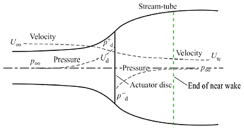
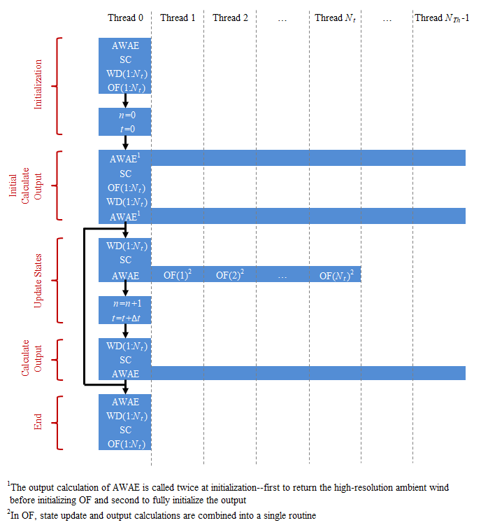
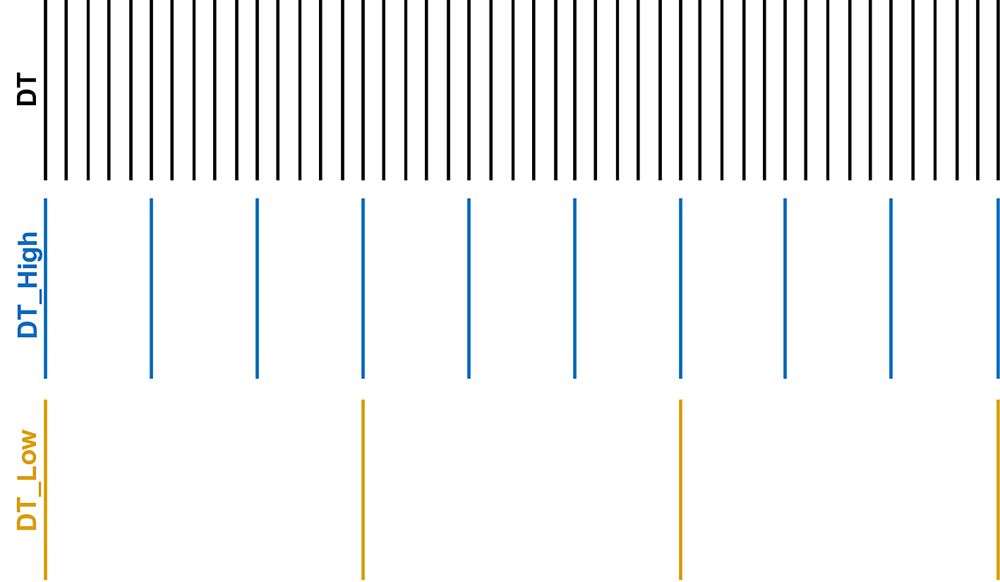
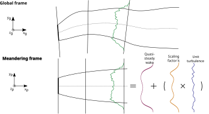
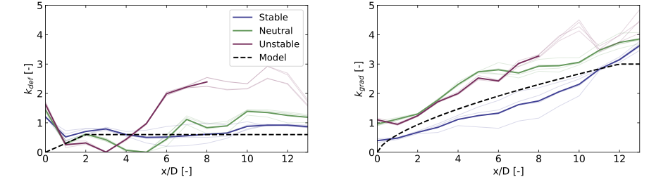
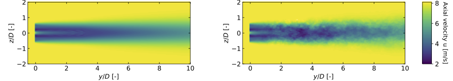

.. _FF:Theory:

FAST.Farm 理论
================

FAST.Farm 是一款多物理场工程工具，用于预测风电场内风力机的性能和载荷。FAST.Farm 使用 `OpenFAST <https://github.com/OpenFAST/openfast>`__ 求解每台独立风力机的气动-水动-伺服-弹性动力学，但同时考虑了大气边界层中风电场范围的环境风的额外物理效应，以及尾流亏损、平流、偏转、蜿蜒和融合。FAST.Farm 基于动态尾流蜿蜒（DWM）模型的原理，包括尾流蜿蜒的被动示踪剂建模，但解决了先前 DWM 实现的许多局限性。

.. _FF:DWMPrincipals:

动态尾流蜿蜒原理及解决的局限性
------------------------------------------------------------

DWM 模型背后的核心思想是捕获与准确预测风电场功率性能和风力机载荷相关的关键尾流特征，包括尾流亏损演化（对性能很重要）以及尾流蜿蜒和尾流附加湍流（对载荷很重要，参见 :numref:`FF:WAT`）。
尽管应用了基本物理定律，但为了最小化计算成本进行了适当的简化，并使用高保真建模（HFM）解决方案来为子模型提供信息和校准。在 DWM 模型中，尾流流动过程通过“尺度分离”来处理，其中小湍流涡（小于两倍直径）影响尾流亏损演化，大湍流涡（大于两倍直径）影响尾流蜿蜒。

风力机转子的推力的存在会导致刚好在转子上风侧的风速降低和压力升高。在紧邻转子下游的近尾流区域（如 :numref:`FF:NearWake`所示），相干涡破裂，压力恢复到自由流水平，风速进一步降低，尾流径向膨胀。在更下游的远尾流区域，尾流亏损近似高斯分布，并通过尾流剪切层中环境风的动量湍流传递到尾流中，恢复到自由流水平。这种流速降低并逐渐恢复到自由流的过程称为尾流亏损演化。在大多数 DWM 实现中，尾流亏损演化是通过轴对称坐标系下准稳态条件的雷诺平均纳维-斯托克斯方程的薄剪切层近似建模的（如 :numref:`FF:WakeAdv`所示）。湍流闭合通过使用依赖于小湍流涡的涡黏性公式实现。这种尾流亏损演化求解仅在远尾流中有效。远尾流对于风电场分析最为重要，因为风力机通常不会紧密排布。然而，由于尾流亏损演化求解从转子开始，因此在入口边界条件处应用近尾流校正以提高远尾流求解的准确性。

   近尾流区域。

尾流蜿蜒是大湍流涡输运尾流亏损的大尺度运动。这种尾流蜿蜒过程在 DWM 中采用实用方法处理 (:cite:`ff-Larsen08_1`)，将蜿蜒建模为被动示踪剂，将尾流亏损横向（水平和垂直）转移到移动参考系（MFoR）中（如 :numref:`FF:WakeMeandering`所示），基于尾流平面上空间平均的环境风（包括大湍流涡）。

尾流附加湍流是尾流中湍流混合产生的额外小尺度湍流。在 DWM 中通常通过放大背景（未扰动）湍流来建模（参见 :numref:`FF:WAT`）。

已经实现了多种 DWM 变体，例如由丹麦技术大学 (:cite:`ff-Madsen10_1,ff-Madsen16_1`) 和马萨诸塞大学 (:cite:`ff-Hao14_1,ff-Churchfield15_1,ff-Hao16_1`) 开发的版本。尽管现有 DWM 实现的具体局限性取决于实现方式，但在开发 FAST.Farm 中解决的特定局限性总结在 :numref:`FF:tab:DWMImprovs`中，并在下一节适当位置进行讨论。

.. table:: FAST.Farm 解决的动态尾流蜿蜒局限性
   :name: FF:tab:DWMImprovs

   +-----------------------------------------+-----------------------------------------+
   | **局限性**                              | **解决方案/创新**                        |
   +=========================================+=========================================+
   | - 环境风针对每个单独转子求解，并基于    | - 可选择从高保真实前求解中计算整个风    |
   |   泰勒冻结湍流假设合成生成；在整个风    |   电场范围的环境风。                     |
   |   电场内不一致，或不基于中尺度条件或    |                                          |
   |   局地地形。                            |                                          |
   +-----------------------------------------+-----------------------------------------+
   | - 尾流以平均环境风速平流，不会从近尾    | - 尾流基于局地空间平均的环境风速和尾    |
   |   流到远尾流加速，也不受局地流动条件    |   流亏损平流。                           |
   |   影响。                                |                                          |
   +-----------------------------------------+-----------------------------------------+
   | - 尾流亏损不会因入流偏斜而发生畸变      | - 尾流亏损在平行于转子盘的平面内求解。  |
   |   （即向下游看时尾流呈圆形，而非椭圆    | - 尾流中心线基于入流偏斜发生偏转。       |
   |   形）。                                |                                          |
   | - 尾流中心线不会因入流偏斜而偏转。      |                                          |
   +-----------------------------------------+-----------------------------------------+
   | - 尾流亏损和中心线仅基于平均条件，不    | - 尾流亏损和中心线基于低通滤波的入流、   |
   |   会针对入流瞬态、风力机控制或风力机    |   风力机控制和风力机运动更新。           |
   |   运动进行更新（后者对于浮式海上风力    |                                          |
   |   机尤其重要）。                        |                                          |
   +-----------------------------------------+-----------------------------------------+
   | - 独立风力机和尾流动力学单独或串行求    | - 独立风力机和尾流动力学在多个内核上并    |
   |   解，不考虑双向尾流融合相互作用。      |   行求解。                               |
   | - 尾流撞击仅基于最强尾流亏损，不考虑    | - 下游风力机的尾流亏损依赖于上游风力机   |
   |   多台上游风力机的累积效应，和/或尾流    |   的尾流撞击。                           |
   |   撞击处理方法在额定风速上下采用不同    | - 尾流亏损基于根平方和方法在轴向叠加。   |
   |   处理方式（即离散变化）。              |                                          |
   | - 没有可用方法计算尾流重叠区域的扰动    |                                          |
   |   风。                                  |                                          |
   +-----------------------------------------+-----------------------------------------+
   | - 尾流蜿蜒速度采用均匀空间平均计算，    | - 尾流蜿蜒速度采用可选的加权空间平均计    |
   |   导致蜿蜒程度低于预期，且频率不正确。  |   算，基于 jinc 函数实现更接近理想的低通 |
   |                                         |   滤波。                                 |
   | - 尾流仅横向蜿蜒，不轴向蜿蜒。          | - 尾流同时横向和轴向蜿蜒。               |
   +-----------------------------------------+-----------------------------------------+

.. _FF:TheoryBasis:

FAST.Farm 理论基础
----------------------

FAST.Farm 是一款非线性时域多物理场工程工具，由多个子模型组成，每个子模型代表风电场的不同物理领域。FAST.Farm 作为开源软件实现，遵循 FAST 模块化框架的编程要求 (:cite:`ff-Jonkman13_1`)，子模型被实现为通过驱动代码互连的模块。FAST.Farm 的子模型层次结构如 :numref:`FF:FFarm`所示。尾流平流、偏转和蜿蜒；近尾流校正；以及尾流亏损增量是尾流动力学（WD）模型的子模型，在单个模块中实现。环境风和尾流融合是环境风与阵列效应（AWAE）模型的子模型，在单个模块中实现。结合 OpenFAST（OF）模块，FAST.Farm 共有三个模块和一个驱动程序。*OF* 和 *WD* 模块有多个实例，每个风力机/转子对应一个实例。每个子模型/模块将在以下小节中描述。

FAST.Farm 可以串行或并行模式编译和运行。FAST.Farm 通过 OpenMP 实现并行化，这使得 FAST.Farm 能够利用多核计算机，通过在节点内的核心/线程之间分配计算任务（但不跨节点）来加速单个仿真。这一过程如 :numref:`FF:Parallel`所示，其中线程数 (:math:`N_{Th}`) 大于风力机数 (:math:`N_t`)。*AWAE* 模块有一个实例，*OF* 和 *WD* 模块有 :math:`N_t`个实例。图中显示了每个模块的初始化、状态更新、输出计算和结束调用。*AWAE* 的输出计算在所有线程上并行化。在时间推进过程中，每个 *OF*实例并行求解，同时 *AWAE*模块读取环境风数据。

   FAST.Farm 并行化流程。

风电场大小和风力机数量仅受可用内存限制。在并行模式下，OpenFAST 子模型的每个实例可以在单独的线程上并行运行。同时，*AWAE*模块内的环境风在另一个线程上读入内存。因此，最快的仿真需要比风电场中的风力机数量多至少一个核心。此外，*AWAE*模块内的输出计算被并行化为单独的线程。为了支持大型风电场建模，可能需要通过消息传递接口（MPI）实现内存并行化和在多核高性能计算机（HPC）的节点之间并行化单个仿真。MPI 尚未在 FAST.Farm 中实现。然而，多核 HPC 可以用于在单独的节点上并行（批处理模式）运行多个串行或并行仿真。在串行模式下，多个串行仿真可以在单独的核心和/或节点上并行（批处理模式）运行。

.. _FF:Driver:

FAST.Farm 驱动程序
~~~~~~~~~~~~~~~~~~~~

FAST.Farm 驱动程序，也称为“粘合代码”，是将各个模块耦合在一起并推动整体时域求解前进的代码。此外，FAST.Farm 驱动程序读取仿真参数输入文件，检查这些参数的有效性，初始化模块，将结果写入文件，并在仿真结束时释放内存。

为了简化 FAST.Farm 驱动程序中的耦合算法并确保计算效率，FAST.Farm 中的所有模块状态 (:math:`x^d`)、输入 (:math:`u^d`)、输出 (:math:`y^d`) 和函数（状态更新用 :math:`X^d`，输出用 :math:`Y^d`）都表示为离散时间形式，即 :math:`t=n\Delta t`，其中 :math:`t`是时间，:math:`n`是离散时间步计数器，:math:`\Delta t`是用户指定的离散时间步（增量）。因此，FAST.Farm 中模块的最一般形式比 FAST 模块化框架允许的形式更简单 (:cite:`ff-Jonkman13_1`)，数学表达式为： [1]_

.. math::
   \begin{aligned}
       x^d\left[ n+1 \right]=X^d\left( x^d\left[ n \right],u^d\left[ n \right],n \right)\\
       y^d\left[ n \right]=Y^d\left( x^d\left[ n \right],u^d\left[ n \right],n \right)
   \end{aligned}

*OF* 和 *WD* 模块没有输入到输出的直接馈通，这意味着相应的输出函数简化为 :math:`y^d\left[ n \right]=Y^d\left( x^d\left[ n \right],n \right)`。*OF*模块能够以上述形式编写的原因在 :numref:`FF:OF`中解释。此外，*AWAE*模块没有状态，将模块简化为仅前馈系统，模块形式简化为 :math:`y^d\left[ n \right]=Y^d\left( u^d\left[ n \right],n \right)`。对于本手册中的函数，方括号 :math:`\left[\quad\right]`表示离散函数，圆括号 :math:`\left(\quad\right)`表示连续函数；当隐含时括号会被省略。FAST.Farm 每个模块（*OF*、*WD*和 *AWAE*）的状态、输入和输出列于 :numref:`FF:tab:modules`中，并在以下章节进一步解释。

.. table:: FAST.Farm 中的模块状态、输入和输出
   :name: FF:tab:modules

   +-----------------------------------------+---------------------------------------------------------------------+-----------------------------------------------------------------+--------------------------------------------------------------------------+
   | **模块**                                | **状态（离散时间）**                                                | **输入**                                                        | **输出**                                                                 |
   +=========================================+=====================================================================+=================================================================+==========================================================================+
   | *OpenFAST (OF)*                         | - OpenFAST 包装器中没有状态，但 OpenFAST 内部有很多状态             | - 全局控制器命令                                                | - 来自独立风力机控制器的命令/测量值                                       |
   |                                         |                                                                     | - 到独立风力机控制器的命令                                      | - :math:`\hat{x}^\text{Disk}`                                            |
   |                                         |                                                                     | - :math:`\vec{V}_\text{Dist}^\text{High}`                       | - :math:`\vec{p}^\text{Hub}`                                             |
   |                                         |                                                                     |                                                                 | - :math:`D^\text{Rotor}`                                                 |
   |                                         |                                                                     |                                                                 | - :math:`\gamma^\text{YawErr}`                                           |
   |                                         |                                                                     |                                                                 | - :math:`^\text{DiskAvg}V_x^\text{Rel}`                                  |
   |                                         |                                                                     |                                                                 | - :math:`^\text{AzimAvg}C_t\left( r \right)`                             |
   +-----------------------------------------+---------------------------------------------------------------------+-----------------------------------------------------------------+--------------------------------------------------------------------------+
   | *Wake Dynamics (WD)*                    | - :math:`^\text{FiltDiskAvg}V_x^\text{Rel}`                         | - :math:`\hat{x}^\text{Disk}`                                   | 对于 :math:`0 \le n_p \le N_p-1`：                                       |
   |                                         | - :math:`^\text{FiltAzimAvg}C_t\left( r \right)`                    | - :math:`\vec{p}^\text{Hub}`                                    |                                                                          |
   |                                         |                                                                     | - :math:`D^\text{Rotor}`                                        | - :math:`\hat{x}_{n_p}^\text{Plane}`                                     |
   |                                         | 对于 :math:`0 \le n_p \le N_p-1`：                                  | - :math:`\gamma^\text{YawErr}`                                  | - :math:`\vec{p}_{n_p}^\text{Plane}`                                     |
   |                                         |                                                                     | - :math:`^\text{DiskAvg}V_x^\text{Rel}`                         | - :math:`V_{x_{n_p}}^\text{Wake}\left(r\right)`                          |
   |                                         | - :math:`^\text{Filt}D_{n_p}^\text{Rotor}`                          | - :math:`^\text{AzimAvg}C_t\left( r \right)`                    | - :math:`V_{r_{n_p}}^\text{Wake}\left(r\right)`                          |
   |                                         | - :math:`^\text{Filt}\gamma_{n_p}^\text{YawErr}`                    | - :math:`\vec{V}_{n_p}^\text{Plane}` （对于 :math:`0\le n_p\le N_p-1`） | - :math:`D_{n_p}^\text{Wake}`                                            |
   |                                         | - :math:`^\text{Filt}\vec{V}_{n_p}^\text{Plane}`                    | - :math:`^\text{DiskAvg}V_x^\text{Wind}`                        |                                                                          |
   |                                         | - :math:`^\text{FiltDiskAvg}V_{x_{n_p}}^\text{Wind}`                | - :math:`TI_\text{Amb}`                                         |                                                                          |
   |                                         | - :math:`^\text{Filt}TI_{\text{Amb}_{n_p}}`                         |                                                                 |                                                                          |
   |                                         | - :math:`x_{n_p}^\text{Plane}`                                      |                                                                 |                                                                          |
   |                                         | - :math:`\hat{x}_{n_p}^\text{Plane}`                                |                                                                 |                                                                          |
   |                                         | - :math:`\vec{p}_{n_p}^\text{Plane}`                                |                                                                 |                                                                          |
   |                                         | - :math:`V_{x_{n_p}}^\text{Wake}\left(r\right)`                     |                                                                 |                                                                          |
   |                                         | - :math:`V_{r_{n_p}}^\text{Wake}\left(r\right)`                     |                                                                 |                                                                          |
   +-----------------------------------------+---------------------------------------------------------------------+-----------------------------------------------------------------+--------------------------------------------------------------------------+
   | *Ambient Wind and Array Effects (AWAE)* | - 无                                                                | 对于每个风力机和 :math:`0 \le n_p \le N_p-1`：                   | 对于每个风力机：                                                         |
   |                                         |                                                                     |                                                                 |                                                                          |
   |                                         |                                                                     | - :math:`\hat{x}_{n_p}^\text{Plane}`                            | - :math:`\vec{V}_\text{Dist}^\text{High}`                                |
   |                                         |                                                                     | - :math:`\vec{p}_{n_p}^\text{Plane}`                            | - :math:`\vec{V}_{n_p}^\text{Plane}` （对于 :math:`0 \le n_p \le N_p-1`） |
   |                                         |                                                                     | - :math:`V_{x_{n_p}}^\text{Wake}\left(r\right)`                 | - :math:`^\text{DiskAvg}V_x^\text{Wind}`                                 |
   |                                         |                                                                     | - :math:`V_{r_{n_p}}^\text{Wake}\left(r\right)`                 | - :math:`TI_\text{Amb}`                                                  |
   |                                         |                                                                     | - :math:`D_{n_p}^\text{Wake}`                                   |                                                                          |
   +-----------------------------------------+---------------------------------------------------------------------+-----------------------------------------------------------------+--------------------------------------------------------------------------+

初始化后，在每个时间步内，每个模块（*OF* 和 *WD*）的状态都会更新（从时间 :math:`t` 到 :math:`t+\Delta t`，或者等价地，从 :math:`n` 到 :math:`n+1`）；时间递增；模块输出被计算并作为输入传输到其他模块。由于形式简化，每个模块的状态更新可以并行求解；输出到输入的传输不需要大型非线性求解；并且不需要整体求解的校正步骤。没有校正步骤是 OpenFAST 中使用的耦合算法的主要简化 (:cite:`ff-Sprague14_1,ff-Sprague15_1`)。此外，*OF* 和 *WD*模块的输出计算可以并行化，然后是 *AWAE*模块的输出计算。 [2]_ 在并行模式下，FAST.Farm 通过 OpenMP 实现并行化。

由于时间尺度小且物理机制复杂，OpenFAST 子模型是 FAST.Farm 模块中计算速度最慢的。此外，*AWAE*模块的输出计算是唯一无法与 OpenFAST 并行求解的主要计算。因此，并行化的 FAST.Farm 解决方案在最快情况下可能仅比独立 OpenFAST 仿真稍慢。这使得仿真的计算成本足够低，可以运行风力机/风电场设计和分析所需的大量仿真。

.. _FF:OF:

OpenFAST（OF模块）
~~~~~~~~~~~~~~~~~~~~~

FAST.Farm 使用 `OpenFAST <https://github.com/OpenFAST/openfast>`__ 来建模风电场中不同风力机的动力学（载荷和运动）。OpenFAST 捕获环境激励（入流风；对于海上系统，还包括波浪、海流和冰）和整个系统（转子、传动链、机舱、塔筒、控制器；对于海上系统，还包括子结构和系泊系统）的耦合系统响应。OpenFAST 本身是各种模块的互连，每个模块对应于气动-水动-伺服-弹性耦合求解的不同物理领域。OpenFAST 求解的详细信息超出了本手册的范围，但可以在上述超链接和相关参考文献中找到。

FAST.Farm 的 *OF*模块是一个包装器，支持将 OpenFAST 耦合到 FAST.Farm——类似于 SOWFA 中可用的 OpenFAST 包装器，但输入和输出不同（如下所述）。该包装器还控制 OpenFAST 状态更新的子循环。OpenFAST 内部求解的时间尺度比 FAST.Farm 中的时间尺度小得多。因此，出于准确性和数值稳定性的原因，OpenFAST 时间步通常比 FAST.Farm 所需的时间步小得多，如 :numref:`FF:timescales`所示。

   OpenFAST（DT）、FAST.Farm 高分辨率域（DT_High）和 FAST.Farm 低分辨率域（DT_Low）的时间尺度范围示意图。

每个风力机对应一个 *OF*模块实例。在并行模式下，这些实例通过 OpenMP 并行化。OpenFAST 本身具有各种模块，具有不同的输入、输出、状态和参数——包括连续时间、离散时间、代数和其他（例如逻辑）状态。然而，为了将 OpenFAST 耦合到 FAST.Farm，*OF*模块以离散时间形式运行，并且没有输入到输出的直接馈通。这是通过以 FAST.Farm 时间步 :math:`\Delta t`决定的速率调用 *OF*模块，并在输出相对于输入引入一个时间步 (:math:`\Delta t`)延迟来实现的；由于 FAST.Farm 内部求解的时间尺度较慢，这种一个时间步延迟预计不会有问题。

在初始化时，用户指定风力机数量 (:math:`N_t`，:math:`n_t`是风力机计数器，满足 :math:`1\le n_t\le N_t`)、相应的 OpenFAST 主输入文件，以及全局 *X-Y-Z*惯性坐标系中的风力机原点。风力机原点定义为未变形塔筒中心线与地面的交点，对于海上系统则为与平均海平面的交点。全局惯性坐标系的定义为：*Z*垂直向上（与重力方向相反），*X*水平指向名义下风向（沿零度风向），*Y*水平横向。该坐标系不与特定的罗盘方向绑定。

*OF*模块还使用风力机周围高分辨率风域（时间和空间分辨率均很高）的扰动风（环境风加上邻近风力机的尾流）作为输入（来自 *AWAE*模块的输出，更多信息参见 :numref:`FF:AWAE`）:math:`\vec{V}_\text{Dist}^\text{High}`，以确保 OpenFAST 计算的单个风力机载荷和响应能够准确地由流过风电场的气流驱动，包括尾流和阵列效应。在空间上，高分辨率风域必须足够大，以涵盖转子偏航、叶片变形和支撑结构的运动（后者对于浮式海上风力机尤其重要）。OpenFAST 使用四维（三个空间维度加一个时间维度）插值来确定其分析节点处的局部风。

*OF*模块计算尾流动力学计算所需的几个输出（输入到 *WD*模块）。这些输出包括：
- :math:`\hat{x}^\text{Disk}` —— 转子中心线的方向
- :math:`\vec{p}^\text{Hub}` —— 转子中心的全局位置
- :math:`D^\text{Rotor}` —— 转子直径
- :math:`\gamma^\text{YawErr}` —— 转子的机舱偏航误差
- :math:`^\text{DiskAvg}V_x^\text{Rel}` —— 转子盘平均的相对风速（环境风加上邻近风力机的尾流加上风力机运动），垂直于盘面
- :math:`^\text{AzimAvg}C_t\left( r \right)` —— 方位角平均的推力系数（垂直于转子盘），沿径向分布，其中 :math:`r`是半径。

在本手册中，上箭头 :math:`\vec{\quad}`表示三分量向量，帽子 :math:`\hat{\quad}`表示三分量单位向量。为了清晰起见，本手册中使用 :math:`\left( r \right)`表示径向依赖性作为连续函数，尽管径向依赖性在 FAST.Farm 中是在离散径向有限差分网格上存储/计算的。除了 :math:`\gamma^\text{YawErr}`和 :math:`^\text{AzimAvg}C_t\left( r \right)`之外，所有列出的变量在 FAST.Farm 开发之前就已经在 OpenFAST 中计算。:math:`\gamma^\text{YawErr}`定义为从转子中心线到转子盘平均相对风速（环境风加上邻近风力机的尾流加上风力机运动）绕全局 *Z*的角度，两者都投影到水平全局 *X-Y*平面上——示意图参见 :numref:`FF:WakeDefl`。:math:`^\text{AzimAvg}C_t\left( r \right)`通过公式 :eq:`eq:Ct`计算。

.. math::
   ^\text{AzimAvg}C_t\left( r \right)=\frac{\sum\limits_{n_b=1}^{N_b}{\left\{ \hat{x}^\text{Disk} \right\}^T}\vec{f}_{n_b}\left( r \right)}{\frac{1}{2}\rho 2\pi r\left( ^\text{DiskAvg}V_x^\text{Rel} \right)^2}
   :label: eq:Ct

其中：
- :math:`N_b` —— 转子叶片数，:math:`n_b`是叶片计数器，满足 :math:`1\le n_b\le N_b`
- :math:`\left\{ \quad \right\}^T` —— 向量转置
- :math:`\rho` —— 空气密度
- :math:`\vec{f}_{n_b}\left( r \right)` —— 沿转子盘平面内径向向外延伸的线上，叶片 :math:`n_b`单位长度上的气动施加载荷。 [3]_

公式 :eq:`eq:Ct`的分子是单位长度上的气动施加载荷在垂直于转子盘方向的投影，即径向相关的推力。分母是径向相关推力系数的归一化因子，由给定半径处的周长 :math:`2\pi r`和转子盘平均相对风速的动压 :math:`\frac{1}{2}\rho {{\left( ^\text{DiskAvg}V_x^\text{Rel} \right)}^2}`组成。

.. _FF:WD:

尾流动力学（WD模块）
~~~~~~~~~~~~~~~~~~~~~~~~~

FAST.Farm 的 *WD*模块计算单个转子的尾流动力学，包括尾流平流、偏转和蜿蜒；近尾流校正；以及尾流亏损增量。近尾流校正处理尾流亏损在近尾流（压力梯度区）的膨胀。尾流亏损增量使准稳态轴对称尾流亏损名义上向下风方向移动。每个子模型将在以下小节中描述。每个转子对应一个 *WD*模块实例。

尾流动力学计算涉及许多用户指定的参数，这些参数可能取决于例如风力机运行或大气条件，可以进行校准以更好地匹配实验数据或高保真仿真，例如通过运行`SOWFA <https://github.com/NatLabRockies/SOWFA>`（或等效工具）作为基准。每个校准参数的默认值已基于 SOWFA 仿真推导得出 (:cite:`ff-Doubrawa18_1`)，但 FAST.Farm 用户可以覆盖这些默认值。

尾流亏损演化在轴对称有限差分网格上离散时间求解，该网格由固定数量的尾流平面组成，:math:`N_p`（:math:`n_p`是尾流平面对计数器，满足 :math:`0\le n_p\le N_p-1`）。尾流平面可以看作是计算尾流亏损的尾流横截面。

尾流平面的演化有三种尾流公式可用。参数 **Mod_Wake**用于在尾流公式之间切换。有三个可用选项：
1. 极坐标（**Mod_Wake=1**）（默认）。尾流是轴对称的，在极坐标网格上定义，使用隐式 Crank-Nicolson 方案求解，在剪切层近似下满足动量和质量守恒定律。每个平面具有固定的径向网格节点。由于假设尾流亏损是轴对称的，径向有限差分网格可以视为一个平面。
2. 卷曲尾流模型（**Mod_Wake=2**）。尾流在笛卡尔网格上定义，通过引入横流速度来考虑偏斜入流中的卷曲尾流涡的影响，使用一阶前向欧拉方案求解动量守恒，不强制执行质量守恒，可以考虑尾流旋转的影响。每个平面在蜿蜒参考系的 y 和 z 方向上具有固定数量的节点。在偏斜入流中尾流将呈现“卷曲”形状。
3. 笛卡尔（**Mod_Wake=3**）。对应于卷曲尾流涡强度为零的模型2，产生轴对称尾流。该公式可以包含旋转效应。

由于卷曲和笛卡尔实现依赖于一阶前向方案，因此其鲁棒性低于极坐标实现。卷曲尾流模型的近似稳定性准则在以下`论文 <https://doi.org/10.5194/wes-6-555-2021>`的公式20中给出。该准则已被调整以提供 :numref:`FF:ModGuidance`中给出的关于 **dr**和 **DT_Low**的指导。

卷曲尾流模型的实现在以下`参考文献 <https://onlinelibrary.wiley.com/doi/10.1002/we.2785>`中有描述。

**本手册其余部分涉及极坐标公式。**

*WD*模块的输入包括 :math:`\hat{x}^\text{Disk}`、:math:`\vec{p}^\text{Hub}`、:math:`D^\text{Rotor}`、:math:`\gamma^\text{YawErr}`、:math:`^\text{DiskAvg}V_x^\text{Rel}`和 :math:`^\text{AzimAvg}C_t\left( r \right)`。额外输入包括转子尾流平面的平流、偏转和蜿蜒速度 (:math:`\vec{V}_{n_p}^\text{Plane}`)；垂直于盘面的转子盘平均环境风速 (:math:`^\text{DiskAvg}V_x^\text{Wind}`)；以及转子处风的环境湍流强度 (:math:`TI_\text{Amb}`)（来自 *AWAE*模块的输出，更多信息参见 :numref:`FF:AWAE`）。:math:`\vec{V}_{n_p}^\text{Plane}`对于 :math:`0\le n_p\le N_p-1`通过扰动风的空间平均计算。

*WD*模块计算扰动风计算所需的几个输出，用作 *AWAE*模块的输入。这些输出包括：
- :math:`\hat{x}_{n_p}^\text{Plane}` —— 使用每个平面的法向单位向量定义的尾流平面方向，即尾流平面中心线的方向
- :math:`\vec{p}_{n_p}^\text{Plane}` —— 尾流平面中心的全局位置
- :math:`V_{x_{n_p}}^\text{Wake}\left(r\right)`和 :math:`V_{r_{n_p}}^\text{Wake}\left(r\right)` —— 尾流平面处的轴向和径向尾流速度亏损，沿径向分布
- :math:`D_{n_p}^\text{Wake}` —— 尾流平面处的尾流直径，每个对应 :math:`0\le n_p\le N_p-1`。

尽管本手册省略了细节，但在启动阶段，尾流尚未传播到所有尾流平面，尾流平面的数量受经过时间限制，以避免在 *WD*和 *AWAE*模块中设置超出尾流传播范围的输入、输出和状态。

.. _FF:AdvDefMean:

尾流平流、偏转和蜿蜒
^^^^^^^^^^^^^^^^^^^^^^^^^^^^^^^^^^^^^^^^^^^
通过对横向（水平和垂直）尾流蜿蜒的被动示踪剂解的简单扩展，FAST.Farm 中的尾流动力学解决方案扩展到考虑尾流偏转（如 :numref:`FF:WakeDefl`所示）和尾流平流（如 :numref:`FF:WakeAdv`所示）以及其他物理改进。引入了以下扩展：

1. 通过对扰动风而非环境风进行空间平均来计算尾流平面速度 :math:`\vec{V}_{n_p}^\text{Plane}`（对于 :math:`0\le n_p\le N_p-1`）（参见 :numref:`FF:AWAE`）
2. 使尾流平面与转子中心线而非风向对齐
3. 对转子处的局部条件进行低通时间滤波，作为 *WD*模块的输入，以考虑入流、风力机控制和/或风力机运动的瞬态效应，而不是考虑时间平均条件。

通过这些扩展，被动示踪剂解决方案能够：
1. 使尾流中心线根据入流偏斜发生偏转。这是因为在偏斜入流中，垂直于盘面的尾流亏损会引入与环境流不平行的速度分量。
2. 使尾流从近尾流到远尾流加速，因为近尾流中的尾流亏损更强，向下风方向逐渐减弱。
3. 使尾流亏损演化根据转子处的条件发生变化，因为使用了低通时间滤波条件而非时间平均条件。
4. 使尾流除了横向蜿蜒外还能轴向蜿蜒，因为考虑了局部轴向风。
5. 使尾流形状在偏斜流动中从下风向看为椭圆形而非圆形（从转子中心线向下看时尾流形状保持圆形）。

对于第3点，低通时间滤波非常重要，因为尾流对转子处局部条件的变化反应缓慢，并且尾流演化是以准稳态方式处理的。此外，需要对第1点产生的尾流偏转进行校正，以考虑 *WD*模块中未直接建模的尾流旋转和剪切的物理组合。这通过对第1点的尾流偏转进行水平非对称校正来实现（示意图参见 :numref:`FF:WakeDefl`）。这种水平尾流偏转校正是一种简单的线性校正（具有斜率和偏移），类似于 FLORIS 尾流模型中实现的校正。它对于基于机舱偏航的尾流重定向（尾流转向）风电场控制的精确建模非常重要。

在数学上，低通时间滤波器使用具有指数平滑的递归单极点滤波器实现 (:cite:`ff-Smith06_1`)。该滤波器的离散时间递归（差分）方程为 (:cite:`ff-Jonkman09_1`)：

.. math::
   {x^d_{n_p}}\left[ n+1 \right]={x^d_{n_p}}\left[ n \right]\alpha +{u^d}\left[ n \right]\left( 1-\alpha \right) \qquad \textrm{for}~n_p=0
   :label: eq:disc

其中：
- :math:`x^d` —— 存储输入 :math:`u^d`的低通时间滤波值的离散时间状态
- :math:`\alpha=e^{-2\pi \Delta t f_c}` —— 低通时间滤波参数，取值在0（最小滤波）和1（最大滤波）之间（不包含边界）
- :math:`f_c` —— 用户指定的截止（拐角）频率（低通时间滤波器的时间常数为 :math:`\frac{1}{f_c}`）。

下标 :math:`n_p`用于表示与尾流平面 :math:`n_p`相关的状态；公式 :eq:`eq:disc`适用于转子盘处，此时 :math:`n_p=0`。

为了与尾流亏损演化的准稳态处理一致（参见 :numref:`FF:Deficit`），当尾流平面向下游传播时，转子处的条件作为尾流平面的固定状态保持不变：

.. math::
   x^d_{n_p}[n+1] = x^d_{n_p-1}[n] \qquad \textrm{for}~1 \leq n_p \leq N_p-1
   :label: eq:propagation

公式 :eq:`eq:disc`和 :eq:`eq:propagation`直接适用于 *WD*模块输入 :math:`D^\text{Rotor}` [4]_、:math:`\gamma^\text{YawErr}`、:math:`^\text{DiskAvg}V_x^\text{Rel}`和 :math:`TI_\text{Amb}`。相关状态分别为 :math:`^\text{Filt}D_{n_p}^\text{Rotor}`、:math:`^\text{Filt}\gamma_{n_p}^\text{YawErr}`、:math:`^\text{FiltDiskAvg}V_{x_{n_p}}^\text{Wind}`和 :math:`^\text{Filt}TI_{\text{Amb}_{n_p}}`（每个适用于 :math:`0\le n_p\le N_p-1`）。*WD*模块输入 :math:`^\text{DiskAvg}V_x^\text{Rel}`和 :math:`^\text{AzimAvg}C_t\left( r \right)`是转子处边界条件所需的，但在尾流亏损演化计算中不需要，因此不随尾流平面向下游传播。因此，公式 :eq:`eq:disc`适用于这些输入，但公式 :eq:`eq:propagation`不适用。相关状态为 :math:`^\text{FiltDiskAvg}V_x^\text{Rel}`和 :math:`^\text{FiltAzimAvg}C_t\left( r \right)`。同样，仅使用公式 :eq:`eq:disc`对 *WD*模块输入 :math:`\vec{V}_{n_p}^\text{Plane}`进行低通时间滤波，状态为 :math:`^\text{Filt}\vec{V}_{n_p}^\text{Plane}`（对于 :math:`0\le n_p\le N_p-1`）。公式 :eq:`eq:disc`和 :eq:`eq:propagation`以修改后的形式适用于 *WD*模块输入 :math:`\hat{x}^\text{Disk}`和 :math:`\vec{p}^\text{Hub}`，以导出与轴对称坐标系中从转子到每个尾流平面的下游距离相关的状态 (:math:`x_{n_p}^\text{Plane}`)，以及与尾流平面（垂直于平面）方向相关的状态和输出 (:math:`\hat{x}_{n_p}^\text{Plane}`)，以及尾流平面的全局中心位置 (:math:`\vec{p}_{n_p}^\text{Plane}`)，如下所示：

.. math::
   \hat{x}_{n_p}^\text{Plane}\left[ n+1 \right]=
      \begin{cases}
         \frac{\hat{x}_{n_p}^\text{Plane}\left[ n \right]\alpha +\hat{x}^\text{Disk}\left( 1-\alpha \right)}
            {\left\| \hat{x}_{n_p}^\text{Plane}\left[ n \right]\alpha +\hat{x}^\text{Disk}\left( 1-\alpha \right) \right\|_2}
            &\qquad\textrm{for}~n_p=0 \\
         \\
         \hat{x}_{n_p-1}^\text{Plane}\left[ n \right]
            &\qquad\textrm{for}~1\le n_p\le N_p-1 \\
      \end{cases}
   :label: eq:6.6

.. math::
   x_{n_p}^\text{Plane}\left[ n+1 \right]=
      \begin{cases}
         0  &\qquad\textrm{for}~n_p=0 \\
         \\
         x_{n_p-1}^\text{Plane}\left[ n \right]+|d\hat{x}_{n_p-1}|
            &\qquad\textrm{for}~1\le n_p\le N_p-1 \\
      \end{cases}
   :label: eq:6.7

.. math::
   \vec{p}_{n_p}^\text{Plane}\left[ n+1 \right]=
      \begin{cases}
         \begin{aligned}[l]
         &\vec{p}_{n_p}^\text{Plane}\left[ n \right]\alpha + \left\{ \vec{p}^\text{Hub}\left[ n \right]\right. \\
         &\qquad + \left.\left( C_\text{HWkDfl}^\text{O}+C_\text{HWkDfl}^\text{OY}~^\text{Filt}\gamma _{n_p}^\text{YawErr}\left[ n+1 \right] \right)\widehat{XY_{n_p}} \right\}\left( 1-\alpha \right)
         \end{aligned}
         & \textrm{for}~n_p=0 \\
         \\
         \begin{aligned}[l]
         &\vec{p}_{n_p-1}^\text{Plane}\left[ n \right] + \hat{x}_{n_p-1}^\text{Plane}\left[ n \right]d\hat{x}_{n_p-1} \\
         &\qquad +\left[ I-\hat{x}_{n_p-1}^\text{Plane}\left[ n \right]{{\left\{ \hat{x}_{n_p-1}^\text{Plane}\left[ n \right] \right\}}^T} \right]\vec{V}_{n_p-1}^\text{Plane}\Delta t    \\
         &\qquad +\left( \left( C_\text{HWkDfl}^\text{x}+C_\text{HWkDfl}^\text{xY}~^\text{Filt}\gamma _{n_p-1}^\text{YawErr}\left[ n \right] \right)d\hat{x}_{n_p-1} \right)\widehat{XY_{n_p-1}}
         \end{aligned}
         & \textrm{for}~1\le n_p\le N_p-1 \\
      \end{cases}
   :label: eq:6.8

其中：

.. math::
   d\hat{x}_{n_p-1}=\left\{ \hat{x}_{n_p-1}^\text{Plane}\left[ n \right] \right\}^T\ ^\text{Filt}\vec{V}_{n_p-1}^\text{Plane}\left[ n+1 \right]\Delta t
   :label: eq:6.9

.. math::
   \widehat{XY_{n_p}}=\left\{ \frac{\left( \left\{ \hat{x}_{n_p}^\text{Plane}\left[ n+1 \right] \right\}^T\hat{X} \right)\hat{Y}-\left( \left\{ \hat{x}_{n_p}^\text{Plane}\left[ n+1 \right] \right\}^T\hat{Y} \right)\hat{X}}{\left\| \left( \left\{ \hat{x}_{n_p}^\text{Plane}\left[ n+1 \right] \right\}^T\hat{X} \right)\hat{X}+\left( \left\{ \hat{x}_{n_p}^\text{Plane}\left[ n+1 \right] \right\}^T\hat{Y} \right)\hat{Y} \right\|_2} \right\}
   :label: eq:6.10

公式 :eq:`eq:6.6`与公式 :eq:`eq:disc`和 :eq:`eq:propagation`的不同之处在于，在应用公式 :eq:`eq:disc`对输入 :math:`\hat{x}^\text{Disk}`进行低通时间滤波后，状态被重新归一化以确保向量保持单位长度；公式 :eq:`eq:6.6`确保当尾流平面名义上向下游传播时，尾流平面方向保持不变。公式 :eq:`eq:6.7`表示每个尾流平面在轴对称坐标系中向下游传播的距离等于低通时间滤波的尾流平面速度在时间步内沿平面方向投影的距离； [5]_ 初始尾流平面 (:math:`n_p=0`) 始终位于转子盘处。公式 :eq:`eq:6.8`表示尾流平面的全局中心位置遵循被动示踪剂概念，类似于公式 :eq:`eq:6.7`，但考虑了尾流平面的全三分量运动，包括偏转和蜿蜒。公式 :eq:`eq:6.8`中每个尾流平面右侧的最后一项是水平尾流偏转校正，其中：

- :math:`C_\text{HWkDfl}^\text{O}` —— 用户指定的参数，定义转子处的水平偏移
- :math:`C_\text{HWkDfl}^\text{OY}` —— 用户指定的参数，定义转子处随机舱偏航误差缩放的水平偏移
- :math:`C_\text{HWkDfl}^\text{x}` —— 用户指定的参数，定义随下游距离缩放的水平偏移
- :math:`C_\text{HWkDfl}^\text{xY}` —— 用户指定的参数，定义随下游距离和机舱偏航误差缩放的水平偏移
- :math:`\hat{X}`, :math:`\hat{Y}`和 :math:`\hat{Z}` —— 分别平行于惯性坐标系 *X*、*Y*和 *Z*的单位向量
- :math:`\widehat{XY_{np}}` —— 水平全局 *X-Y*平面中与 :math:`\hat{x}^\text{Plane}_{n_p}\left[ n+1 \right]`正交的三分量单位向量
- :math:`C_\text{HWkDfl}^\text{O}+C_\text{HWkDfl}^\text{OY}~^\text{Filt}\gamma _{n_p}^\text{YawErr}\left[ n+1 \right]` —— 转子处的偏移
- :math:`C_\text{HWkDfl}^\text{x}+C_\text{HWkDfl}^\text{xY}~^\text{Filt}\gamma _{n_p}^\text{YawErr}\left[ n+1 \right]` —— 斜率
- :math:`d\hat{x}_{n_p-1}` —— 尾流平面的名义下风向增量（来自公式 :eq:`eq:6.7`）
- *I* —— 三乘三单位矩阵
- :math:`\left[ I-\hat{x}_{n_p-1}^\text{Plane}\left[ n \right]\left\{ \hat{x}_{n_p-1}^\text{Plane}\left[ n \right] \right\}^T \right]` —— 用于计算 :math:`V^\text{Plane}_{n_p-1}`中垂直于 :math:`\hat{x}^\text{Plane}_{n_p-1}\left[ n\right]`的横向分量。

需要注意的是，尾流平面的平流、偏转和蜿蜒速度 :math:`\vec{V}^\text{Plane}_{n_p-1}`在轴向方向上进行了低通时间滤波，但在横向方向上没有。轴向方向的低通时间滤波有助于最小化尾流平面在轴向行进时相互接近或穿过的频率；这种滤波在横向方向上不需要，因为通过对扰动风进行空间平均可以获得适当的横向蜿蜒速度（参见 :numref:`FF:AWAE`）。

与公式 :eq:`eq:disc`的低通时间滤波器对应的一致输出方程是 :math:`y^d\left[ n \right]={x^d}\left[ n \right]\alpha +{u^d}\left[ n \right]\left( 1-\alpha \right)`，即 :math:`{Y^d(\quad)}=X^d(\quad)`，或者等价地，:math:`y^d\left[ n \right]=x^d\left[ n+1 \right]` (:cite:`ff-Jonkman09_1`)。然而，输出延迟一个时间步 (:math:`\Delta t`) 以避免 *WD*模块内输入到输出的直接馈通，得到 :math:`y^d\left[ n \right]=x^d\left[ n \right]`。这个一个时间步延迟应用于 *WD*模块的所有输出，由于 FAST.Farm 内部求解的时间尺度较慢，预计不会有问题。

.. _FF:SNearWake:

近尾流校正
^^^^^^^^^^^^^^^^^^^^

*WD*模块的近尾流校正子模型计算转子盘处的轴向和径向尾流速度亏损，作为 :numref:`FF:Deficit`中描述的尾流亏损演化的入口边界条件。为了提高远尾流解的准确性，近尾流校正考虑了转子后压力梯度区中未在尾流亏损演化求解中考虑的风速下降和尾流径向膨胀。为了清晰起见，本节中的方程使用连续变量表示，但在 FAST.Farm 中，方程在轴对称有限差分网格上离散求解。

近尾流校正对于低推力条件 (:math:`C_T<\frac{24}{25}`，此时动量理论有效) 和高推力条件 (:math:`1.1<C_T \le 2`) 采用不同的计算方法，其中 :math:`C_T`是转子盘平均推力系数，由在 :math:`n+1`处评估的低通时间滤波的方位角平均推力系数（垂直于转子盘）:math:`^\text{FiltAzimAvg}{C_t}\left( r \right)`推导得到。螺旋桨制动区域出现在非常高的推力系数下 (:math:`C_T \ge 2`)，此处未考虑。在低推力和高推力区域之间，基于 :math:`C_T`实现两种解的线性混合。

在低推力 (:math:`C_T<\frac{24}{25}`) 条件下，转子盘处沿径向分布的轴向诱导 :math:`a\left( r\right)`由在 :math:`n+1`处评估的低通时间滤波的方位角平均推力系数（垂直于转子盘）:math:`^\text{FiltAzimAvg}{C_t}\left( r \right)`使用公式 :eq:`eq:ar`推导得到，该公式遵循叶素动量（BEM）理论的动量区域。

.. math::
   a\left( r \right)=\frac{1}{2}\left( 1-\sqrt{1-MIN \Big[^\text{FiltAzimAvg}C_t\left( r \right),\frac{24}{25} \Big]} \right)
   :label: eq:ar

为了避免叶片端部出现不切实际的高诱导，公式 :eq:`eq:ar`不直接考虑轮毂或叶尖损失校正，但这些可以在 OpenFAST 内的应用气动载荷计算中考虑（取决于 OpenFAST 内启用的气动选项），这会对 :math:`^\text{FiltAzimAvg}C_t\left( r \right)`产生影响。此外，:math:`^\text{FiltAzimAvg}{C_t}\left( r \right)`被上限定为 :math:`\frac{24}{25}`，以避免接下来讨论的径向尾流膨胀出现病态。

沿径向分布的轴向和径向尾流速度亏损 (:math:`V_{x_{n_p}}^\text{Wake}\left(r\right)`和 :math:`V_{r_{n_p}}^\text{Wake}\left(r\right)`相关的状态和输出)在转子盘处 (:math:`n_p = 0`)由 :math:`a\left( r\right)`和在 :math:`n+1`处评估的低通时间滤波的转子盘平均相对风速（环境风加上邻近风力机的尾流加上风力机运动，垂直于盘面）:math:`^\text{FiltDiskAvg}V_x^\text{Rel}`使用公式 :eq:`eq:VWake_xAtRotor`和 :eq:`eq:VWake_rAtRotor`推导得到。

.. math::
   V^\text{Wake}_{x_{n_p}}(r^\text{Plane})|_{n_p=0} = -^\text{FiltDiskAvg}V^\text{Rel}_x C_\text{NearWake} a(r)
   :label: eq:VWake_xAtRotor

.. math::
   V^\text{Wake}_{r_{n_p}}(r^\text{Plane})|_{n_p=0} = 0
   :label: eq:VWake_rAtRotor

其中：

.. math:: r^\text{Plane}=\sqrt{2 \int\limits_0^r  \frac{1-a(r')}{1-C_\text{NearWake} a(r')} r' dr'}

在公式 :eq:`eq:VWake_xAtRotor`中：
- :math:`r^\text{Plane}` —— 与 :math:`r`相关的尾流径向膨胀
- :math:`r'` —— :math:`r`的虚拟变量
- :math:`C_\text{NearWake}` —— 用户指定的校准参数，大于1且小于 :math:`2.5`，决定了在压力梯度区中，尾流在远尾流恢复之前风速下降的程度和径向膨胀的程度。 [6]_

公式 :eq:`eq:VWake_xAtRotor`的右侧表示压力梯度区末端的轴向诱导速度；出现负号是因为轴向尾流亏损的方向与自由流轴向风的方向相反——更多信息参见 :numref:`FF:Deficit`。公式 :eq:`eq:VWake_xAtRotor`左侧的尾流径向膨胀是压力梯度区内增量环量的质量守恒应用的结果。 [7]_ 径向尾流亏损初始化为零，如公式 :eq:`eq:VWake_rAtRotor`所示。由于近尾流校正直接应用于转子盘，因此转子下游前几个直径范围内的尾流亏损演化求解（即近尾流）预计不准确；因此，需要对 FAST.Farm 进行修改才能准确模拟紧密排布的风电场。

在高推力 (:math:`1.1<C_T \le 2`) 条件下，转子盘处 (:math:`n_p = 0`) 沿径向分布的轴向尾流速度亏损 (:math:`V_{x_{n_p}}^\text{Wake}\left(r\right)`) 通过高斯拟合高推力下的 LES 解得到，如公式 :eq:`eq:VWake_xAtRotor_High`所示，由 :cite:`ff-Martinez21_1`推导。径向尾流亏损再次初始化为零。

.. math::
   V^\text{Wake}_{x_{n_p}}(r)|_{n_p=0} = -\mu(C_T) ^\text{FiltDiskAvg}V^\text{Rel}_x e^{-\Big(\frac{r}{\sigma(C_T)^\text{Filt}D_{n_p}^\text{Rotor}|_{n_p=0}}\Big)^2}
   :label: eq:VWake_xAtRotor_High

其中：

.. math:: \mu(C_T)=\frac{0.3}{2C_T^2-1}+\frac{1}{5}

.. math:: \sigma(C_T)=\frac{C_T}{2}+\frac{4}{25}

.. _FF:Deficit:

尾流亏损增量
^^^^^^^^^^^^^^^^^^^^^^
与大多数 DWM 实现一样，FAST.Farm 的 *WD*模块通过轴对称坐标系下准稳态条件的雷诺平均纳维-斯托克斯方程的薄剪切层近似来建模尾流亏损演化，湍流闭合通过使用涡黏性公式实现 (:cite:`ff-Ainslie88_1`)。薄剪切层近似忽略了压力项，并假设径向方向的速度梯度远大于轴向方向的速度梯度。通过这些简化，动量守恒（公式 :eq:`eq:6.16`）和质量守恒（连续性，公式 :eq:`eq:6.17`）的解析表达式如下：

.. math::
   \begin{aligned}
   & V_x\frac{\partial V_x}{\partial x}+V_r\frac{\partial V_x}{\partial r}=\frac{1}{r}\frac{\partial }{\partial r}\left( r \nu_T\frac{\partial V_x}{\partial r} \right),\\
   & \qquad\qquad \textrm{或等价地，}\\
   & r V_x\frac{\partial V_x}{\partial x}+rV_r\frac{\partial V_x}{\partial r}={\nu_T}\frac{\partial V_x}{\partial r}+r{\nu_T}\frac{\partial^2 V_x}{\partial r^2}+r\frac{\partial \nu_T}{\partial r}\frac{\partial V_x}{\partial r}
   \end{aligned}
   :label: eq:6.16

.. math::
   \frac{\partial V_x}{\partial x}+\frac{1}{r}\frac{\partial}{\partial r} \left(r V_r \right)=0\quad \textrm{，或等价地，}\quad V_r+r\frac{\partial V_r}{\partial r}+r\frac{\partial V_x}{\partial x}=0
   :label: eq:6.17

其中 :math:`V_x`和 :math:`V_r`分别是轴对称坐标系中的轴向和径向速度，:math:`\nu_T`是涡黏性（均依赖于 :math:`x`和 :math:`r`）。左侧的方程以文献中常见的形式编写。右侧的等效方程以 FAST.Farm 中实现的形式编写。为了清晰起见，本节中的方程首先使用连续变量表示，但在 FAST.Farm 中，方程在由固定数量的尾流平面组成的轴对称有限差分网格上离散求解，如本节末尾总结所示。对于连续变量，对应于尾流平面 :math:`n_p`的下标 :math:`n_p`替换为 :math:`\left( x \right)`。对于随着尾流向下游传播保持恒定的变量，按照公式 :eq:`eq:propagation`，下标被完全省略。例如，:math:`^\text{Filt}D_{n_p}^\text{Rotor}`、:math:`^\text{FiltDiskAvg}V_{x_{n_p}}^\text{Wind}`和 :math:`^\text{Filt}TI_{\text{Amb}_{n_p}}`分别写为 :math:`^\text{Filt}D^\text{Rotor}`、:math:`^\text{FiltDiskAvg}V_{x}^\text{Wind}`和 :math:`^\text{Filt}TI_\text{Amb}`。

:math:`V_x` 和 :math:`V_r` 与低通时间滤波后的转子盘平均环境风速（垂直于盘面）:math:`^\text{FiltDiskAvg}V_{x}^\text{Wind}`以及沿径向分布的轴向和径向尾流速度亏损状态和输出：:math:`V^\text{Wake}_x(x,r)`和 :math:`V^\text{Wake}_r(x,r)`相关，由公式 :eq:`eq:Vx`和 :eq:`eq:Vr`给出。

.. math::
   V_x(x,r) =\ ^\text{FiltDiskAvg}V^\text{Wind}_x + V^\text{Wake}_x(x,r)
   :label: eq:Vx

.. math::
   V_r(x,r) = V^\text{Wake}_r(x,r)
   :label: eq:Vr

可以将 :math:`V_x(x,r)` 和 :math:`V_r(x,r)` 看作尾流中相对于自由流的风速变化，因此 :math:`V^\text{Wake}_x(x,r)` 通常为负值。在 DWM 的先前实现中已经使用了多种涡黏性公式的变体。FAST.Farm 中当前实现的涡黏性公式由公式 :eq:`eq:EddyViscosity`给出。

.. math::
   \begin{split}
       \nu_T(x,r) = &F_{\nu \text{Amb}}(x) k_{\nu \text{Amb}}\ ^\text{Filt}TI_\text{Amb}\ ^\text{FiltDiskAvg}V^\text{Wind}_x \frac{^\text{Filt}D^\text{Rotor}}{2} \\
       +&F_{\nu \text{Shr}}(x) k_{\nu \text{Shr}} MAX\Bigg( \Bigg(\frac{D^\text{Wake}(x)}{2}\Bigg)^2 \Bigg|\frac{\partial V_x}{\partial r}(x,r)\Bigg|, \frac{D^\text{Wake}(x)}{2} MIN\Big|_r\{V_x(x,r)\} \Bigg)
   \end{split}
   :label: eq:EddyViscosity

其中：

- :math:`F_{\nu \text{Amb}}(x)` —— 与环境湍流相关的滤波函数
- :math:`F_{\nu \text{Shr}}(x)` —— 与尾流剪切层相关的滤波函数
- :math:`k_{\nu \text{Amb}}` —— 用户指定的校准参数，用于权衡环境湍流对涡黏性的影响
- :math:`k_{\nu \text{Shr}}` —— 用户指定的校准参数，用于权衡尾流剪切层对涡黏性的影响
- :math:`\frac{D^\text{Wake}(x)}{2}` —— 尾流半宽
- :math:`|\frac{\partial V_x}{\partial r}|` —— 轴向速度径向梯度的绝对值
- :math:`MIN|_r(V_x(x,r))` —— 给定下游距离处沿径向的 :math:`V_x` 最小值

尽管与 DWM 先前实现中发现的任何特定涡黏性公式都不匹配，但 FAST.Farm 中选择的实现易于应用且本身具有可定制性，允许用户将尾流演化正确校准到已知解。涡黏性公式表达了环境湍流（右侧第一项）和尾流剪切层（第二项）对尾流中湍流应力的影响。公式 :eq:`eq:EddyViscosity` 明确给出了 :math:`\nu_T` 对 :math:`x` 和 :math:`r` 的依赖关系，以清晰说明哪些项依赖于下游距离和/或半径。公式 :eq:`eq:EddyViscosity` 右侧第一项类似于 :cite:`ff-Madsen10_1` 给出的内容，特征长度取为转子半径 :math:`\frac{^\text{Filt}D^\text{Rotor}}{2}`。第二项类似于 :cite:`ff-Keck13_1` 给出的内容，但没有考虑大气剪切，大气剪切在 *AWAE* 模块的环境湍流定义中考虑，更多信息参见 :numref:`FF:AWAE`。在这第二项中，特征长度取为尾流半宽，使用 :math:`MAX(\quad)` 运算符表示两种尾流剪切层方法的最大值。第二种剪切层方法是需要的，以避免在轴向速度径向梯度接近零的半径处第一种方法低估湍流应力。

FAST.Farm 中当前实现的滤波函数由公式 :eq:`eq:FAmb` 和 :eq:`eq:FShr` 给出，其中 :math:`C_{\nu \text{Amb}}^{D_\text{Max}}`、:math:`C_{\nu \text{Amb}}^{D_\text{Min}}`、:math:`C_{\nu \text{Amb}}^{e}`、:math:`C_{\nu \text{Amb}}^{F_\text{Min}}`、:math:`C_{\nu \text{Shr}}^{D_\text{Max}}`、:math:`C_{\nu \text{Shr}}^{D_\text{Min}}`、:math:`C_{\nu \text{Shr}}^{e}` 和 :math:`C_{\nu \text{Shr}}^{F_\text{Min}}` 分别是与环境湍流和尾流剪切层相关的函数的用户指定校准参数。

.. math::
   F_{\nu \text{Amb}}\left( x \right)=
      \begin{cases}
         C_{\nu \text{Amb}}^{F_\text{Min}} & \textrm{对于 }x\le C_{\nu \text{Amb}}^{D_\text{Min}}~^\text{Filt}D^\text{Rotor} \\
         \\
         C_{\nu \text{Amb}}^{F_\text{Min}}+\left(1-C_{\nu \text{Amb}}^{F_\text{Min}}\right){{\left[ \frac{\frac{x}{^\text{Filt}D^\text{Rotor}}-C_{\nu \text{Amb}}^{D_\text{Min}}}{C_{\nu \text{Amb}}^{D_\text{Max}}-C_{\nu \text{Amb}}^{D_\text{Min}}} \right]}^{C_{\nu \text{Amb}}^{e}}} & \textrm{对于 }C_{\nu \text{Amb}}^{D_\text{Min}}~^\text{Filt}D^\text{Rotor}<x<C_{\nu \text{Amb}}^{D_\text{Max}}~^\text{Filt}D^\text{Rotor} \\
         \\
         1 & \textrm{对于 }x\ge C_{\nu \text{Amb}}^{D_\text{Max}}~^\text{Filt}D^\text{Rotor} \\
      \end{cases}
   :label: eq:FAmb

.. math::
   F_{\nu \text{Shr}}\left( x \right)=
      \begin{cases}
         C_{\nu \text{Shr}}^{F_\text{Min}} & \textrm{对于 }x\le C_{\nu \text{Shr}}^{D_\text{Min}}~^\text{Filt}D^\text{Rotor} \\
         \\
         C_{\nu \text{Shr}}^{F_\text{Min}}+\left(1-C_{\nu \text{Shr}}^{F_\text{Min}}\right){{\left[ \frac{\frac{x}{^\text{Filt}D^\text{Rotor}}-C_{\nu \text{Shr}}^{D_\text{Min}}}{C_{\nu \text{Shr}}^{D_\text{Max}}-C_{\nu \text{Shr}}^{D_\text{Min}}} \right]}^{C_{\nu \text{Shr}}^{e}}} & \textrm{对于 }C_{\nu \text{Shr}}^{D_\text{Min}}~^\text{Filt}D^\text{Rotor}<x<C_{\nu \text{Shr}}^{D_\text{Max}}~^\text{Filt}D^\text{Rotor} \\
         \\
         1 & \textrm{对于 }x\ge C_{\nu \text{Shr}}^{D_\text{Max}}~^\text{Filt}D^\text{Rotor} \\
      \end{cases}
   :label: eq:FShr

公式 :eq:`eq:FAmb` 和 :eq:`eq:FShr` 的滤波函数分别表示环境湍流产生的湍流应力的延迟以及尾流剪切层产生的湍流应力的发展，并且在 FAST.Farm 中被泛化。每个滤波函数被分为下游距离的三个区域，包括：
1. 转子附近的固定最小值（介于0和1之间，包含边界）
2. 远离转子下游的固定值1
3. 中间距离的过渡区域，其中值可以线性过渡，或者通过过渡区域内归一化下游距离的任意有理指数过渡。

尾流直径的定义有些模糊，并且在 DWM 文献中没有统一定义。FAST.Farm 允许用户选择多种方法之一来计算尾流直径 :math:`D^\text{Wake}\left( x \right)`，包括将尾流直径取为：
1. 转子直径
2. 尾流轴向速度等于环境风速的 :math:`C_\text{WakeDiam}` 比例时的直径，其中 :math:`C_\text{WakeDiam}` 是用户指定的介于0和0.99之间（不包含边界）的校准参数
3. 捕获穿过尾流平面的轴向尾流亏损质量通量的 :math:`C_\text{WakeDiam}` 比例的直径
4. 捕获穿过尾流平面的轴向尾流亏损动量通量的 :math:`C_\text{WakeDiam}` 比例的直径。

通过使用 :math:`MAX(\quad)` 运算符，当尾流直径计算返回较小值时，方法2到4的下限设置为等于转子直径。这样做是为了避免用于计算尾流蜿蜒速度的空间平均中的风数据点过少导致的数值问题，更多信息参见 :numref:`FF:AWAE`。尽管 FAST.Farm 中的实现是数值化的，但这四种方法的解析表达式在公式 :eq:`eq:DWake` 中给出。这里，:math:`|x` 表示以 :math:`x` 为条件的平均值。

.. math::
   D^\text{Wake}\left( x \right)=
      \begin{cases}
      &^\text{Filt}D^\text{Rotor}\qquad\textrm{对于方法1：转子直径}\\
      \\
      &MAX\left( ^\text{Filt}D^\text{Rotor},\left\{ 2r|\left( V_x\left( x,r \right)=C_\text{WakeDiam}~^\text{FiltDiskAvg}V_x^\text{Wind} \right) \right\} \right)\\
      &\phantom{^\text{Filt}D^\text{Rotor}}\qquad\textrm{对于方法2：基于速度}\\
      \\
      &MAX\left( ^\text{Filt}D^\text{Rotor},\left\{ D^\text{Wake}\left( x \right)|\int\limits_{0}^{\frac{D^\text{Wake}\left( x \right)}{2}}{V_x^\text{Wake}\left( x,r \right)2\pi r dr}=C_\text{WakeDiam}\int\limits_{0}^{\infty }{V_x^\text{Wake}\left( x,r \right)2\pi r dr} \right\} \right)\\
      &\phantom{^\text{Filt}D^\text{Rotor}}\qquad\textrm{对于方法3：基于质量通量}\\
      \\
      &MAX\left( ^\text{Filt}D^\text{Rotor},\left\{ D^\text{Wake}\left( x \right)|\int\limits_{0}^{\frac{D^\text{Wake}\left( x \right)}{2}}{\left( V_x^\text{Wake}\left( x,r \right) \right)^2 2\pi r dr}=C_\text{WakeDiam}\int\limits_{0}^{\infty }{\left( V_x^\text{Wake}\left( x,r \right) \right)^2 2\pi r dr} \right\} \right)\\
      &\phantom{^\text{Filt}D^\text{Rotor}}\qquad\textrm{对于方法4：基于动量通量}\\
      \end{cases}
   :label: eq:DWake

动量和连续性方程在 *WD* 模块的尾流亏损增量子模型中使用二阶精度有限差分方法在 :math:`n+\frac{1}{2}` 处数值求解，遵循隐式 Crank-Nicolson 方案 (:cite:`ff-Crank96_1`)。按照该方案，所有导数都使用中心差分，例如动量方程的公式 :eq:`eq:FD`。

.. math::
   \frac{\partial V_x}{\partial x}=\frac{V_{x_{n_p}}^\text{Wake}\left( r \right)\left[ n+1 \right]-V_{x_{n_p-1}}^\text{Wake}\left( r \right)\left[ n \right]}{\Delta x}
   :label: eq:FD

这里，

.. math::
   \Delta x=|x_{n_p}^\text{Plane}\left[ n+1 \right]-x_{n_p-1}^\text{Plane}\left[ n \right]|

或者等价地，从公式 :eq:`eq:6.9` 得到：

.. math::
   \Delta x=|{{\left\{ \hat{x}_{n_p-1}^\text{Plane}\left[ n \right] \right\}}^T}\ ^\text{Filt}\vec{V}_{n_p-1}^\text{Plane}\left[ n+1 \right]\Delta t| \qquad \textrm{对于 }1\le n_p\le N_p-1

对于动量方程，对于转子下游的每个尾流平面 (:math:`1\le n_p\le N_p-1`)，项 :math:`V_x`、:math:`V_r`、:math:`\nu_T` 和 :math:`\frac{\partial \nu_T}{\partial r}` 在 :math:`n` 处计算（或等价地在 :math:`x=x_{n_p-1}^\text{Plane}\left[ n \right]` 处），例如：:math:`V_x=^\text{FiltDiskAvg}V_{x_{n_p-1}}^\text{Wind}\left[ n \right]+V_{x_{n_p-1}}^\text{Wake}\left( r \right)\left[ n \right]`，以及 :math:`V_r = V_{r_{n_p-1}}^\text{Wake}\left( r \right)\left[ n \right]`，以避免 :math:`n+1` 解中的非线性。这将防止解达到二阶收敛，但已被证明保持数值稳定。尽管每个中心差分的定义超出了本文的范围，但最终结果是，对于转子下游的每个尾流平面，可以通过线性三对角矩阵方程组，根据 :math:`V_{x_{n_p-1}}^\text{Wake}\left( r \right)\left[ n \right]`、:math:`V_{r_{n_p-1}}^\text{Wake}\left( r \right)\left[ n \right]` 以及其他先前计算的状态（例如 :math:`^\text{FiltDiskAvg}V_{x_{n_p-1}}^\text{Wind}\left[ n \right]`）的已知解来求解 :math:`V_{x_{n_p}}^\text{Wake}\left( r \right)\left[ n+1 \right]`。FAST.Farm 中通过 Thomas 算法 (:cite:`ff-Thomas49_1`) 高效求解线性三对角矩阵方程组。

对于连续性方程，需要使用不同的有限差分方案，因为当动量方程使用的相同有限差分方案应用于连续性方程时，得到的三对角矩阵不是对角占优的，导致数值解不稳定。相反，连续性方程使用的有限差分方案基于 :math:`n+\frac{1}{2}` 和 :math:`n_r-\frac{1}{2}` 处的二阶精度方案。但是，涉及 :math:`V_r` 和 :math:`\frac{\partial V_r}{\partial r}` 的项在 :math:`n+1` 处计算，例如：:math:`V_r=\frac{1}{2}\left(V_{r_{n_p,n_r}}^\text{Wake}\left[ n+1 \right]+V_{r_{n_p,n_r-1}}^\text{Wake}\left[ n+1 \right]\right)`，其中 :math:`n_r` 是 :math:`N_r` 个径向节点的径向计数器 (:math:`0\le n_r\le N_r-1`)。 [8]_ 尽管每个中心差分的定义超出了本文的范围，但最终结果是，对于转子下游的每个尾流平面，可以从动量方程解得到的 :math:`V_{x_{n_p}}^\text{Wake}\left( r \right)\left[ n+1 \right]`、:math:`V_{x_{n_p-1}}^\text{Wake}\left( r \right)\left[ n \right]` 以及对于 :math:`1\le n_r\le N_r-1` 的 :math:`V_{r_{n_p,n_r-1}}^\text{Wake}\left[ n+1 \right]` 的已知解，显式地顺序求解 :math:`V_{r_{n_p,n_r}}^\text{Wake}\left[ n+1 \right]`。 [9]_

.. _FF:WAT:

尾流附加湍流（WAT）
^^^^^^^^^^^^^^^^^^^^^^^^^^^

尾流附加湍流是尾流中湍流混合产生的额外小尺度湍流。它通过缩放背景（未扰动）湍流来建模。

WAT 的理论在 :cite:`ff-Branlard2024` 中有更详细的介绍。

尾流附加湍流的基本原理如 :numref:`FF:WATSketch` 所示。

   尾流附加湍流

在每个尾流平面计算缩放因子，将其与单位湍流箱相乘并添加到准稳态尾流中，以形成最终的具有尾流附加湍流的尾流。在该实现中，缩放因子在蜿蜒参考系中计算，但与全局参考系中的“全局”单位湍流箱组合。更多细节如下。

**缩放因子**

根据尾流亏损 :math:`V_x^\text{Wake}` 表达的缩放因子在每个尾流平面确定如下：

.. math::
   \begin{aligned}
      k_{} (x,y,z) =
          \frac{k_\text{def}^\text{WAT}}{\overline{U}} \left| V_x^\text{Wake}(x,y,z) \right|
        + \frac{k_\text{grad}^\text{WAT}D}{2\overline{U}} \left[\left|{\frac{\partial {V_x^\text{Wake}(x,y,z)}}{\partial r}}\right| + \left|{\frac{1}{r}\frac{\partial {V_x^\text{Wake}(x,y,z)}}{\partial \theta}}\right| \right]
   \end{aligned}

其中 :math:`D` 是参考直径，:math:`\bar{U}` 是取为垂直于转子盘面的风力机位置处滤波后的平均速度。坐标 :math:`x,y,z` 和 :math:`r,\theta` 是在蜿蜒参考系中取的。参数 :math:`k_\text{def}^\text{WAT}` 和 :math:`k_\text{grad}^\text{WAT}` 是模型的调谐参数，分别乘以准稳态尾流亏损和尾流亏损的梯度。这些基于具有五个校准参数的涡黏性滤波器，以提供对下游位置更真实的依赖。两者的一般形式在公式 :eq:`eq:kDefGrad` 中给出：

.. math::
   k_\text{def/grad}^\text{WAT} \left( \tilde{x}, k_\text{c}, f_\text{min}, D_\text{min}, D_\text{max}, e \right) = k_\text{c} \left( f_\text{min} + (1 - f_\text{min}) \left[ \frac{\tilde{x} - D_\text{min}}{D_\text{max} - D_\text{min}} \right]^e \right)
   :label: eq:kDefGrad

其中 :math:`\tilde{x} = x/D`，:math:`k_\text{c}` 是 :math:`k_\text{def}` 或 :math:`k_\text{grad}`。当 :math:`\tilde{x}` 不在 :math:`D_\text{min}` 和 :math:`D_\text{max}` 之间时，该函数被限制在 :math:`k_\text{c} f_\text{min}` 和 :math:`k_\text{c}` 之间。调谐参数如 :eq:`eq:kDefGradDefaults` 所示：

.. math::
   \begin{matrix}
                               & & k_\text{def/grad} & f_\text{min}   & D_\text{min} & D_\text{max}       & e       \\
                               & & (\gt 0)           & (\ge 0, \le 1) & (\ge 0)      & (\gt k_\text{min}) & (\gt 0) \\\hline
      k_\text{def}^\text{WAT}  & & 0.6               & 0              & 0            & 2                  & 1       \\
      k_\text{grad}^\text{WAT} & & 3                 & 0              & 0            & 12                 & 0.65    \\
   \end{matrix}
   :label: eq:kDefGradDefaults

选择这些参数是因为它们对于稳定和中性情况拟合得相对较好（先前的研究表明，FAST.Farm 对于不稳定情况与 LES 匹配得很好，此时高环境湍流使得 WAT 模型似乎不必要），如 :numref:`FF:WAT:TuneParam` 所示。

   不同稳定性情况下作为下游距离函数的拟合调谐参数。不同拟合选项和平滑的结果用较浅的颜色显示，平均值用较深的颜色显示。模型和推荐的默认值用黑色虚线给出。注意，超过 :math:`8D` 的不稳定情况的结果由于强烈的尾流衰减而不确定。

我们选择在 :math:`\tilde{x}=0` 处强制为零值，因为这是无背景湍流强度情况下的预期行为。:math:`k` 因子的逐渐增加是涡旋随着下游逐渐破裂的特征，如 :numref:`FF:WAT:NoTI` 所示。

   均匀 8 m/s 入流下，FAST.Farm 中实现的无 WAT（左）和有 WAT（右）的单台风力机尾流中的瞬时速度场。

**单位湍流箱**

三个 Mann 湍流箱存储为维度为 :math:`(3, n_x, n_y, n_z)` 的四维数组 :math:`\boldsymbol{u}_\text{unit}`。用于 WAT 的湍流箱是具有单位标准差的各向同性湍流箱，使用 Mann 模型生成 (:cite:`ff-Mann1994`)。为了生成具有单位标准差的箱，耗散率设置为：

.. math::
   \alpha\epsilon^{2/3}\approx \frac{1}{0.688 L^{2/3}}

我们发现对长度尺度没有依赖性。不过，如果用户生成自己的箱，我们建议将其设置为转子直径。

**预定义箱**

FAST.Farm 高分辨率域的推荐做法是选择等于叶片最大弦长的网格间距。根据不同风力机的数据，最大弦长可以近似为：:math:`c_\text{max}\approx 0.03D`。因此，我们建议在所有三个方向上使用此间距，作为在获得足够范围的同时保持箱大小适中的折中方案，我们选择：:math:`\Delta x = \Delta y = \Delta z = 0.03D`，:math:`L_x = L_y=15D`，:math:`L_z=2D`，:math:`n_x=n_y=512`，:math:`n_z=64`，导致每个风分量的箱大小为 65 Mb。

用户可以根据本节和上节中的指导生成自己的 Mann 箱。

**WAT 箱的平流**

整个风电场仅存储一个 WAT 湍流箱。为了平流 WAT 湍流箱，*AWAE* 模块跟踪一个被动示踪剂，其在每个时间步以每台风力机的转子平均速度的平均值平流（:math:`\boldsymbol{U}_\text{farm}`）。被动示踪剂的位置 :math:`\boldsymbol{B}` 定义为：

.. math::
   \frac{d\boldsymbol{B}}{dt} = \boldsymbol{U}_\text{farm}(t)

其中：

.. math::
   \boldsymbol{U}_\text{farm} = \operatorname{mean}\{ \overline{V}^\text{Low}_\text{Amb}[i_w], i_w =1\cdots n_t\}

其中 :math:`\overline{V}^\text{Low}_\text{Amb}[i_w]` 是转子平均环境风速。该方程使用一阶前向欧拉方案积分如下：

.. math::
   \boldsymbol{B}^{n+1} =  \boldsymbol{B}^{n}  + \Delta t_\text{low}\,  \boldsymbol{U}^{n}_\text{farm}

其中上标 :math:`n` 表示时间步，并且假设示踪剂在 :math:`t=0` 时位于原点：

.. math::
   \boldsymbol{B}^{0}=(0,0,0)

*AWAE* 模块需要示踪剂在中间高分辨率时间步的位置。高分辨率时间步的位置计算如下：

.. math::
   \boldsymbol{B}^{n,j} =  \boldsymbol{B}^{n}   - (n_h-j) \, \Delta t_\text{high}\,  \boldsymbol{U}^{n-1}_\text{farm}
       ,\qquad j\in{0,\dots, n_h-1}

.. _FF:AWAE:

环境风和阵列效应（AWAE模块）
~~~~~~~~~~~~~~~~~~~~~~~~~~~~~~~~~~~
FAST.Farm 的 *AWAE* 模块处理整个风电场的环境风和尾流相互作用，包括环境风和尾流融合子模型。环境风子模型处理来自高保真实前仿真或 OpenFAST 中 *InflowWind* 模块接口的整个风电场的环境风。尾流融合子模型识别整个风电场所有尾流之间的重叠区域并融合它们的尾流亏损。这两个子模型将在下面的小节中描述。

*AWAE* 模块中的计算使用尾流体积，尾流体积是由（可能弯曲的）圆柱体形成的区域，从一个尾流平面开始，沿着连接两个相邻尾流平面中心的线延伸到下一个尾流平面。如果相邻的尾流平面（圆柱体的顶面和底面）不平行，例如涉及机舱偏航角变化的瞬态仿真中，中心线将是弯曲的而不是直线。:numref:`FF:FFarmDomains` 说明了将在下面小节中详细介绍的一些概念。*AWAE* 模块中的计算还需要遍历所有风数据点、风力机和尾流平面；在 FAST.Farm 的并行模式下，通过实现 OpenMP 并行加速了这些循环。

*AWAE* 模块没有状态，将模块简化为仅前馈系统，其中模块输出直接从模块输入计算（输入直接馈通到输出）。*AWAE* 模块使用由尾流动力学模型为每台风力机计算的（每个对应 :math:`0\le n_p\le N_p-1`）:math:`\hat{x}_{n_p}^\text{Plane}`、:math:`\vec{p}_{n_p}^\text{Plane}`、:math:`V_{x_{n_p}}^\text{Wake}\left(r\right)`、:math:`V_{r_{n_p}}^\text{Wake}\left(r\right)` 和 :math:`D_{n_p}^\text{Wake}` 作为输入（由 *WD* 模块输出）。*AWAE* 模块计算每台风力机的 OpenFAST 计算所需的输出 :math:`\vec{V}_\text{Dist}^\text{High}`（*OF* 模块的输入），以及每台风力机的尾流动力学计算所需的（对于 :math:`0\le n_p\le N_p-1` 的）:math:`\vec{V}_{n_p}^\text{Plane}`、:math:`^\text{DiskAvg}V_x^\text{Wind}` 和 :math:`TI_\text{Amb}` 输出（*WD* 模块的输入）。

.. _FF:AmbWind:

环境风
^^^^^^^^^^^^^
FAST.Farm 使用的环境风数据可以通过两种方式之一生成。使用 OpenFAST 中的 *InflowWind* 模块允许使用简单的环境风，例如均匀风、离散风事件或合成生成的湍流风数据。合成生成的湍流可以来自例如 TurbSim 或 Mann 模型，其中风使用泰勒的冻结湍流假设在风电场中传播。这种方法最适用于小型风电场或大型风电场中的一部分风力机。FAST.Farm 还可以使用整个风电场（不存在风力机时）的高保真实前 LES 仿真生成的环境风，例如 SOWFA 的 ABLSolver 预处理器。这种大气实前仿真比合成湍流捕获更多的物理效应——如 :numref:`FF:ABLSolver` 所示——包括大气稳定性、风电场范围的湍流长度尺度和复杂地形效应。它比使用 *InflowWind* 的环境风建模选项计算成本更高，但比包含多台风力机的 SOWFA 仿真计算成本低得多。

FAST.Farm 需要两种不同分辨率的环境风。因为风将在 *AWAE* 模块内的尾流平面上进行空间平均，FAST.Farm 需要整个风电场的低分辨率风域（在空间和时间上）。低分辨率域的空间分辨率——由结构化的三维风数据点网格组成——应该足够使得空间平均准确，例如对于公用事业规模的风力机，大约几十米。低分辨率域的时间步决定了 FAST.Farm 驱动程序的时间步 (:math:`\Delta t`) 和所有 FAST.Farm 模块。因此，它应该与尾流动力学的时间尺度一致，例如对于更高的平均风速，在秒量级或更小。注意，OpenFAST 在 *OF* 模块内使用更小的时间步子循环。为了让 OpenFAST 准确计算载荷，FAST.Farm 还需要每台风力机周围的高分辨率风域（在空间和时间上），并包含任何风力机位移。每个高分辨率域的空间和时间分辨率应该足够用于准确的气动载荷计算，例如大约叶片弦长量级和零点几秒量级 (:cite:`ff-Shaler19_1`)。高分辨率域与低分辨率域的部分重叠。为了简化 FAST.Farm 内部的计算并最小化计算成本，高分辨率域的时间步必须是低分辨率域时间步的整数除数。

当使用高保真实前仿真生成的环境风时，*AWAE* 模块读取高分辨率域和低分辨率域的三分量风速数据——分别是每台风力机的 :math:`\vec{V}_\text{Amb}^\text{High}` 和 :math:`\vec{V}_\text{Amb}^\text{Low}`——这些是高保真求解器在每个时间步内计算的。这些值存储在文件中，供给定的驱动时间步使用。风数据文件，包括空间离散化，必须是 VTK 格式，由 FAST.Farm 用户在初始化时指定。当使用 *InflowWind* 入流选项时，高分辨率域和低分辨率域的环境风通过调用 *InflowWind* 模块计算。在这种情况下，这些域的空间离散化直接在 FAST.Farm 主输入文件中指定。在给定驱动时间步内来自低分辨率域和高分辨率域组合的这些风数据是 FAST.Farm 最大的内存需求。

在给定时间步处理完环境风后，环境风子模型使用公式 :eq:`eq:VxWind` 计算每台风力机的转子盘平均环境风速（垂直于盘面）:math:`^\text{DiskAvg}V_x^\text{Wind}` 作为输出。

.. math::
   ^\text{DiskAvg}V_x^\text{Wind}=\left. \left( \left\{ \hat{x}_{n_p}^\text{Plane} \right\}^T\left\{ \frac{1}{N_{n_p}^\text{Polar}}\sum\limits_{n^\text{Polar}=1}^{N_{n_p}^\text{Polar}}{\vec{V}_{\text{Amb}_{n^\text{Polar}}}^\text{Low}} \right\} \right) \right|_{n_p=0}
   :label: eq:VxWind

在公式 :eq:`eq:VxWind` 中，:math:`N_{n_p}^\text{Polar}` 是给定风力机尾流平面 :math:`n_p` 上极坐标网格中的点数，:math:`n^\text{Polar}` 是点计数器，对于尾流平面 :math:`n_p` 满足 :math:`1\le n^\text{Polar}\le N_{n_p}^\text{Polar}`，并且该公式在转子盘处的尾流平面 (:math:`n_p=0`) 上计算。尾流平面 :math:`n_p` 上的极坐标网格具有均匀的径向和方位角离散化，等于低分辨率域的平均 *X-Y-Z* 空间离散化（独立于 *WD* 模块内使用的径向有限差分网格），直径为 :math:`C_\text{Meander}D_{n_p}^\text{Wake}`；:math:`C_\text{Meander}` 将在下面的 :numref:`FF:WMerging` 中进一步讨论。公式 :eq:`eq:VxWind` 中的 :math:`\vec{V}_\text{Amb}^\text{Low}` 附加下标 :math:`n^\text{Polar}` 以标识从低分辨率域三线性插值到尾流平面上极坐标网格的风数据。直观上，公式 :eq:`eq:VxWind` 说明，每台风力机的转子盘平均环境风速（垂直于盘面）是转子盘处尾流平面上的环境风速沿低通时间滤波后的转子中心线投影的均匀空间平均值。

*AWAE* 模块的环境风子模型还使用公式 :eq:`eq:TI` 计算每个转子周围的环境湍流强度 :math:`TI_\text{Amb}` 作为输出：

.. math::
   TI_\text{Amb}=\left. \left(
      \frac{\sqrt{\frac{1}{3N_{n_p}^\text{Polar}}\sum\limits_{n^\text{Polar}=1}^{N_{n_p}^\text{Polar}}\left\| \vec{V}_{\text{Amb}_{n^\text{Polar}}}^\text{Low}-
            \left\{ \frac{1}{N_{n_p}^\text{Polar}}\sum\limits_{n^\text{Polar}=1}^{N_{n_p}^\text{Polar}}{\vec{V}_{\text{Amb}_{n^\text{Polar}}}^\text{Low}} \right\} \right\|_2^2}}
         {\left\| \left\{ \frac{1}{N_{n_p}^\text{Polar}}\sum\limits_{n^\text{Polar}=1}^{N_{n_p}^\text{Polar}}{\vec{V}_{\text{Amb}_{n^\text{Polar}}}^\text{Low}} \right\} \right\|_2}
      \right) \right|_{n_p=0}
   :label: eq:TI

公式 :eq:`eq:TI` 中的括号项与公式 :eq:`eq:VxWind` 中的相同，表示转子盘处尾流平面上环境风速的均匀空间平均值。与风电行业中使用的湍流强度的常规定义不同，该定义由轴向风分量的时间平均量组成，*AWAE* 模块的环境风子模型中计算的湍流强度基于三个矢量分量的均匀空间平均。不使用时间平均确保只需要处理当前时间步的环境风，这减少了内存需求。此外，空间平均中的任何时间变化都被 *WD* 模块中的低通时间滤波器缓和。使用空间平均和三个矢量分量允许大气剪切、风转向和其他环境风特性影响 *WD* 模块中的涡黏性和尾流亏损演化。尾流附加湍流在 :numref:`FF:WAT` 中描述。注意，公式 :eq:`eq:TI` 使用低分辨率域中极坐标网格每个点周围的八个风数据点，而不是插值。这是因为通过从低分辨率域三线性插值计算尾流平面上极坐标网格中的风数据会平滑空间变化并人为降低计算得到的湍流强度。

.. _FF:WMerging:

尾流融合
^^^^^^^^^^^^^

在 DWM 的先前实现中，风力机和尾流动力学是单独或串行求解的，没有考虑双向尾流融合相互作用。此外，没有可用的方法来计算尾流重叠区域的扰动风。尾流融合如 :numref:`FF:WakeMerg` 的 SOWFA 仿真所示。在 FAST.Farm 中，*AWAE* 模块的尾流融合子模型通过查找空间上重叠的尾流体积来识别整个风电场所有尾流之间的重叠区域。尾流亏损基于 RSS 方法在轴向方向上叠加 (:cite:`ff-Katic86_1`)；横向分量（径向尾流亏损）通过矢量和叠加。在 Katic 等人 (:cite:`ff-Katic86_1`) 的研究中，RSS 方法应用于轴向亏损在整个尾流直径上均匀的尾流，并且不考虑径向亏损。相比之下，FAST.Farm 中的 RSS 方法局部应用于给定的风数据点。RSS 方法假设融合尾流中轴向亏损的局部动能等于给定风数据点处每个尾流轴向亏损的局部动能之和。RSS 方法仅适用于标量数组，这对于轴向亏损效果很好，因为重叠尾流可能具有相似的轴向方向。这意味着，在叠加中只有矢量的大小是重要的。对横向分量（径向尾流亏损）应用矢量和，因为任何给定的径向方向都依赖于轴对称坐标系中的方位角。

高分辨率域和低分辨率域的扰动（环境风加尾流）风速——分别是每台风力机的 :math:`\vec{V}_\text{Dist}^\text{High}` 和 :math:`\vec{V}_\text{Dist}^\text{Low}`——分别使用公式 :eq:`eq:VDistHigh` 和 :eq:`eq:VDistLow` 计算。

.. math::
   \begin{split}
     & \vec{V}_\text{Dist}^\text{High}=\vec{V}_\text{Amb}^\text{High} \\
    & \quad \quad \,-\left\{
      \sqrt{\sum\limits_{n^\text{Wake}=1}^{N^\text{Wake}}{
         \begin{cases}
            {{\left( \left\{ \bar{\hat{x}}^{Plane} \right\}^T
               \left\{ V_{x_{n^\text{Wake}}}^\text{Wake}\hat{x}_{n^\text{Wake}}^\text{Plane}+
                  V_{r_{n^\text{Wake}}}^\text{Wake}\hat{r}_{n^\text{Wake}}^\text{Plane} \right\} \right)}^2}
            & \textrm{对于 }(n_{t_{n^\text{Wake}}}\ne n_t) \\
            \\
            0 & \textrm{否则}\\
         \end{cases}
         }}
      \right\}\bar{\hat{x}}^\text{Plane} \\
    & \quad \quad \,+\sum\limits_{n^\text{Wake}=1}^{N^\text{Wake}}{
      \begin{cases}
         \left[ I-\bar{\hat{x}}^\text{Plane}\left\{ \bar{\hat{x}}^\text{Plane} \right\}^T \right]
            \left\{ V_{x_{n^\text{Wake}}}^\text{Wake}\hat{x}_{n^\text{Wake}}^\text{Plane}+
               V_{r_{n^\text{Wake}}}^\text{Wake}\hat{r}_{n^\text{Wake}}^\text{Plane} \right\}
         & \textrm{对于 }(n_{t_{n^\text{Wake}}}\ne n_t) \\
         \\
         \vec{0} & \textrm{否则} \\
      \end{cases}
      } \\
   \end{split}
   :label: eq:VDistHigh

.. math::
   \begin{split}
     & \vec{V}_\text{Dist}^\text{Low}=\vec{V}_\text{Amb}^\text{Low} \\
     & \quad \quad \,-\left\{
         \sqrt{\sum\limits_{n^\text{Wake}=1}^{N^\text{Wake}}{
            {{\left( {{\left\{
            \bar{\hat{x}}^\text{Plane} \right\}}^T}
               \left\{ V_{x_{n^\text{Wake}}}^\text{Wake}\hat{x}_{n^\text{Wake}}^\text{Plane}+
                  V_{r_{n^\text{Wake}}}^\text{Wake}\hat{r}_{n^\text{Wake}}^\text{Plane}
               \right\}
            \right)}^2}}
         \right\}\bar{\hat{x}}^\text{Plane} \\
    & \quad \quad +\sum\limits_{n^\text{Wake}=1}^{N^\text{Wake}}
         \left[ I-\bar{\hat{x}}^\text{Plane}\left\{ \bar{\hat{x}}^\text{Plane} \right\}^T \right]
         \left\{ V_{x_{n^\text{Wake}}}^\text{Wake}\hat{x}_{n^\text{Wake}}^\text{Plane}+
            V_{r_{n^\text{Wake}}}^\text{Wake}\hat{r}_{n^\text{Wake}}^\text{Plane}
         \right\} \\
   \end{split}
   :label: eq:VDistLow

这里，:math:`(n_{t_{n^\text{Wake}}}\ne n_t)` 表示尾流 :math:`n^\text{Wake}` 与给定风力机 :math:`n_t` 不相关。公式 :eq:`eq:VDistHigh` 和 :eq:`eq:VDistLow` 右侧的第一、第二和第三项分别表示环境风速、轴向尾流速度亏损的 RSS 叠加以及横向尾流速度亏损的矢量和。尽管许多数学细节超出了本文的范围，但公式 :eq:`eq:VDistHigh` 和 :eq:`eq:VDistLow` 的命名如下：

- :math:`N^\text{Wake}` —— 与风域中给定风数据点重叠的尾流体积数量
- :math:`n^\text{Wake}` —— 尾流计数器，满足 :math:`1\le n^\text{Wake}\le N^\text{Wake}`，当用作下标时，用于标识尾流平面中的特定点，代替 :math:`\left( r \right)` 和下标 :math:`n_p`
- :math:`V_{x_{n^\text{Wake}}}^\text{Wake}` —— 与给定风数据点在特定尾流体积和对应尾流平面中所处位置相关的轴向尾流速度亏损
- :math:`V_{r_{n^\text{Wake}}}^\text{Wake}` —— 与给定风数据点在特定尾流体积和对应尾流平面中所处位置相关的径向尾流速度亏损
- :math:`\hat{x}_{n^\text{Wake}}^\text{Plane}` —— 与给定风数据点在特定尾流体积和对应尾流平面中所处位置相关的轴向方向
- :math:`\hat{r}_{n^\text{Wake}}^\text{Plane}` —— 与给定风数据点在特定尾流体积和对应尾流平面中所处位置相关的径向单位向量
- :math:`\overline{\hat{x}}^\text{Plane}` —— 与风空间域中给定点相关的加权平均轴向方向
- :math:`\{ \overline{\hat{x}}^\text{Plane}\}^T` —— 将 :math:`\{ V_{x_{n^\text{Wake}}}^\text{Wake}\hat{x}_{n^\text{Wake}}^\text{Plane}+V_{r_{n^\text{Wake}}}^\text{Wake}\hat{r}_{n^\text{Wake}}^\text{Plane}\}` 投影到 :math:`\hat{r}_{n^\text{Wake}}^\text{Plane}` 上
- :math:`\left[ I-\hat{x}_{n^\text{Wake}}^\text{Plane}\{ \overline{\hat{x}}^\text{Plane}\}^T\right]` —— 计算 :math:`\{ V_{x_{n^\text{Wake}}}^\text{Wake}\hat{x}_{n^\text{Wake}}^\text{Plane}+V_{r_{n^\text{Wake}}}^\text{Wake}\hat{r}_{n^\text{Wake}}^\text{Plane}\}` 垂直于 :math:`\overline{\hat{x}}^\text{Plane}` 的横向分量。

通过遍历所有点、风力机和尾流平面并在空间上确定给定点是否位于直径等于尾流平面径向范围的尾流体积中，来找到尾流体积。尾流体积 :math:`n_p`（对于 :math:`0\le n_p\le N_p-2`）从尾流平面 :math:`n_p` 开始，延伸到尾流平面 :math:`n_p+1`。尾流体积的中心线由 :math:`\vec{p}_{n_p}^\text{Plane}`、:math:`\hat{x}_{n_p}^\text{Plane}`、:math:`\vec{p}_{n_p+1}^\text{Plane}` 和 :math:`\hat{x}_{n_p+1}^\text{Plane}` 确定——如果 :math:`\hat{x}_{n_p}^\text{Plane}` 和 :math:`\hat{x}_{n_p+1}^\text{Plane}` 不平行，则该中心线是弯曲的。计算 :math:`V_{x_{n^\text{Wake}}}^\text{Wake}` 和 :math:`V_{r_{n^\text{Wake}}}^\text{Wake}` 涉及尾流亏损在轴向和径向的双线性插值。当相邻的尾流平面不平行时，轴向插值会变得复杂。矢量量 :math:`\{ V_{x_{n^\text{Wake}}}^\text{Wake}\hat{x}_{n^\text{Wake}}^\text{Plane}+V_{r_{n^\text{Wake}}}^\text{Wake}\hat{r}_{n^\text{Wake}}^\text{Plane}\}` 表示与给定风数据点在特定尾流体积和对应尾流平面中所处位置相关的总尾流速度亏损。因为每个尾流平面可能具有唯一的方向，所以在给定风数据点处叠加时的“轴向”和“径向”是通过加权平均重叠该点的每个尾流体积的方向来确定的（通过每个轴向尾流亏损的大小加权）。类似的公式用于计算每台风力机的高分辨率域 (:math:`\vec{V}_\text{Dist}^\text{High}`) 上的分布式风速，这是计算风力机的扰动风入流所需要的。注意，对于高分辨率域，防止风力机与其自身的尾流相互作用。

一旦找到低分辨率域上的分布式风速，*AWAE* 模块的尾流融合子模型使用公式 :eq:`eq:VnpPlane` 计算每台风力机的每个尾流平面的平流、偏转和蜿蜒速度（对于 :math:`0\le n_p\le N_p-1` 的 :math:`\vec{V}_{n_p}^\text{Plane}`）作为输出，作为尾流平面上扰动风速的加权空间平均值。

.. math::
   \vec{V}_{n_p}^\text{Plane}=
      \frac{\sum\limits_{n^\text{Polar}=1}^{N_{n_p}^\text{Polar}}w_{n^\text{Polar}}\vec{V}_{\text{Dist}_{n^\text{Polar}}}^\text{Low}}
           {\sum\limits_{n^\text{Polar}=1}^{N_{n_p}^\text{Polar}}{w_{n^\text{Polar}}}}
   :label: eq:VnpPlane

尾流平面 :math:`n_p` 上的极坐标网格具有均匀的径向和方位角离散化，等于低分辨率域的平均 *X-Y-Z* 空间离散化（独立于 *WD* 模块内使用的径向有限差分网格），局部直径如下所述。公式 :eq:`eq:VnpPlane` 中的 :math:`\vec{V}_\text{Dist}^\text{Low}` 附加下标 :math:`n^\text{Polar}` 以标识从低分辨率域三线性插值到尾流平面上极坐标网格的风数据。与公式 :eq:`eq:VxWind` 不同，公式 :eq:`eq:VnpPlane` 包含空间加权因子 :math:`w_{n^\text{Polar}}`，其依赖于点 :math:`n^\text{Polar}` 到尾流平面中心的径向距离（下文讨论）。如果任何尾流平面的中心已经离开低分辨率域的边界，FAST.Farm 将发出警告，并对完全离开低分辨率域边界的任何尾流平面将其蜿蜒速度 :math:`\vec{V}_{n_p}^\text{Plane}` 设置为零。定性地，公式 :eq:`eq:VnpPlane` 说明，每台风力机的每个尾流平面的平流、偏转和蜿蜒速度是尾流平面上扰动风速的加权空间平均值。Larsen 等人 (:cite:`ff-Larsen08_1`) 提出了一种均匀空间平均，其中直径 :math:`2D_{n_p}^\text{Wake}` 的圆内的所有点都被赋予相等的权重。然而，极空间域中圆形函数的傅里叶变换在极波数域中产生 *jinc* 函数， [10]_ 意味着截止波数以下的能量平缓衰减，截止波数以上不同波数处存在能量集中。FAST.Farm 开发的经验表明，这种方法导致整体尾流蜿蜒较少且频率不正确。因此，FAST.Farm 中实现了三种加权空间平均方法，如公式 :eq:`eq:wn` 所定义。

.. math::
   w_{n^\text{Polar}}=
   \begin{cases}
      1 & \textrm{对于方法1：均匀}\\
      \\
      jinc\left( \frac{r_{n^\text{Polar}}}{C_\text{Meander}D^\text{Wake}} \right)
      & \textrm{对于方法2：截断 jinc}\\
      \\
      jinc\left( \frac{r_{n^\text{Polar}}}{C_\text{Meander}D^\text{Wake}} \right)jinc\left( \frac{r_{n^\text{Polar}}}{2C_\text{Meander}D^\text{Wake}} \right)
      & \textrm{对于方法3：加窗 jinc}\\
   \end{cases}
   :label: eq:wn

第一种方法是具有均匀权重的空间平均，在尾流平面 :math:`n_p` 处的局部极网格直径为 :math:`C_\text{Meander}D_{n_p}^\text{Wake}`，截止波数为 :math:`\frac{1}{C_\text{Meander}D^\text{Wake}}`。第二种和第三种方法通过依赖于点到尾流中心线的半径 :math:`r_{n^\text{Polar}}` 的 *jinc* 函数形式对空间平均中的每个点进行加权，该半径由 :math:`C_\text{Meander}D^\text{Wake}` 归一化。这在极波数域中产生更理想的低通滤波器，截止波数为 :math:`\frac{1}{C_\text{Meander}D^\text{Wake}}`，能量截止更陡峭。然而，由于 *jinc* 函数随着参数增大而衰减缓慢，因此必须对 *jinc* 函数加窗才能实际应用。第二种方法在 *jinc* 函数的第一个零点处截断，对应于尾流平面 :math:`n_p` 处的局部极网格直径为 :math:`1.21967C_\text{Meander}D_{n_p}^\text{Wake}`。第三种方法通过将 *jinc* 函数乘以半参数的 *jinc* 函数（极域等效于一维 Lanczos/sinc 窗）来对 *jinc* 函数进行加窗，这将权重在第二个零点处逐渐减小到零（权重在第一个零点以下为正，超过第一个零点后为负，直到逐渐减小到零）。这对应于尾流平面 :math:`n_p` 处的局部极网格直径为 :math:`2.23313C_\text{Meander}D_{n_p}^\text{Wake}`。这些加权空间平均方法提高了尾流蜿蜒的整体水平和频率内容，但由于极网格直径较大，计算量略有增加（即截断 *jinc* 方法的极网格内的点数比均匀方法多约50%，加窗 *jinc* 方法的点数比均匀方法多约5倍）。取值 :math:`C_\text{Meander}=2`，极网格直径为 :math:`2D^\text{Wake}`，截止波数为 :math:`\frac{1}{2D^\text{Wake}}`，遵循 Larsen 等人 (:cite:`ff-Larsen08_1`) 提出的横向尾流蜿蜒重要特征尺寸。在所有方法中包含 :math:`C_\text{Meander}` 是为了让 FAST.Farm 的用户能够更好地将蜿蜒与已知解匹配。注意，:math:`C_\text{Meander}` 的值越低，尾流蜿蜒越明显。

.. [1]
   :math:`x^d` 和 :math:`X^d` 与 :cite:`ff-Jonkman13_1` 中描述的完全相同。:math:`u^d`, :math:`y^d` 和 :math:`Y^d` 与 :cite:`ff-Jonkman13_1` 中的 :math:`u`, :math:`y` 和 :math:`Y` 完全相同，但仅在离散时间 :math:`t=n\Delta t` 中计算，因此在这里用上标 :math:`^d` 标记。

.. [2]
   并非所有这些可能的并行任务都已在 FAST.Farm 中实现，因为性能分析未显示足够的计算加速。然而，为了最小化 *AWAE* 模块输出计算的计算成本，环境风数据文件的读取与 *OF* 和 *WD* 模块的状态更新并行进行。更多信息参见 :numref:`FF:TheoryBasis` 的介绍。

.. [3]
   使用 FAST 的 Line2 到 Line2 网格映射算法 (:cite:`ff-Sprague14_1,ff-Sprague15_1`) 导出，以传递 FAST 中计算的沿变形/弯曲叶片的单位长度分布的气动施加载荷。

.. [4]
   转子直径 :math:`D^\text{Rotor}` 的变化可能是叶片变形的结果。这些变化可能很小，但为了一致性，该变量的处理方式与其他输入相同。

.. [5]
   添加绝对值是因为，就尾流演化而言，如果尾流平面沿着与其原始传播方向相反的方向行进（例如由于局部阵风），则使用行进的总下游距离，而不是相对于转子的瞬时下游距离。

.. [6]
   从第一性原理出发，预期值为 :math:`C_\text{NearWake}=2`，但 FAST.Farm 的用户可以对其进行校准，以使远尾流更好地匹配已知解。

.. [7]
   增量质量流量由下式给出：

   .. math:: d\dot{m} = 2\pi r dr \rho\ ^\text{FiltDiskAvg}V^\text{Rel}_x (1-a(r)) = 2\pi r^\text{Plane} dr^\text{Plane} \rho\ ^\text{FiltDiskAvg}V^\text{Rel}_x (1-C_\text{NearWake} a(r))

   由此可得：
   :math:`r^\text{Plane} dr^\text{Plane} = \frac{1-a\left( r\right)}{1-C_\text{NearWake} a\left( r\right)}r dr`，然后可以沿径向积分。

.. [8]
   这里使用下标 :math:`n_r` 代替 :math:`\left( r\right)`。

.. [9]
   注意，轴对称坐标系中心线处 (:math:`n_r=0`) 的径向尾流速度亏损始终为零 (:math:`V_{r_{n_p}}^\text{Wake}\left( r \right)|_{r=0}=0`)。

.. [10]
   在本文中，*jinc* 函数定义为 :math:`jinc(r)=\frac{J_1(2\pi r)}{r}`（原点处极限值为 :math:`jinc(0)=\pi`），其中 :math:`J_1(r)` 是第一类一阶贝塞尔函数。*jinc* 函数归一化满足 :math:`\int\limits_{0}^{\infty }{jinc\left( r \right)2\pi r dr}=1`。*jinc* 函数是一维 sinc 函数的极域等效，sinc 函数定义为 :math:`\text{sinc}\left( x \right)=\frac{\sin\left( \pi x \right)}{\pi x}`（原点处极限值为 :math:`\text{sinc}(0)=1`），sinc 函数是矩形函数的傅里叶变换，即理想低通滤波器，归一化满足 :math:`\int\limits_{-\infty }^{\infty }{\text{sinc}\left( x \right)dx}=1`。

.. _FF:FutureWork:

未来工作
=======================
虽然 FAST.Farm 已经可以使用，但仍有几个计划中的功能，将在未来版本中添加：
- **MPI 并行化**：目前，FAST.Farm 仅通过 OpenMP 支持节点内并行。要在多个节点上并行运行单个仿真，需要添加 MPI 支持。这将允许在大型超级计算机上运行大型风电场的非常高分辨率的仿真。
- **高级尾流模型**：当前实现包含三种尾流模型：极坐标、笛卡尔和卷曲尾流。未来版本可能会添加更多高级尾流模型，例如能够模拟浮式风力机运动引起的尾流效应，或者更准确地模拟复杂地形中的尾流行为。
- **耦合仿真能力**：计划添加与其他仿真工具的耦合接口，例如与波浪能仿真器、电网仿真工具或结构分析软件耦合，以实现更全面的多物理场仿真。
- **改进的可视化**：未来版本将包含更好的内置可视化功能，允许用户直接在 FAST.Farm 中实时查看尾流行为、风电场流动和结构响应，而无需导出到第三方工具。
- **不确定性量化工具**：计划添加内置的不确定性量化功能，允许用户量化输入参数不确定性对风力机载荷、发电量和尾流行为的影响。
- **更多验证案例**：将持续添加更多验证案例，将 FAST.Farm 结果与现场测量、风洞实验和高保真 LES 仿真结果进行比较，以进一步改进模型准确性。
- **用户友好的预处理工具**：计划开发更易用的预处理工具，帮助用户更轻松地创建风电场模型、生成入流文件和设置仿真参数，减少用户的学习曲线。

.. _FF:References:

参考文献
=======================
以下参考文献提供了 FAST.Farm 理论和实现的基础：
- :cite:`ff-Larsen08_1` Larsen, T. J., Madsen, H. A., Larsen, G. C., & Troldborg, N. (2008). Dynamic wake meandering modeling. Risoe National Laboratory, Technical Report Risoe-R-1603(EN).
- :cite:`ff-Madsen10_1` Madsen, H. A., Larsen, T. J., Larsen, G. C., & Troldborg, N. (2010). The dynamic wake meandering model for load calculations in large wind farms. Wind Energy, 13(2-3), 173-193.
- :cite:`ff-Madsen16_1` Madsen, H. A., Larsen, T. J., & Hansen, K. S. (2016). Implementation and validation of the dynamic wake meandering model in the aeroelastic code HAWC2. Journal of Physics: Conference Series, 753(6), 062020.
- :cite:`ff-Hao14_1` Hao, Y., Larsen, G. C., & Sarlak, H. (2014). Implementation and verification of the dynamic wake meandering model in OpenFAST. Proceedings of the 32nd ASME Wind Energy Symposium.
- :cite:`ff-Churchfield15_1` Churchfield, M. J., Saranyasoontorn, K., & Schreck, S. (2015). A comparison of the dynamic wake meandering model with large-eddy simulation of a wind turbine wake in atmospheric boundary layer flow. Wind Energy, 18(12), 2137-2153.
- :cite:`ff-Hao16_1` Hao, Y., & Sprague, M. A. (2016). Verification and validation of the dynamic wake meandering model implementation in OpenFAST. Proceedings of the 34th ASME Wind Energy Symposium.
- :cite:`ff-Keck13_1` Keck, R. E., & Rathmann, O. (2013). A simple model for wake expansion and meandering in large wind farms. Journal of Physics: Conference Series, 555(1), 012063.
- :cite:`ff-Katic86_1` Katic, I., Højstrup, J., & Jensen, N. O. (1986). A simple model for cluster efficiency. Proceedings of the European Wind Energy Conference, 406-410.
- :cite:`ff-Crank96_1` Crank, J., & Nicolson, P. (1996). A practical method for numerical evaluation of solutions of partial differential equations of the heat-conduction type. In Numerical methods for partial differential equations (pp. 114-121). Springer.
- :cite:`ff-Thomas49_1` Thomas, L. H. (1949). Elliptic problems in linear difference equations over a network. Watson Sci. Comput. Lab. Rept., Columbia Univ., New York.
- :cite:`ff-Shaler19_1` Shaler, K. M., Jonkman, J. M., & Robertson, A. N. (2019). FAST.Farm theory guide: multi-physics engineering tool for wind farm power performance and structural loads analysis. National Renewable Energy Laboratory Technical Report NREL/TP-5000-74597.
- :cite:`ff-Shaler19_2` Shaler, K. M., Jonkman, J. M., & Robertson, A. N. (2019). Verification and validation of FAST.Farm: new multiphysics engineering tool for wind farm simulation. Proceedings of the 37th ASME Wind Energy Symposium.
- :cite:`ff-Jonkman13_1` Jonkman, J., & Buhl, M. L., Jr. (2005). FAST user’s guide. National Renewable Energy Laboratory Technical Report NREL/EL-500-38230.
- :cite:`ff-Sprague14_1` Sprague, M. A., Jonkman, J. M., & Jonkman, B. J. (2014). Modularization framework for wind turbine aeroelastic simulation tools. Proceedings of the 32nd ASME Wind Energy Symposium.
- :cite:`ff-Sprague15_1` Sprague, M. A., Jonkman, J. M., & Jonkman, B. J. (2015). Using the modularization framework to extend FAST for wind farm simulation. Proceedings of the 33rd ASME Wind Energy Symposium.
- :cite:`ff-Ainslie88_1` Ainslie, J. F. (1988). A mathematical model of the wake behind a wind turbine in a neutrally stable atmosphere. Journal of Wind Engineering and Industrial Aerodynamics, 27(1-3), 213-224.
- :cite:`ff-Doubrawa18_1` Doubrawa, P., Churchfield, M. J., & Martinez, L. A. (2018). Calibration of the FAST.Farm dynamic wake meandering model against large-eddy simulation. Proceedings of the 36th ASME Wind Energy Symposium.
- :cite:`ff-Martinez21_1` Martinez, L. A., Doubrawa, P., & Shaler, K. M. (2021). A near-wake correction for the FAST.Farm dynamic wake meandering model based on high-fidelity simulation. Journal of Physics: Conference Series, 1934(1), 012026.
- :cite:`ff-Smith06_1` Smith, J. O. (2006). Introduction to digital filters with audio applications. W3K Publishing.
- :cite:`ff-Jonkman09_1` Jonkman, J. M. (2009). Dynamics modeling and loads analysis of an offshore floating wind turbine. University of Colorado, PhD Thesis.
- :cite:`ff-Branlard2024` Branlard, E., & Jonkman, J. (2024). Wake added turbulence modeling in FAST.Farm. Wind Energy Science Discussions, in review.
- :cite:`ff-Mann1994` Mann, J. (1994). Wind field simulation. Probabilistic Engineering Mechanics, 9(4), 269-282.
- :cite:`ff-TurbSim_1` Kelley, N. D., & Jonkman, B. J. (2005). TurbSim user’s guide: version 1.50. National Renewable Energy Laboratory Technical Report NREL/TP-500-41136.

.. _FF:Acknowledgments:

致谢
=======================
FAST.Farm 的开发得到了以下机构和个人的支持：
- 美国能源部风能技术办公室提供了资金支持。
- 国家可再生能源实验室（NREL）提供了研究环境和技术支持。
- 丹麦技术大学（DTU）的研究人员提供了动态尾流蜿蜒模型的原始实现和理论指导。
- 科罗拉多大学博尔德分校的研究人员提供了风电场模拟和验证的专业知识。
- 全球范围内的行业合作伙伴和大学用户提供了宝贵的反馈和测试案例，帮助改进了 FAST.Farm 的功能和可用性。
- 开源社区的贡献者提供了代码改进、错误修复和功能增强。

FAST.Farm 的开发团队特别感谢以下个人的杰出贡献：
- Katherine M. Shaler：FAST.Farm 的主要开发者和理论指南的主要作者。
- Jason M. Jonkman：FAST/OpenFAST 的创建者，为 FAST.Farm 的设计和架构提供了指导。
- Amy N. Robertson：结构动力学和载荷分析专家，为 FAST.Farm 与 OpenFAST 的集成提供了关键支持。
- Paula Doubrawa：高保真仿真专家，领导了 FAST.Farm 模型的校准和验证工作。
- Luis A. Martinez：近尾流校正和卷曲尾流模型的开发者。
- Emmanuel Branlard：尾流附加湍流模型的开发者。
- Matthew A. Sprague：模块化框架的设计者，为 FAST.Farm 的软件架构提供了关键支持。
- Bonnie J. Jonkman：为 FAST.Farm 的用户界面和文档做出了重要贡献。
- Nick Johnson：为代码优化和并行化做出了重要贡献。
- Andy Platt：为风电场控制和仿真集成提供了专业知识。

最后，感谢所有使用 FAST.Farm 并提供反馈的用户，你们的反馈是持续改进 FAST.Farm 的动力来源。