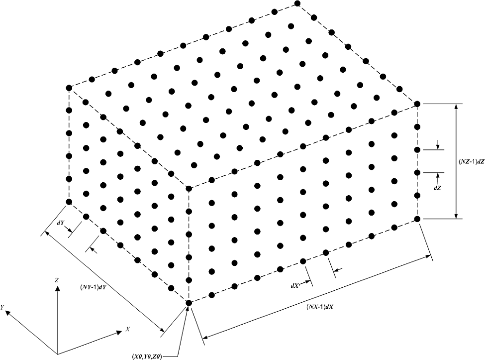
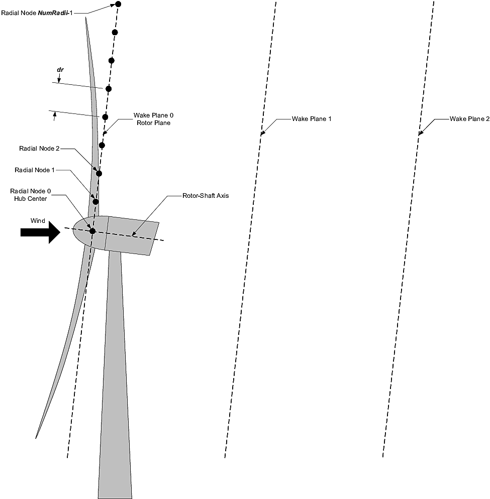

.. _FF:Input:

输入文件
========

FAST.Farm主输入文件定义了环境风、风电场内的风力机布局、尾流轴对称有限差分网格、尾流动力学校准参数、可视化输出、输出文件规范和辅助参数。由高保真前驱大气模拟生成的环境风数据（可选）存储在单独的文件中，这些文件在FAST.Farm主输入文件中被引用。风电场中每个风力机的属性存储在标准的OpenFAST输入文件中，在FAST.Farm主输入文件中通过其主OpenFAST输入文件（每个风力机一个）引用。

除了行数可指定的表格外，不得在输入文件中添加或删除任何行。

单位
----

FAST.Farm使用国际单位制（kg、m、s、N）。

.. _FF:sec:FFarminputfile:

FAST.Farm主输入文件
--------------------

FAST.Farm主输入文件分为几个功能部分：

-  仿真控制
-  共享系泊
-  环境风
-  风力机
-  尾流动力学
-  可视化
-  输出

每个部分对应FAST.Farm模型的一个方面——参见下面的小节。FAST.Farm主输入文件的示例见:numref:`FF:APP:Input`。当输入参数与:numref:`FF:Theory`中记录的FAST.Farm理论中的变量一一对应时，理论中的变量会在下面小节的输入参数后用括号显示。

输入文件以两行标题信息开始，供用户使用，软件不会使用这些信息。

仿真控制
~~~~~~~~

**Echo** [标志] 指定是否希望FAST.Farm回显FAST.Farm主输入文件的内容（对调试输入文件中的错误很有用）。如果**Echo** = TRUE，将生成回显文件。回显文件的命名约定为<*RootName*>\ *.ech*，其中<*RootName*>是FAST.Farm主输入文件的名称，不包括其文件扩展名。

**AbortLevel** [引号字符串] 表示什么错误级别会导致程序中止。选项有："WARNING"、"SEVERE"或"FATAL"。FAST.Farm中的**AbortLevel**与独立OpenFAST中设置的级别用法相同，但FAST.Farm中设置的**AbortLevel**将覆盖风电场中每个风力机的OpenFAST主输入文件中设置的级别。通常将FAST.Farm设置为在发生致命错误时中止，更多指导请参考FAST v8自述文件。

**TMax** [秒] 是要运行的仿真总时长。第一个输出在:math:`t=0`时计算；最后一个输出在:math:`t` = **TMax**时计算。FAST.Farm中设置的**TMax**将覆盖风电场中每个风力机的OpenFAST主输入文件中设置的仿真时长。

**Mod_AmbWind** [开关] 指示环境风来源。有四个选项：1) 使用VTK格式的高保真前驱模拟生成的环境风数据[**Mod_AmbWind=1**]；2) 使用FAST.Farm与*InflowWind*模块接口定义的环境风数据，使用一个*InflowWind*实例[**Mod_AmbWind=2**]；3) 使用FAST.Farm与*InflowWind*模块接口定义的环境风数据，使用多个*InflowWind*实例[**Mod_AmbWind=3**]；4) 使用存储在AMReX绘图文件格式中的高保真前驱模拟生成的环境风数据[**Mod_AmbWind=4**]。下面不同的环境风小节对应每个选项。请注意，**Mod_AmbWind** = 4要求FAST.Farm编译时启用AMReX支持（CMake中添加`-DAMREX_READER=ON`，使用Visual Studio编译时不可用）。

**Mod_WaveField** [开关] 指示如何处理波浪场。有两个选项：1) 直接使用每个风力机的HydroDyn输入，不进行调整；2) 根据风力机相对于风电场原点的偏移调整波浪相位。

**Mod_SharedMooring** [开关] 指示风电场级系泊系统是否连接风力机。目前有两个选项：0) 无共享系泊；3) MoorDyn。

共享系泊
~~~~~~~~

平台之间的共享系泊缆会引入平台之间的耦合，其时间尺度与平台和常规系泊系统相互作用的时间尺度相同（在OpenFAST模拟中通常用10-30毫秒的时间步解析）。更多信息见:numref:`MoorDyn`。

**SharedMoorFile** [引号字符串] 设置风电场系泊缆的MoorDyn输入文件的名称和位置。仅当**Mod_SharedMooring** = 3时使用。**文件名必须用引号括起来**，可以包含绝对路径或相对路径。系泊缆连接到风电场中的每个风力机。关于风电场级输入文件的详细信息，请参考`MoorDyn与FAST.Farm <https://moordyn.readthedocs.io/en/latest/usage.html#moordyn-with-fast-farm>`_文档。

**DT_Mooring** (秒) 设置MoorDyn共享系泊连接的时间步。

**WrMooringVis** [开关] 写入共享系泊缆的可视化文件，时间步为FAST.Farm全局时间步。

.. _FF:Input:VTK:

环境风：Visualization Toolkit格式的前驱数据
~~~~~~~~~~~~~~~~~~~~~~~~~~~~~~~~~~~~~~~~~~~~

本节中的输入参数仅在**Mod_AmbWind** = 1时使用，表示使用高保真前驱模拟生成的环境风。在这种情况下，环境风及其空间离散化必须存储在VTK格式中——如:numref:`FF:AmbWindVTK`所述——FAST.Farm将直接使用这些数据，不进行修改。

**DT_Low-VTK** [秒] (:math:`t`) 设置低分辨率环境风数据文件和计算的时间步，以及FAST.Farm的全局（驱动/粘合代码）时间步。本文档中**DT_Low-VTK**与**DT_Low**相同。FAST.Farm的模块每**DT_Low**秒调用一次，尽管OpenFAST及其模块可以使用小于或等于**DT_Low**的整数倍时间步。

**DT_High-VTK** [秒] 设置高分辨率环境风数据文件和计算的时间步，且**必须是小于或等于DT_Low的整数倍**。本文档中**DT_High-VTK**与**DT_High**相同。**DT_Low**和**DT_High**必须足够小以确保解决方案的精度，并与从高保真前驱模拟生成环境风数据时使用的时间分辨率匹配。**DT_Low**应与尾流动力学的时间尺度一致，例如，对于更高的平均风速，应为秒级或更小。**DT_High**应足以进行准确的气动载荷计算，例如，为零点几秒级。关于选择合适时间步的更多指导见:numref:`FF:ModGuidance`。

**WindFilePath** [引号字符串] 指定低分辨率和高分辨率环境风数据文件所在目录的路径。路径可以相对于FAST.Farm主输入文件的位置指定，也可以用绝对路径指定。建议在路径周围使用引号。如果文件名或路径名中包含空格，则必须使用引号。**FAST.Farm要求环境风数据文件存储在WindFilePath指定目录的特定子目录中，并使用特定的文件名**。低分辨率环境风数据文件必须命名为*Amb.t<n*\ :sub:`low`\ *>.vtk*，并存储在名为*Low*的子目录中。在文件名中，*<n*\ :sub:`low`\ *>*是介于*0*（在:math:`t=0`时）和*N-1*之间的整数（不带前导零），其中:math:`N=FLOOR\left( \frac{\textbf{TMax}}{\textbf{DT_Low}} \right)+1`是低分辨率时间步的数量。高分辨率环境风数据文件必须命名为*Amb.t<n*\ :sub:`high`\ *>.vtk*，其中*<n*\ :sub:`high`\ *>*是介于0（在:math:`t=0`时）和:math:`\frac{\textbf{DT_Low}}{\textbf{DT_High}}\left( N-1 \right)`之间的整数（不带前导零）。这些文件必须存储在名为*HighT<n*\ :sub:`t`\ *>*的子目录中，其中*<n*\ :sub:`t`\ *>*是介于1和风力机总数（**NumTurbines**）之间的整数（不带前导零）。子目录*HighT<n*\ :sub:`t`\ *>*必须包含对应于风力机*<n*\ :sub:`t`\ *>*的高分辨率环境风数据，风力机在FAST.Farm主输入文件的风力机部分中指定——见:numref:`FF:Input:WT`。每个环境风数据文件（低分辨率和高分辨率域）的VTK格式相同，如:numref:`FF:AmbWindVTK`所述。

**ChkWndFiles** [标志] 指定FAST.Farm在运行仿真前是否检查环境风数据文件的一致性（防止后续可能的崩溃）。由于此检查非常耗时，如果之前已经检查过环境风数据（例如在之前的仿真中），建议将**ChkWndFiles**设置为FALSE（禁用检查）。如果设置为TRUE，FAST.Farm将检查以确保：

- 低分辨率环境风数据文件的数量足以运行整个仿真（直到:math:`t =`\ **TMax**）。如果子目录中有更多文件，将仅使用前*N*个。
- 高分辨率环境风数据文件的数量足以为所有风力机运行整个仿真（直到:math:`t =`\ **TMax**）。如果有更多子目录，将仅使用前**NumTurbines**个。如果每个子目录中有更多文件，将仅使用前:math:`\frac{\textbf{DT_Low}}{\textbf{DT_High}}\left( N-1 \right)+1`个。
- 每个低分辨率环境风数据文件的空间分辨率（网格点数、原点和间距）相同。
- 给定风力机的每个高分辨率环境风数据文件的空间分辨率（网格点数、原点和间距）相同。
- 风电场中所有风力机的高分辨率域的网格点数相同。

环境风：InflowWind模块
~~~~~~~~~~~~~~~~~~~~~~

本节中的输入参数仅在**Mod_AmbWind** = 2或3时使用，表示通过一个或多个*InflowWind*模块实例使用环境风。在这种情况下，*InflowWind*中指定的环境风将被插值到低分辨率和高分辨率域，供FAST.Farm使用。

**DT_Low** [秒] (:math:`\Delta t`) 设置低分辨率环境风计算的时间步，以及FAST.Farm的全局（驱动/粘合代码）时间步。FAST.Farm的模块每**DT_Low**秒调用一次，尽管OpenFAST及其模块可以选择使用小于或等于**DT_Low**的整数倍时间步。
当**Wake_Mod=2,3**时，算法的稳定性将取决于**dr**和**DT_Low**的选择。
（通常:math:`\textbf{DT_Low}<\textbf{dr}/(2V_\text{Hub})`，见:numref:`FF:ModGuidance`）

**DT_High** [秒] 设置高分辨率环境风数据计算的时间步，且必须是小于或等于**DT_Low**的整数倍。**DT_Low**和**DT_High**必须足够小以确保解决方案的精度至关重要。**DT_Low**应与尾流动力学的时间尺度一致，例如，对于更高的平均风速，应为秒级或更小。**DT_High**应足以进行准确的气动载荷计算，例如，为零点几秒级。关于选择合适时间步的更多指导见:numref:`FF:ModGuidance`。

接下来的九个输入参数设置低分辨率环境风域的空间离散化。低分辨率域存储为全局*X-Y-Z*惯性坐标系中的结构化3D风数据点网格（表示3D单元格的角点），如:numref:`FF:StrucDomains`中通用图示。

   低分辨率或高分辨率域的结构化3D网格

**NX_Low**、**NY_Low**和**NZ_Low** [整数] 设置每个方向的风数据点数量。

**X0_Low**、**Y0_Low**和**Z0_Low** [米] 设置网格的原点（最小的*X-Y-Z*坐标）。

**dX_Low**、**dY_Low**和**dZ_Low** [米] 设置每个方向的空间离散化。

低分辨率域的总尺寸为(**NX_Low**-1)\ **dX_Low** :math:`\times` (**NY_Low**-1)\ **dY_Low** :math:`\times` (**NZ_Low**-1)\ **dZ_Low**。低分辨率域应覆盖整个风电场中可能存在风力机和尾流的区域，其分辨率应足以保证空间平均的准确性，例如，对于公用事业规模的风力机，为数十米级。关于选择合适空间离散化的更多指导见:numref:`FF:ModGuidance`。

与低分辨率域类似，每个高分辨率域存储为全局*X-Y-Z*惯性坐标系中的结构化3D风数据点网格——如:numref:`FF:StrucDomains`中通用图示。

**NX_High**、**NY_High**和**NZ_High** [整数] 设置每个方向的风数据点数量。这些值对于每个风力机都相同，因此只需设置一次。

每个风力机的高分辨率风域的原点和空间离散化在下面FAST.Farm主输入文件的风力机部分中指定。

**InflowFile** [引号字符串] 指定*InflowWind*模块的主输入文件名称，可以相对于FAST.Farm主输入文件的位置指定，也可以用绝对路径指定。建议在文件名周围使用引号。如果文件名或路径名中包含空格，则必须使用引号。关于该文件内容的信息见:numref:`FF:AmbWindIfW`。

.. _FF:Input:AMReX:

环境风：AMReX格式的前驱数据
~~~~~~~~~~~~~~~~~~~~~~~~~~~~~

本节中的输入参数仅在**Mod_AmbWind** = 4时使用，表示使用存储在`AMReX <https://amrex-codes.github.io>`__绘图文件格式中的高保真前驱模拟生成的环境风。此选项要求FAST.Farm编译时启用AMReX库（CMake中添加`-DAMREX_READER=ON`）。网格尺寸、原点和空间离散化直接从AMReX绘图文件头读取，无需在输入文件中指定。

**WindDirPrefix** [引号字符串] 指定AMReX风子卷目录的路径前缀。子卷目录遵循命名约定*<WindDirPrefix>_<sv>_<index>*，其中*<sv>*是子卷编号（低分辨率域为0，每个风力机的高分辨率域为1到**NumTurbines**），*<index>*是零填充整数目录索引。路径可以相对于FAST.Farm主输入文件的位置指定，也可以用绝对路径指定。建议在路径周围使用引号。关于预期目录结构的更多细节见:numref:`FF:AmbWindAMReX`。

**DirStartIndex** [引号字符串] 指定对应于仿真开始时间:math:`t=0`的目录索引后缀（例如"00000"）。字符串长度决定了应用于所有目录索引号的零填充宽度；**DirStartIndex**中的前导零数量设置了构建后续目录名称时使用的总字段宽度。FAST.Farm会自动搜索从该索引开始的所有可用时间步。建议在此值周围使用引号。

**DT_Low-AMReX** [秒] 设置低分辨率环境风数据的时间步和FAST.Farm的全局（驱动/粘合代码）时间步。所有FAST.Farm模块每**DT_Low-AMReX**秒调用一次，尽管OpenFAST及其模块可以使用小于或等于**DT_Low-AMReX**的整数倍时间步。该值必须与生成前驱模拟数据时使用的时间步匹配。

**DT_High-AMReX** [秒] 设置高分辨率环境风数据的时间步，且**必须是小于或等于DT_Low-AMReX的整数倍**。它必须与前驱数据中高分辨率子卷的时间分辨率匹配。**DT_Low-AMReX**应与尾流动力学的时间尺度一致（例如，秒级），**DT_High-AMReX**应足以进行准确的气动载荷计算（例如，零点几秒级）。更多指导见:numref:`FF:ModGuidance`。

.. _FF:Input:WT:

风力机
~~~~~~

**NumTurbines** [整数] (:math:`N_t`) 是风电场中的风力机数量，决定了后续表格中的行数（在两个表格标题行之后）。

对于每个风力机：

- **WT_X**、**WT_Y**和**WT_Z** [米] 指定全局*X-Y-Z*惯性坐标系中的原点。原点定义为未变形塔筒中心线与地面的交点，对于海上系统则为与平均海平面的交点。

- **WT_FASTInFile** [引号字符串] 指定与每个风力机关联的OpenFAST主输入文件名称。FAST.Farm内部为每个风力机分配一个介于1和**NumTurbines**之间的整数(:math:`n_t`)，对应于表格中的行。OpenFAST主输入文件名可以相对于FAST.Farm主输入文件的位置指定，也可以用绝对路径指定。建议在文件名周围使用引号。相同的风力机可以使用相同的OpenFAST主输入文件，除非对应的OpenFAST模型使用DLL格式的Bladed风格控制器，或者对于海上风力机，每个风力机需要不同的波浪条件。如果使用Bladed风格的DLL控制器，则必须使用不同的Bladed风格控制器DLL（每个都有唯一名称）。这需要使用不同的*ServoDyn*主输入文件，引用适当的DLL名称，以及不同的OpenFAST主输入文件，每个引用适当的*ServoDyn*主输入文件名。如果每个风力机需要不同的波浪条件，则每个风力机的不同波浪条件（例如，基于唯一的随机波浪种子）必须在*HydroDyn*主输入文件中设置，并且必须使用不同的OpenFAST主输入文件，每个引用适当的*HydroDyn*主输入文件名。关于OpenFAST输入文件内容的信息见:numref:`FF:Input:OFInput`。

- 当**Mod_AmbWind** = 2或3时，风力机表格有六个额外列，用于完成每个风力机的高分辨率风域的空间离散化：

   - **X0_High**、**Y0_High**和**Z0_High** [米] 设置网格的原点。
   - **dX_High**、**dY_High**和**dZ_High** [米] 设置每个方向的空间离散化。

高分辨率域的总尺寸为(**NX_High**-1)\ **dX_High** :math:`\times` (**NY_High**-1)\ **dY_High** :math:`\times` (**NZ_High**-1)\ **dZ_High**。每个高分辨率域必须围绕对应的风力机延伸，覆盖任何风力机位移。这些域的分辨率应足以进行准确的气动载荷计算，例如，约为叶片弦长。高分辨率域将占据低分辨率域部分相同的空间，因此需要域重叠。

尾流动力学
~~~~~~~~~~

在FAST.Farm中，每个尾流平面被视为径向有限差分网格，如:numref:`FF:RadialFD`所示。

   径向有限差分网格。为了图示清晰，尾流平面的数量和尺寸显示得比实际应有的小。

有三种尾流公式可用（更多细节见:numref:`FF:Theory`）：

**Mod_Wake** [开关] 用于在尾流公式之间切换。有三个选项可用：
1) 极坐标[**Mod_Wake=1**]（默认）；
尾流是轴对称的，在极坐标网格上定义，使用隐式Crank-Nicolson方案求解，在剪切层近似下满足动量和质量守恒定律。
2) 卷曲尾流模型[**Mod_Wake=2**]；
尾流在笛卡尔网格上定义，通过引入横向速度来考虑偏斜入流中的卷曲尾流涡效应，动量守恒使用一阶向前欧拉方案求解，不强制质量守恒，可以考虑尾流旋转效应。
在偏斜入流中，尾流将呈现"卷曲"形状。
3) 笛卡尔[**Mod_Wake=3**]；对应于卷曲尾流涡强度为零的模型2，导致轴对称尾流。

当**Wake_Mod=2,3**时，算法的稳定性将取决于**dr**和**DT_Low**的选择（参见:numref:`FF:ModGuidance`中的指导）。

**RotorDiamRef** [浮点，米]：用于尾流计算的参考风力机转子直径。

尾流平面由以下参数定义：

- **dr** [米] 设置径向增量。为了确保FAST.Farm准确计算尾流亏损，应设置**dr**使得FAST.Farm能够充分解析每个平面内的尾流亏损。
当使用笛卡尔网格时（**Mod_Wake=2或3**），**dr**表示平面y和z方向的间距。
当**Wake_Mod=2,3**时，算法的稳定性将取决于**dr**和**DT_Low**的选择（参见:numref:`FF:ModGuidance`中的指导）。

- **NumRadii** [整数] (:math:`N_r`) 设置半径数量。为了确保FAST.Farm准确计算尾流亏损，应设置**NumRadii**使得每个尾流平面的直径2(**NumRadii**-1)\ **dr**相对于转子直径足够大。
当使用笛卡尔网格时，y和z坐标从(-NumRaddi+1)*dr延伸到(NumRadii-1)*dr。

- **NumPlanes** [整数] (:math:`N_p`) 设置尾流平面数量。为了确保FAST.Farm准确捕获尾流亏损，应设置**NumPlanes**使得尾流平面向下游传播足够的距离，最好直到尾流亏损衰减消失。

接下来的20个输入是用户指定的校准参数和选项，影响尾流动力学计算。这些参数可能取决于例如风力机运行或大气条件，可以进行校准以更好地匹配实验数据或使用高保真模拟结果作为基准。每个校准参数的默认值基于`SOWFA <https://nwtc.nrel.gov/SOWFA>`__模拟得出[引用ff-Doubrawa18_1]，但用户可以覆盖这些默认值。

**f_c** [Hz] (:math:`f_c`) 是尾流平流、偏转和蜿蜒模型的低通时间滤波器的截止（拐角）频率，必须大于零。
滤波器常数最好按如下方式设置：

.. math:: :label: fffc

    \tau_1=\frac{1.1}{1-1.3 \operatorname{min}(a_\text{avg}, 0.5)} \frac{R}{U_\infty}, \qquad f_c = \frac{2.4}{\tau_1}

其中
:math:`\tau_1`是类似于Oye动态入流模型中使用的时间尺度，
:math:`a_\text{avg}`是转子盘上的平均轴向诱导因子。
如果使用DEFAULT关键字代替数值，**f_c**将设置为:math:`12.5/R_\text{est}` Hz，
这对应于上面公式中:math:`U=10` m/s，:math:`a=1/3`的情况，
其中估计的转子半径为: :math:`R_\text{est} = (dr * NumRadii) / 3`。
更改网格分辨率会改变估计半径，因此建议直接设置**f_c**的数值，而不是使用DEFAULT。
如果出现数值问题，可以尝试降低**f_c**的值以引入更多高频滤波。
在以前的版本中，默认值过小，设置为:math:`0.0007` Hz。

**C_HWkDfl_O** [米] (:math:`C_{HWkDfl}^{O}`) 是尾流偏转校正的校准参数，定义转子处的水平偏移。如果使用DEFAULT关键字代替数值，**C_HWkDfl_O**将设置为:math:`0.0`。

**C_HWkDfl_OY** [米/度] (:math:`C_{HWkDfl}^{OY}`) 是尾流偏转校正的校准参数，定义随偏航误差缩放的转子处水平偏移。如果使用DEFAULT关键字代替数值，
当**Mod_Wake=2**时**C_HWkDfl_OY**设置为:math:`0`，否则设置为:math:`0.3`。

**C_HWkDfl_x** [-] (:math:`C_{HWkDfl}^{x}`) 是尾流偏转校正的校准参数，定义随下游距离缩放的水平偏移。如果使用DEFAULT关键字代替数值，**C_HWkDfl_x**将设置为:math:`0.0`。

**C_HWkDfl_xY** [1/度] (:math:`C_{HWkDfl}^{xY}`) 是尾流偏转校正的校准参数，定义随下游距离和偏航误差缩放的水平偏移。如果使用DEFAULT关键字代替数值，
当**Mod_Wake=2**时**C_HWkDfl_xY**设置为:math:`0.0`，否则设置为:math:`-0.004`。

**C_NearWake** (:math:`C_{NearWake}`) [-] 是近尾流校正的校准参数，必须大于1。如果使用DEFAULT关键字代替数值，**C_NearWake**将设置为:math:`1.8`。

**k_vAmb** [五个浮点数，逗号分隔] :math:`[k_{\nu Amb}, C_{\nu Amb}^{FMin}, C_{\nu Amb}^{DMin}, C_{\nu Amb}^{DMax}, C_{\nu Amb}^{Exp}]`
涡粘性中环境湍流影响的调优参数。如果指定DEFAULT关键字，所有五个参数将设置为下面指定的默认值。五个参数按顺序为：

   - :math:`k_{\nu Amb}` [-] (:math:`\gt 0`)
        | 默认值：:math:`k_{\nu Amb} = 0.05`
        | **k_vAmb**最大值的校准系数。
   - :math:`C_{\nu Amb}^{FMin}` [-]  (:math:`\ge 0`, :math:`\le 1`)
        | 默认值：:math:`C_{\nu Amb}^{FMin} = 1.0`。
        | 定义最小值区域值的校准参数。
   - :math:`C_{\nu Amb}^{DMin}` [-] (:math:`\ge 0`)
        | 默认值：:math:`C_{\nu Amb}^{DMin} = 0.0`。
        | 定义最小值区域和指数区域之间过渡直径分数的校准参数。
   - :math:`C_{\nu Amb}^{DMax}` [-] (:math:`\ge k_\text{DMin}`)
        | 默认值：:math:`C_{\nu Amb}^{DMax} = 1.0`。
        | 定义指数区域和最大值区域之间过渡直径分数的校准参数。
   - :math:`C_{\nu Amb}^{Exp}` [-] (:math:`\gt 0`)
        | 默认值：:math:`C_{\nu Amb}^{Exp} = 0.01`。
        | 定义指数区域指数的校准参数。

**k_vShr** [五个浮点数，逗号分隔] :math:`[k_{\nu Shr}, C_{\nu Shr}^{FMin}, C_{\nu Shr}^{DMin}, C_{\nu Shr}^{DMax}, C_{\nu Shr}^{Exp}]`
涡粘性中尾流剪切层影响的调优参数。如果指定DEFAULT关键字，所有五个参数将设置为下面指定的默认值。五个参数按顺序为：

   - :math:`k_{\nu Shr}` [-] (:math:`\gt 0`)
        | 默认值：:math:`k_{\nu Shr} = 0.016`
        | **k_vShr**最大值的校准系数。
   - :math:`C_{\nu Shr}^{FMin}` [-]  (:math:`\ge 0`, :math:`\le 1`)
        | 默认值：:math:`C_{\nu Shr}^{FMin} = 0.2`。
        | 定义最小值区域值的校准参数。
   - :math:`C_{\nu Shr}^{DMin}` [-] (:math:`\ge 0`)
        | 默认值：:math:`C_{\nu Shr}^{DMin} = 3.0`。
        | 定义最小值区域和指数区域之间过渡直径分数的校准参数。
   - :math:`C_{\nu Shr}^{DMax}` [-] (:math:`\ge k_\text{DMin}`)
        | 默认值：:math:`C_{\nu Shr}^{DMax} = 25.0`。
        | 定义指数区域和最大值区域之间过渡直径分数的校准参数。
   - :math:`C_{\nu Shr}^{Exp}` [-] (:math:`\gt 0`)
        | 默认值：:math:`C_{\nu Shr}^{Exp} = 0.1`。
        | 定义指数区域指数的校准参数。

**Mod_WakeDiam** [开关] 指定尾流直径计算模型（方法）。有四个选项：1) 使用转子直径[**Mod_WakeDiam=1**]；2) 使用基于速度的方法[**Mod_WakeDiam=2**]；3) 使用基于质量通量的方法[**Mod_WakeDiam=3**]；4) 使用基于动量通量的方法[**Mod_WakeDiam=4**]。如果使用DEFAULT关键字代替数值，**Mod_WakeDiam**将设置为:math:`1`。

**C_WakeDiam** [-] (:math:`C_{WakeDiam}`) 是尾流直径计算的校准参数，必须大于零且小于:math:`0.99`。当**Mod_WakeDiam=1**时不使用。如果使用DEFAULT关键字代替数值，**C_WakeDiam**将设置为:math:`0.95`。

**Mod_Meander** [开关] 指定尾流蜿蜒的空间滤波模型（方法）。有三个选项：1) 使用均匀空间平均[**Mod_Meander=1**]；2) 使用截断jinc函数[**Mod_Meander=2**]；3) 使用加窗jinc函数[**Mod_Meander=3**]。如果使用DEFAULT关键字代替数值，**Mod_Meander**将设置为:math:`3`。

**C_Meander** [-] (:math:`C_{Meander}`) 是尾流蜿蜒的校准参数，必须大于或等于1。如果使用DEFAULT关键字代替数值，**C_Meander**将设置为:math:`1.9`。

卷曲尾流参数
~~~~~~~~~~~~

**Swirl** [开关]
在尾流中包含旋转速度[仅当**Mod_Wake=2**或**Mod_Wake=3**时使用]。

**k_VortexDecay** [-] 此常数指定卷曲尾流模型中横向速度分量的衰减率。
默认值为0.0。

**NumVortices** [-] 卷曲尾流模型中的涡旋数量。
默认值为100。

**sigma_D** [-] 卷曲尾流模型中涡核的宽度，用转子直径无量纲化。如果使用DEFAULT关键字代替数值，**sigma_D**将设置为:math:`0.2`。

**FilterInit** [开关] 在卷曲尾流模型中用于过滤初始尾流平面亏损的网格点数（在y和z方向）。
值为零对应无过滤。过滤用于去除尾流中的强梯度，稳定解。
默认值为1。

**k_vCurl** [-] 卷曲尾流模型中用于缩放涡粘性的校准参数。
此值是调优参数，用于增加或减少卷曲尾流模型中的扩散。
我们发现此值可能是推力系数的函数，对于较高的推力系数建议使用较大的值。
建议如下：
:math:`C_T=0.4`时:math:`k_v=0.9`，
:math:`C_T=0.7`时:math:`k_v=2.0`，
:math:`C_T=0.9`时:math:`k_v=3.0`。
这些指导在未来可能会改变。
默认值为2.0。

**Mod_Projection** [开关] 选择在AWAE中如何投影尾流平面速度。有两个选项：
1) 保留所有分量
2) 沿平面法向投影。
如果使用DEFAULT，则当**Mod_Wake=2**时**Mod_Projection=2**，否则**Mod_Projection=1**。

尾流附加湍流（WAT）
~~~~~~~~~~~~~~~~~~~

尾流附加湍流模型在:numref:`FF:WAT`中描述。

**WAT** [开关] 选择是否包含尾流附加湍流。
有三个选项：
0) 无尾流附加湍流，
1) 使用预定义的湍流盒作为背景湍流，
2) 使用用户定义的湍流盒。
当**WAT=1**时，湍流盒的点数从文件名推断，每个方向的尺寸取为:math:`dx=dy=dz=0.03*\text{RotorDiamRef}`。

**WAT_BoxFile**：[引号字符串]
包含湍流盒u分量的文件路径（预定义或用户定义）。此湍流盒应为Mann盒格式。
文件名格式应为"Label_1024x32x16.u"，其中扩展名".u"是必需的。FAST.Farm将假定存在扩展名为".v"和".w"的文件，这些文件也将被读取。
当**WAT=1**时，文件名中用"x"分隔的三个数字将被认为是湍流盒x、y和z维度的点数。

**WAT_NxNyNz**：[三个整数，逗号分隔]
WAT_BoxFile中x、y和z方向的点数。仅当WAT=2时使用。

**WAT_DxDyDz**：[三个浮点数，逗号分隔]
WAT_BoxFile中x、y和z方向点之间的距离（米）。仅当WAT=2时使用。
当**WAT=1**时，如果所有风力机的尺寸相同，尺寸将设置为**[dX_high, dY_high, dZ_high]**，否则将使用:math:`dx=dy=dz=0.03*\text{RotorDiamRef}`的指导计算尺寸。

**WAT_ScaleBox**：[标志]
设置为True时，输入的湍流盒将被缩放，使得每个节点的平均值为零，标准差为1。
默认值为True。

**WAT_k_Def** [五个浮点数，逗号分隔] :math:`[k_\text{def}, k_\text{FMin}, k_\text{DMin}, k_\text{DMax}, e]`
尾流附加湍流缩放因子中准稳态尾流亏损效应的调优参数。此调优参数是转子下游位置的函数，使用五个参数。关于**WAT_k_Def**使用的函数的详细信息，请参考:numref:`FF:WAT`（FAST.Farm理论）中的等式:eq:`eq:kDefGradDefaults`。如果指定DEFAULT关键字，所有五个参数将设置为下面指定的默认值。五个参数按顺序为：

   - :math:`k_\text{def}` [-] (:math:`\gt 0`)
        | 默认值：:math:`k_\text{def} = 0.6`。
        | **WAT_k_Def**最大值的校准系数。
   - :math:`k_\text{FMin}` [-]  (:math:`\ge 0`, :math:`\le 1`)
        | 默认值：:math:`k_\text{FMin} = 0.0`。
        | 定义最小值区域值的校准参数。
   - :math:`k_\text{DMin}` [-] (:math:`\ge 0`)
        | 默认值：:math:`k_\text{DMin} = 0.0`。
        | 定义最小值区域和指数区域之间过渡直径分数的校准参数。
   - :math:`k_\text{DMax}` [-] (:math:`\ge k_\text{DMin}`)
        | 默认值：:math:`k_\text{DMax} = 2.0`。
        | 定义指数区域和最大值区域之间过渡直径分数的校准参数。
   - :math:`e` [-] (:math:`\gt 0`)
        | 默认值：:math:`e = 1.0`。
        | 定义指数区域指数的校准参数。

**WAT_k_Grad** [五个浮点数，逗号分隔] :math:`[k_\text{Grad}, k_\text{FMin}, k_\text{DMin}, k_\text{DMax}, e]`
尾流附加湍流缩放因子中尾流亏损梯度的调优参数。此调优参数是转子下游位置的函数，使用五个参数。关于**WAT_k_Grad**使用的函数的详细信息，请参考:numref:`FF:WAT`（FAST.Farm理论）中的等式:eq:`eq:kDefGradDefaults`。如果指定DEFAULT关键字，所有五个参数将设置为下面指定的默认值。五个参数按顺序为：

   - :math:`k_\text{Grad}` [-] (:math:`\gt 0`)
        | 默认值：:math:`k_\text{Grad} = 3.0`。
        | **WAT_k_Grad**最大值的校准系数。
   - :math:`k_\text{FMin}` [-]  (:math:`\ge 0`, :math:`\le 1`)
        | 默认值：:math:`k_\text{FMin} = 0.0`。
        | 定义最小值区域值的校准参数。
   - :math:`k_\text{DMin}` [-] (:math:`\ge 0`)
        | 默认值：:math:`k_\text{DMin} = 0.0`。
        | 定义最小值区域和指数区域之间过渡直径分数的校准参数。
   - :math:`k_\text{DMax}` [-] (:math:`\ge k_\text{DMin}`)
        | 默认值：:math:`k_\text{DMax} = 12.0`。
        | 定义指数区域和最大值区域之间过渡直径分数的校准参数。
   - :math:`e` [-] (:math:`\gt 0`)
        | 默认值：:math:`e = 0.65`。
        | 定义指数区域指数的校准参数。

可视化
~~~~~~

**WrDisWind** [标志] 指定是否生成完整的3D低分辨率和高分辨率扰动风数据输出文件。这些文件显示整个风电场的环境风和尾流相互作用，用于可视化，如果**WrDisWind**=TRUE则生成。这些输出文件的VTK数据格式和空间分辨率（网格点数、原点和间距）与FAST.Farm模拟使用的对应低分辨率和高分辨率环境风数据匹配。VTK文件写入到FAST.Farm主文件存储目录下名为*vtk_ff*的目录中。这些输出文件的命名约定分别为：低分辨率和高分辨率扰动风数据文件为*<RootName>.Low.Dis.<n*\ :sub:`low`\ *>.vtk*和*<RootName>.HighT<n*\ :sub:`t`\ *>\ *.Dis.<n*\ :sub:`t`\ *>.vtk*，其中<*RootName*>是FAST.Farm主输入文件的名称，不包括其文件扩展名，*<n*\ :sub:`t`\ *>*和*<n*\ :sub:`low`\ *>*如:numref:`FF:Input:VTK`中指定，但包含前导零。

为了可视化，FAST.Farm还可以输出低分辨率扰动（包括尾流）风数据文件，这些文件是完整低分辨率域的二维（2D）切片，由以下7个输入指定。最多可以输出99个平行于*X-Y*、*Y-Z*和/或*X-Z*平面的2D切片。

- **NOutDisWindXY** [整数] 指定输出低分辨率扰动风数据文件的平行于*X-Y*平面的2D切片数量（0到99）。
- **OutDisWindZ** [米] 是长度为**NOutDisWindXY**的列表，包含要输出的每个平面的*Z*坐标。这些值在**全局惯性坐标系**中，用逗号、分号、空格和/或制表符的任意组合分隔。
- **NOutDisWindYZ** [整数] 指定输出低分辨率扰动风数据文件的平行于*Y-Z*平面的2D切片数量（0到99）。
- **OutDisWindX** [米] 是长度为**NOutDisWindYZ**的列表，包含要输出的每个平面的*X*坐标。这些值在**全局惯性坐标系**中，用逗号、分号、空格和/或制表符的任意组合分隔。
- **NOutDisWindXZ** [整数] 指定输出低分辨率扰动风数据文件的平行于*X-Z*平面的2D切片数量（0到99）。
- **OutDisWindY** [米] 是长度为**NOutDisWindXZ**的列表，包含要输出的每个平面的*Y*坐标。这些值在**全局惯性坐标系**中，用逗号、分号、空格和/或制表符的任意组合分隔。

VTK文件写入到FAST.Farm主文件存储目录下名为*vtk_ff*的目录中。这些输出文件的命名约定为：*X-Y*、*Y-Z*和*X-Z*切片分别为*<RootName>.Low.DisXY<n*\ :sub:`Out`\ *>.<n*\ :sub:`low`\ *>.vtk*、*<RootName>.Low.DisYZ<n*\ :sub:`Out`\ *>.<n*\ :sub:`low`\ *>.vtk*和*<RootName>.Low.DisXZ<n*\ :sub:`Out`\ *>.<n*\ :sub:`low`\ *>.vtk*，其中*<n*\ :sub:`Out`\ *>*是介于1和9之间的整数，对应输出的切片编号。*<RootName>*和*<n*\ :sub:`low`\ *>*如:numref:`FF:Input:VTK`中定义，但包含前导零。

**WrDisDT** [秒] 指定所有扰动风数据输出文件的时间步（帧率的倒数），且必须是大于或等于**DT_Low**的整数倍。当**WrDisWind** = FALSE且**NOutDisWindXY**、**NOutDisWindYZ**和**NOutDisWindXZ**设置为零时，不使用此输入。如果使用DEFAULT关键字代替数值，**WrDisDT**将设置为**DT_Low**。请注意，完整的高分辨率扰动风数据输出文件不会以1/**DT_High**的帧率输出，而是仅每**WrDisDT**秒输出一次。

可视化环境风和尾流相互作用有助于解释结果和调试问题。但是，当**WrDisWind** = TRUE和/或**NOutDisWindXY**、**NOutDisWindYZ**和/或**NOutDisWindXZ**设置大于零时，FAST.Farm每个输出选项将生成:math:`n+1`个文件。生成这些文件会减慢FAST.Farm的运行速度，并占用大量磁盘空间，特别是在生成完整的低分辨率和高分辨率扰动风数据文件时。因此，在运行大量FAST.Farm模拟时，建议禁用可视化。关于可视化输出文件的详细信息见:numref:`FF:Output:Vis`。

输出
~~~~

**SumPrint** [标志] 指定是否生成摘要文件。如果**SumPrint**=TRUE则生成该文件，名称为<*RootName*>\ *.sum*，其中<*RootName*>如上定义。关于摘要文件的详细信息见:numref:`FF:Output:Sum`。

**ChkptTime** [秒] 指定写入检查点文件以便可能重启的频率，但**FAST.Farm目前未使用此功能**。

**TStart** [秒] 指定FAST.Farm开始在时间序列结果输出文件中写入数据的仿真时间。请注意，如果**TStart**不是**DT_Low**的整数倍，可能不会在**TStart**秒生成输出文件。

**OutFileFmt** [开关] 指定生成哪种类型的时间序列结果输出文件。有三个选项可用，与OpenFAST中的选项相同：1) 生成ASCII文本文件[**OutFileFmt=1**]；2) 生成二进制文件[**OutFileFmt=2**]；3) 同时生成ASCII文本和二进制文件[**OutFileFmt=3**]。**但是，FAST.Farm目前仅支持基于文本的输出文件。因此，OutFileFmt必须设置为1**。

**TabDelim** [标志] 指定ASCII文本输出时间序列结果中的列如何分隔。如果**TabDelim** = TRUE，列用制表符分隔。否则，列用空格分隔。当**OutFileFmt** = 2时，不使用**TabDelim**。

**OutFmt** [字符串] 指定基于ASCII文本的输出文件通道格式（不包括时间通道）。时间序列结果输出文件中打印的值应该形成长度为10个字符的字段；"ES10.3E2"是**OutFmt**的常见设置。时间通道使用"F10.4"格式打印。当**OutFileFmt** = 2时，不使用**OutFmt**。关于时间序列结果文件的详细信息见:numref:`FF:Output:Time`。

**OutAllPlanes** [-] 在所有时间步输出所有尾流平面的VTK文件。
注意：此选项需要大量磁盘写入，会大幅减慢仿真速度。
默认值为False。

FAST.Farm可以为最多9个独立风力机输出与尾流相关的量，不考虑尾流融合的影响，最多输出20个径向节点和9个下游距离。这些输出通过以下4个输入指定：

- **NOutRadii** [整数] 指定要输出的径向节点数量（0到20）。
- **OutRadii** [整数] 指定节点编号，介于0（尾流中心）和**NumRadii**-1（径向有限差分网格的最外边缘）之间。值为长度为**NOutRadii**的列表，用逗号、分号、空格和/或制表符的任意组合分隔。
- **NOutDist** [整数] 指定要输出的下游距离数量（0到9）。
- **OutDist** [米] 指定下游距离（不是尾流平面编号），每个都必须大于或等于零。值为长度为**NOutDist**的列表，用逗号、分号、空格和/或制表符的任意组合分隔。下游距离垂直于尾流平面测量，**OutDist为零对应于转子平面**。尾流输出量在尾流平面之间线性插值。只有前9个风力机的尾流相关量可以输出，所有尾流具有相同的输出径向节点编号和下游距离。**OutList**部分中的输出指定在这些输出径向节点编号和下游距离实际输出哪些量。

FAST.Farm还可以在低分辨率风域的最多9个点（位置）输出环境风速（不包括尾流）和扰动风速（包括尾流），通过以下输入定义：

- **NWindVel** [整数] 指定要输出风的点数量（0到9）。
- **WindVelX**、**WindVelY**和**WindVelZ** [米] 分别指定**全局惯性坐标系**中的*X*、*Y*和*Z*坐标。值为长度为**NWindVel**的列表，用逗号、分号、空格和/或制表符的任意组合分隔。**OutList**部分中的输出指定在这些点实际输出哪些风速。
- **OutList** [引号字符串] 控制FAST.Farm生成的输出量。输入一行或多行包含引号字符串的内容，这些字符串又包含一个或多个输出参数名称。输出参数名称用逗号、分号、空格和/或制表符的任意组合分隔。如果在参数名称前加上减号"-"、下划线"_"或字符"m"或"M"，FAST.Farm在写入数据前会将该通道的值乘以:math:`-1`。输出列按输入文件中列出的顺序写入。FAST.Farm允许使用多行，以便将列表分成有意义的组，并使行更短。可以在任何行的右引号后输入注释。如果在行首或行首的引号字符串开头输入字符串"END"，FAST.Farm将停止扫描更多通道名称行。尾流相关输出量通过上面的**OutRadii**和**OutDist**列表为请求的输出径向节点编号和下游距离生成。环境和扰动风速通过上面的**WindVelX**、**WindVelY**和**WindVelZ**列表为请求的点生成。如果FAST.Farm遇到未知/无效的通道名称，会向用户发出警告，但会从输出文件中删除该可疑通道。可用输出参数的完整列表见:numref:`FF:APP:Output`。

.. _FF:AmbWindVTK:

Visualization Toolkit格式的环境风前驱文件
--------------------------------------------

当使用**Mod_AmbWind** = 1的高保真前驱模拟生成的环境风时，必须预先生成低分辨率和高分辨率域的环境风数据文件。每个环境风数据文件必须遵循`简单传统串行VTK文件格式 <https://www.vtk.org/wp-content/uploads/2015/04/file-formats.pdf>`__。VTK格式文件的示例见:numref:`FF:APP:Wind`。

FAST.Farm要求环境风数据文件存储在**WindFilePath**指定目录的特定子目录中，并使用特定的文件名。低分辨率环境风数据文件必须存储在名为*Low*的子目录中，命名为*Amb.t<n*\ :sub:`low`\ *>.vtk*，其中*<n*\ :sub:`low`\ *>*如:numref:`FF:Input:VTK`中指定。高分辨率环境风数据文件必须存储在名为*HighT<n*\ :sub:`t`\ *>*的子目录中，命名为*Amb.t<n*\ :sub:`high`\ *>.vtk*，其中*<n*\ :sub:`t`\ *>*和*<n*\ :sub:`high`\ *>*如:numref:`FF:Input:VTK`中指定。子目录*HighT<n*\ :sub:`t`\ *>*必须包含对应于风力机:math:`n_t`的高分辨率环境风数据，风力机在FAST.Farm主输入文件的风力机部分中指定——见:numref:`FF:Input:WT`。

每个VTK格式的输入文件以文件版本和标识符开头，但FAST.Farm不会检查这些内容。第二行是标题信息，用于标识特定案例，但FAST.Farm不会使用。第三行必须包含单个单词ASCII，指定FAST.Farm目前支持的文件格式。

第四行必须包含单词*DATASET STRUCTURED_POINTS*，指定FAST.Farm目前支持的数据集结构。接下来的三行设置域的空间离散化。每个域存储为全局*X-Y-Z*惯性坐标系中的结构化3D风数据点网格（表示3D单元格的角点）——如:numref:`FF:StrucDomains`中通用图示。每个方向的风数据点数量由DIMENSIONS后跟三个用空格分隔的整数表示，分别为**NX**、**NY**和**NZ**；网格原点（最小的*X-Y-Z*坐标）由ORIGIN后跟三个用空格分隔的浮点数表示，分别为**X0**、**Y0**和**Z0**；每个方向的空间离散化由SPACING后跟三个用空格分隔的浮点数表示，分别为**dX**、**dY**和**dZ**。域的总尺寸为(**NX**-1)\ **dX** :math:`\times` (**NY**-1)\ **dY** :math:`\times` (**NZ**-1)\ **dZ**。

第八行必须包含单词*POINT_DATA*后跟一个整数，指定风数据点的数量，即**NX** :math:`\times` **NY** :math:`\times` **NZ**。第九行必须包含单词*VECTORS*后跟数据名称（FAST.Farm不使用）和*FLOAT*，定义存储在网格上的数据格式。或者，第九行必须包含单词*FIELD*后跟数据名称（FAST.Farm不使用）和1，第十行必须包含数组名称（FAST.Farm不使用）后跟3、风数据点数量即**NX** :math:`\times` **NY** :math:`\times` **NZ**，以及*FLOAT*。文件剩下的**NX** :math:`\times` **NY** :math:`\times` **NZ**行包含每个风数据点的环境风速的*X-Y-Z*分量，存储为三个用空格分隔的浮点数。第一个数据点对应于*ORIGIN*，其余点按*X*、然后*Y*、然后*Z*的顺序循环。对于不平坦水平的地面或波浪表面——例如复杂地形或海上系统的时变海平面——如果给定风数据点在表面以下（不暴露于大气），则该点的风速分量应写为NaN（非数字）[1]_。

.. _FF:AmbWindIfW:

使用InflowWind模块输入文件的环境风
-----------------------------------

当使用**Mod_AmbWind** = 2或3通过与*InflowWind*模块的接口使用环境风时，环境风在OpenFAST文档中描述的标准*InflowWind*输入文件中指定。*InflowWind*主输入文件的名称由FAST.Farm中的输入参数**InflowFile**指定。请注意，**InflowFile**独立于每个风力机的OpenFAST模型使用的*InflowWind*主输入文件。

运行FAST.Farm仿真时，*InflowWind*主输入文件的处理方式与运行独立OpenFAST仿真时相同。唯一区别是，*InflowWind*主输入文件中的输入参数**OutList**被忽略，替换为FAST.Farm中的等效输出设置。FAST.Farm支持所有风文件类型选项及其相关输入选项。风文件类型选项由*InflowWind*主输入文件中的输入参数**WindType**指定。可用的输入选项包括稳定风、均匀时变风（例如离散阵风）和全场湍流风（TurbSim、Bladed和HAWC格式）。

*InflowWind*中指定的风数据必须涵盖整个仿真期间FAST.Farm中定义的整个低分辨率和高分辨率域。这是因为*InflowWind*中指定的环境风数据将被插值到低分辨率和高分辨率域，供FAST.Farm使用。为了确保在*InflowWind*中使用全场湍流风数据时满足这一点，建议：

- 全场风数据文件应周期性生成，以便*InflowWind*中的风域沿风传播方向有效地无限延伸。
- *InflowWind*主输入文件中的输入参数**PropagationDir**应设置为:math:`0`、:math:`\pm90`或:math:`180`度，以便风沿FAST.Farm惯性坐标系的:math:`\pm X`或:math:`\pm Y`轴传播（确切方向应取决于风力机和风电场的方向）。

在*InflowWind*中使用全场湍流风数据时，建议当**PropogationDir** = :math:`0`或:math:`180`度时，定义全场湍流风数据的2D网格与高分辨率域的*Y-Z*网格重合；当**PropogationDir** = :math:`\pm90`度时，与每个风力机的高分辨率域的*X-Z*网格重合。这样做是为了避免对风数据进行双重插值（一次是FAST.Farm生成高分辨率域时，一次是OpenFAST访问风力机分析节点的高分辨率风时）。

当通过多个*InflowWind*模块实例使用环境风时，即**Mod_AmbWind** = 3时，仅指定一个*InflowWind*输入文件。但是，会使用多个风数据文件，每个文件名不同。具体来说，在这种情况下，*InflowWind*输入文件中的文件名仅指风文件的目录路径。风文件根名要求低分辨率域为*Low*，与风力机:math:`n_\text{t}`相关联的高分辨率域为*HighT<n*\ :sub:`t`\ *>*。 [2]_
当使用稳定入流（**WindType** = 1）时，将**Mod_AmbWind**设置为2或3没有影响。在*InflowWind*中使用全场湍流风数据且**Mod_AmbWind** = 3时，要求：

- 全场风数据文件应周期性生成。这有效地沿风传播方向无限延伸风域。
- *InflowWind*输入文件中的输入参数**PropagationDir**应设置为:math:`0`度，以便风沿FAST.Farm惯性坐标系的*X*轴传播。
- 与高分辨率环境风相关联的风数据文件应与低分辨率风数据文件在空间和时间上同步。空间同步必须基于每个风力机原点相对于惯性坐标系原点的全局*X-Y-Z*偏移量。

.. _FF:AmbWindAMReX:

AMReX绘图文件格式的环境风前驱文件
-----------------------------------

当使用**Mod_AmbWind** = 4时，环境风数据必须预先生成并存储为`AMReX <https://amrex-codes.github.io>`__绘图文件。AMReX绘图文件是包含一个``Header``文件和一个或多个单元数据文件的目录，这些文件存储结构化笛卡尔网格上的三分量（*X*、*Y*、*Z*）速度场。FAST.Farm从``Header``读取网格尺寸、原点和间距，要求恰好三个速度分量（按顺序为``x_velocity``、``y_velocity``、``z_velocity``或等效名称）。

子卷目录必须遵循命名约定*<WindDirPrefix>_<sv>_<index>*，其中：

- **WindDirPrefix**是FAST.Farm主输入文件中指定的路径前缀。
- *<sv>*是子卷编号：低分辨率域为``0``，每个风力机的高分辨率域为``1``到**NumTurbines**。
- *<index>*是零填充整数索引，字段宽度与**DirStartIndex**相同。时间步:math:`n`的索引为:math:`\text{DirStartNum} + n \times \Delta_\text{index}`，其中:math:`\text{DirStartNum}`是**DirStartIndex**的整数值，:math:`\Delta_\text{index}`是连续目录索引之间的步长（由FAST.Farm通过扫描可用目录自动确定）。

初始化期间，FAST.Farm读取每个域（低分辨率子卷0和每个高分辨率子卷1到**NumTurbines**）的起始子卷头部以获取网格属性，然后调用目录发现例程确认存在足够数量的时间步，并且所有时间步的网格属性一致。具体来说，FAST.Farm验证：

- 仿真持续时间至少有**NumDT**个低分辨率和高分辨率目录可用。
- 给定子卷的所有时间步的网格尺寸、原点和间距都相同。
- 所有高分辨率子卷（每个风力机一个）的网格尺寸相同。

因为网格属性由前驱数据文件确定，所以当使用**Mod_AmbWind** = 4时，用户无需在FAST.Farm主输入文件中指定低分辨率或高分辨率网格尺寸或原点。风力机表格也只需要标准的四列（**WT_X**、**WT_Y**、**WT_Z**、**WT_FASTInFile**），不需要**Mod_AmbWind** = 2或3时需要的六个额外高分辨率网格列。

.. note::
   AMReX支持仅在使用CMake编译时可用，并且必须在配置时通过传递``-DAMREX_READER=ON``在编译时启用。如果FAST.Farm编译时没有AMReX支持，设置**Mod_AmbWind** = 4将产生致命错误。

.. _FF:Input:OFInput:

OpenFAST输入文件
-----------------

除了FAST.Farm特定的输入文件外，每个风力机的OpenFAST模型也需要输入文件。

**WT_FASTInFile** [引号字符串] 指定每个风力机的OpenFAST主输入文件，包括路径。除了FAST.Farm特定的输入文件外，这是必需的。OpenFAST主文件反过来标识几个模块级输入文件。这些OpenFAST输入文件在OpenFAST文档中有描述。相同的风力机可以使用相同的OpenFAST主输入文件，除非对应的OpenFAST模型使用DLL格式的Bladed风格控制器，或者对于海上风力机，每个风力机需要不同的波浪条件。如果使用Bladed风格的DLL控制器，则必须使用不同的Bladed风格控制器DLL（每个都有唯一名称）。这需要使用不同的*ServoDyn*主输入文件，引用适当的DLL名称，以及不同的OpenFAST主输入文件，每个引用适当的*ServoDyn*主输入文件名。如果每个风力机需要不同的波浪条件，则每个风力机的不同波浪条件（例如，基于唯一的随机波浪种子）必须在*HydroDyn*主输入文件中设置，并且必须使用不同的OpenFAST主输入文件，每个引用适当的*HydroDyn*主输入文件名。

**请注意，运行FAST.Farm仿真时，OpenFAST中的以下输入参数与运行独立OpenFAST仿真时的解释不同。**

OpenFAST主输入文件中的**AbortLevel**被忽略，替换为FAST.Farm主输入中设置的等效输入。

OpenFAST主输入文件中的**TMax**被忽略，替换为FAST.Farm主输入中设置的等效输入。

OpenFAST主输入文件中的**CompInflow**必须设置为1（使用*InflowWind*模块）。

OpenFAST主输入文件中的**CompAero**必须设置为2（使用*AeroDyn v15*模块）。

OpenFAST*InflowWind*模块主输入文件中的**WindType**及其相关输入参数被忽略，替换为每个风力机高分辨率域上计算的扰动风（包括尾流）。

OpenFAST*InflowWind*模块主输入文件中的**PropogationDir**被忽略。

OpenFAST*ServoDyn*模块主输入文件中的**PCMode**、**VSContrl**、**HSSBRMode**和**YCMode**不得设置为4，因为FAST.Farm目前不支持Simulink/Labview接口。

OpenFAST各个输入文件中与相对于OpenFAST惯性坐标系原点定义的风力机几何相关的所有输入参数保持不变。风力机原点定义为未变形塔筒中心线与地面的交点，对于海上系统则为与平均海平面的交点。
但是请注意，此原点（OpenFAST惯性坐标系中的(:math:`0`,\ :math:`0`,\ :math:`0`)）在FAST.Farm全局*X-Y-Z*惯性坐标系中位于(**WT_X**,**WT_Y**,**WT_Z**)。

.. [1]
   FAST.Farm会将这样的风数据点视为域外，因此不会在任何计算中使用。

.. [2]
   当使用HAWC格式（**WindType** = 5）时，必须在文件名后附加:math:`\_u`、:math:`\_v`、:math:`\_w`。
