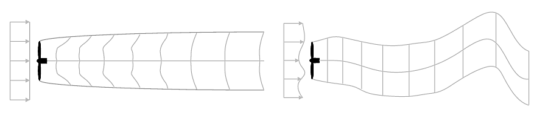
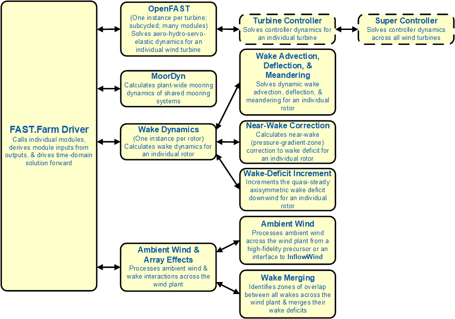
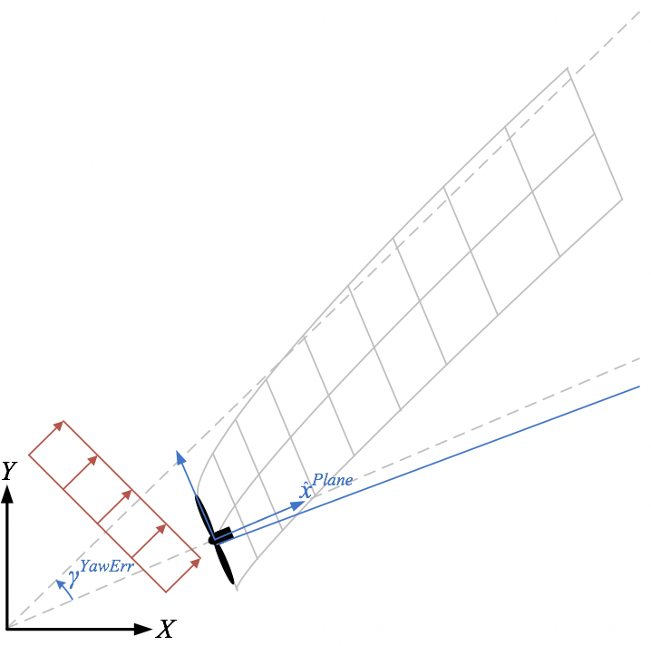
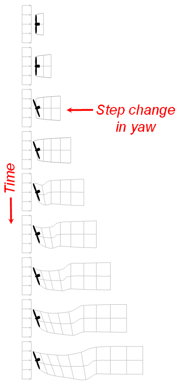
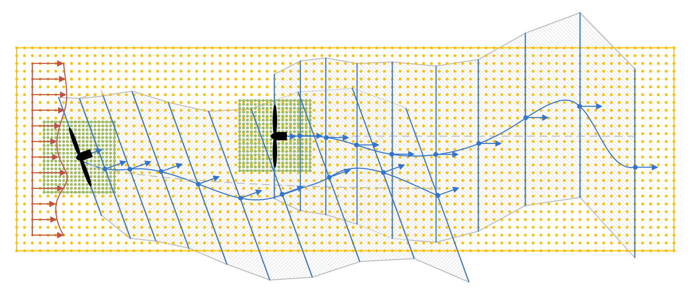
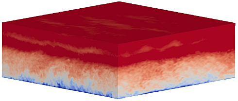
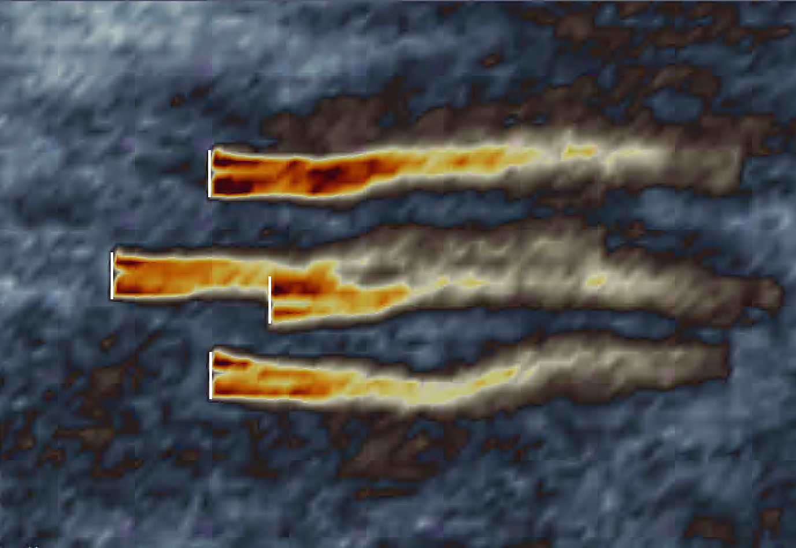

.. _FF:Intro:

介绍
====

FAST.Farm 是一个中等保真度的多物理场工程工具，用于预测风电场中风力机的功率性能和结构载荷。FAST.Farm 使用 `OpenFAST <https://github.com/OpenFAST/openfast>`__ 来求解每个独立风力机的气动-水动-伺服-弹性动力学，但同时考虑了风电场范围内大气边界层环境风的额外物理效应，以及尾流亏损、平流、偏转、蜿蜒和融合。FAST.Farm 基于动态尾流蜿蜒（DWM）模型的一些原理——包括尾流蜿蜒的被动示踪剂建模——但解决了先前 DWM 实现中的许多局限性。FAST.Farm 保持了较低的计算成本，以支持通常高度迭代和概率性的设计过程。FAST.Farm 的应用包括减少风电场性能不足和载荷不确定性，开发风电场控制以提升运行效率，优化风电场选址和拓扑结构，以及为风电场环境创新风力机设计。FAST.Farm 的现有实现也为风电场动力学建模的进一步发展奠定了坚实基础，随着未来计算和实验对风电场物理机制认识的加深，该模型将不断完善。

DWM 模型背后的核心思想是捕获与准确预测风电场功率性能和风力机载荷相关的关键尾流特征，包括尾流亏损演化（对性能很重要）以及尾流蜿蜒和尾流附加湍流（对载荷很重要）。尾流亏损演化和尾流蜿蜒如 :numref:`FF:WakeMeandering` 所示。

   轴对称尾流亏损（左）和蜿蜒（右）演化。

尽管应用了基本物理定律，但为了最小化计算成本进行了适当的简化，并使用高保真建模（HFM）解决方案（例如使用风电场应用模拟器（SOWFA））来为子模型提供信息和校准。在 DWM 模型中，尾流流动过程通过"尺度分离"来处理，其中小湍流涡（小于两倍直径）影响尾流亏损演化，大湍流涡（大于两倍直径）影响尾流蜿蜒。

FAST.Farm 是一个非线性时域多物理场工程工具，由多个子模型组成，每个子模型代表风电场的不同物理领域。FAST.Farm 作为开源软件实现，遵循 FAST 模块化框架的编程要求，子模型被实现为通过驱动代码互连的模块。FAST.Farm 的子模型层次结构如 :numref:`FF:FFarm` 所示，其中虚线表示与 FAST.Farm 分开编译的例程。

   FAST.Farm 子模型层次结构。

尾流平流、偏转和蜿蜒；近尾流校正；以及尾流亏损增量是尾流动力学（WD）模型的子模型，在单个模块中实现。环境风和尾流融合是环境风与阵列效应（AWAE）模型的子模型，在单个模块中实现。结合 OpenFAST（OF）模块，FAST.Farm 共有三个模块和一个驱动程序。*OF* 和 *WD* 模块有多个实例——每个风力机/转子对应一个实例。

FAST.Farm 驱动程序
----------------

FAST.Farm 驱动程序，也称为"粘合代码"，是将各个模块耦合在一起并推动整体时域解决方案前进的代码。此外，FAST.Farm 驱动程序读取仿真参数输入文件，检查这些参数的有效性，初始化模块，将结果写入文件，并在仿真结束时释放内存。

OpenFAST 模块
-------------

FAST.Farm 的 *OF* 模块是一个包装器，使 OpenFAST 能够耦合到 FAST.Farm。OpenFAST 对风电场中不同风力机的动力学（载荷和运动）进行建模，捕获环境激励（入流风，对于海上系统还包括波浪、海流和冰）以及整个系统（转子、传动链、机舱、塔筒、控制器，对于海上系统还包括子结构和系泊系统）的耦合系统响应。OpenFAST 本身是各种模块的互连，每个模块对应气动-水动-伺服-弹性耦合解决方案的不同物理领域。每个风力机对应一个 *OF* 模块实例，在并行模式下，这些实例通过开放多处理（OpenMP）实现并行化。在初始化时，FAST.Farm 用户指定风力机数量、相关的 OpenFAST 主输入文件以及全局 *X-Y-Z* 惯性坐标系中的风力机原点。风力机原点定义为未变形塔筒中心线与地面的交点，对于海上系统则为与平均海平面的交点。全局惯性坐标系的定义为：*Z* 垂直向上（与重力方向相反），*X* 水平指向名义下风向（沿零度风向），*Y* 水平横向。该坐标系不与特定的罗盘方向绑定。在 FAST.Farm 提供的其他时变输入中，OpenFAST 使用风力机周围高分辨率风域（时间和空间分辨率均很高）的扰动风（环境风加尾流）作为输入。这个高分辨率域确保 OpenFAST 计算的单个风力机载荷和响应能够准确地由流过风电场的气流驱动，包括尾流和阵列效应。

尾流动力学模块
--------------

FAST.Farm 的 *WD* 模块计算单个转子的尾流动力学，包括尾流平流、偏转和蜿蜒；近尾流校正；以及尾流亏损增量。近尾流校正处理尾流亏损的近尾流（压力梯度区）校正。尾流亏损增量使准稳态轴对称尾流亏损名义上向下风方向移动。每个转子对应一个 *WD* 模块实例。尾流动力学计算涉及许多用户指定的参数，这些参数可能取决于风力机运行或大气条件等因素，可以进行校准以更好地匹配实验数据或使用高保真建模解决方案作为基准。每个校准参数的默认值已基于 SOWFA 仿真推导得出，但用户可以覆盖这些默认值。

尾流亏损演化在轴对称有限差分网格上离散时间求解，该网格由固定数量的尾流平面组成，每个平面具有固定的径向节点网格。径向有限差分网格可以视为一个平面，因为假设尾流亏损是轴对称的。尾流平面可以看作是尾流的横截面，在其中计算尾流亏损。

   入流偏斜导致的尾流偏转，包括水平尾流偏转校正。下虚线表示转子中心线，上虚线表示风向，蓝实线表示水平尾流偏转校正（与转子中心线的偏移）。

   偏航角阶跃变化导致的单个风力机的尾流平流。

通过对横向（水平和垂直）尾流蜿蜒的被动示踪剂解进行简单扩展，FAST.Farm 中的尾流动力学解决方案扩展到考虑尾流偏转（如 :numref:`FF:WakeDefl` 所示）和尾流平流（如 :numref:`FF:WakeAdv` 所示），以及其他物理改进，例如：

1. 通过对扰动风而非环境风进行空间平均来计算尾流平面速度（在 AWAE 模块中）
2. 使尾流平面与转子中心线而非风向对齐
3. 对转子处的局部条件进行低通时间滤波，作为尾流动力学模块的输入，以考虑入流、风力机控制和/或风力机运动的瞬态效应，而不是考虑时间平均条件。

通过这些扩展，被动示踪剂解决方案能够：

1. 使尾流中心线根据入流偏斜发生偏转，因为在偏斜入流中，垂直于盘面的尾流亏损会引入与环境流不平行的速度分量
2. 使尾流从近尾流到远尾流加速，因为近尾流中的尾流亏损更强，向下风方向逐渐减弱
3. 使尾流亏损演化根据转子处的条件发生变化，因为使用了低通时间滤波条件而非时间平均
4. 使尾流除了横向蜿蜒外还能轴向蜿蜒，因为考虑了局部轴向风
5. 使尾流形状在偏斜流动中从下风向看为椭圆形而非圆形（从转子中心线向下看时尾流形状保持圆形）。

从上述第 1 点，考虑了尾流偏转的水平不对称校正，即对由尾流平面速度导致的尾流偏转的校正，这在物理上是由 *WD* 模块中未直接建模的尾流旋转和剪切的组合产生的（图示见 :numref:`FF:WakeDefl`）。这种水平尾流偏转校正是一种简单的线性校正（具有斜率和偏移），类似于 FLORIS 尾流模型中实现的校正。这种校正对于基于机舱偏航的尾流重定向（尾流转向）风电场控制的精确建模非常重要。

从第 3 点来看，低通时间滤波非常重要，因为尾流对转子处局部条件的变化反应缓慢，并且尾流演化是以准稳态方式处理的。

*WD* 模块的近尾流校正子模型计算转子盘处的尾流速度亏损，作为尾流亏损演化的入口边界条件。为了提高远尾流解的精度，近尾流校正考虑了转子后压力梯度区中风速的下降和尾流的径向膨胀，这些效应在尾流亏损演化的解中没有被其他方式考虑。

与大多数 DWM 实现一样，FAST.Farm 的 *WD* 模块通过轴对称坐标系下准稳态条件的雷诺平均纳维-斯托克斯方程的薄剪切层近似来建模尾流亏损演化，湍流闭合通过使用涡黏性公式实现。薄剪切层近似忽略了压力项，并假设径向方向的速度梯度远大于轴向方向的速度梯度。

环境风与阵列效应模块
--------------------

FAST.Farm 的 *AWAE* 模块处理整个风电场的环境风和尾流相互作用，包括环境风子模型（处理整个风电场的环境风）和尾流融合子模型（识别整个风电场所有尾流之间的重叠区域并融合它们的尾流亏损）。*AWAE* 模块中的计算使用尾流体积，这些体积是由（可能弯曲的）圆柱体形成的区域，从一个尾流平面开始，沿着连接两个相邻尾流平面中心的线延伸到下一个尾流平面。如果相邻尾流平面（圆柱体的顶面和底面）不平行，例如在涉及机舱偏航角变化的瞬态仿真中，中心线将是弯曲的。:numref:`FF:FFarmDomains` 说明了其中一些概念。

   两台风力机风电场的尾流平面、尾流体积和尾流重叠区域，其中上风风力机处于偏航状态。黄点表示低分辨率风域，绿点表示每个风力机周围的高分辨率风域。蓝点和箭头分别表示尾流平面的中心和方向，尾流平面由垂直于其方向的蓝线标识。灰虚线表示尾流的平均轨迹，蓝曲线表示瞬时（蜿蜒）轨迹。与上风风力机相关的尾流体积由向上阴影图案表示，与下风风力机相关的尾流体积由向下阴影图案表示，尾流重叠区域由交叉阴影图案表示。（为了图示清晰，瞬时（蜿蜒）尾流轨迹显示为平滑曲线，但当相邻尾流平面平行时，将建模为尾流平面之间的分段线性。尾流平面和体积的图示直径是尾流直径的两倍，但实际局部直径取决于计算。如图所示，尾流平面或体积可能延伸超出环境风数据低分辨率域的边界。）

*AWAE* 模块中的计算还需要遍历所有风数据点、风力机和尾流平面；在 FAST.Farm 的并行模式下，通过实现开放多处理（OpenMP）并行化加速了这些循环。

环境风可以来自高保真前驱仿真，也可以通过与 OpenFAST 中的 *InflowWind* 模块的接口获得。使用 *InflowWind* 模块可以使用简单的环境风，例如均匀风、离散风事件或合成生成的湍流风数据。合成生成的湍流可以由 TurbSim 或 Mann 模型生成，其中风使用泰勒的冻结湍流假设在风电场中传播。这种方法最适用于小型风电场或大型风电场中的一部分风力机。FAST.Farm 还可以使用由整个风电场（不存在风力机时）的高保真前驱大涡模拟（LES）生成的环境风，例如 SOWFA 的大气边界层求解器（ABLSolver）预处理器。这种大气前驱仿真比合成湍流捕获更多的物理效应——如 :numref:`FF:ABLSolver` 所示——包括大气稳定性、风电场范围的湍流长度尺度和复杂地形效应。

   ABLSolver 生成的示例流场。

这种方法比使用 InflowWind 的环境风建模选项计算成本更高，但比包含风力机的 SOWFA 仿真计算成本低得多。FAST.Farm 需要在空间和时间上具有两种不同分辨率的环境风。由于风将在 *AWAE* 模块内在尾流平面上进行空间平均，FAST.Farm 需要在风力机可能存在的整个风电场范围内有一个低分辨率风域。为了让 OpenFAST 准确计算载荷，FAST.Farm 还需要每个风力机周围有高分辨率风域（包括任何风力机位移）。高分辨率域将占据低分辨率域部分相同的空间，因此需要域重叠。

当使用由高保真前驱仿真生成的环境风时，*AWAE* 模块读取高保真实求解器在每个时间步内计算的高分辨率和低分辨率域的三分量风速数据。这些值存储在文件中，供给定驱动时间步使用。风数据文件（包括空间离散化）必须采用可视化工具包（VTK）格式，并由 FAST.Farm 用户在初始化时指定。`可视化工具包 <http://www.vtk.org/>`__ 是一个开源、免费的软件系统，用于三维（3D）计算机图形、图像处理和可视化。当使用 *InflowWind* 入流选项时，高分辨率和低分辨率域的环境风通过调用 *InflowWind* 模块计算。在这种情况下，空间离散化直接在 FAST.Farm 主输入文件中指定。在给定驱动时间步内，来自低分辨率和高分辨率组合域的这些风数据是 FAST.Farm 最大的内存需求。

在 DWM 的先前实现中，风力机和尾流动力学是单独或串行求解的，没有考虑双向尾流融合相互作用。此外，没有可用的方法来计算尾流重叠区域的扰动风。FAST.Farm 仿真中的尾流融合如 :numref:`FF:WakeMerg` 所示。

   紧密排列转子的尾流融合。

在 FAST.Farm 中，*AWAE* 模块的尾流融合子模型通过查找空间上重叠的尾流体积来识别整个风电场所有尾流之间的重叠区域。尾流亏损基于根平方和（RSS）方法在轴向方向上叠加。横向分量（径向尾流亏损）通过矢量和叠加。RSS 方法假设融合尾流中轴向亏损的局部动能等于给定风数据点处每个尾流轴向亏损的局部能之和。RSS 方法仅适用于标量数组。这种方法适用于轴向亏损，因为重叠尾流的轴向方向可能相似；因此，在叠加中只有矢量的大小是重要的。对横向分量（径向尾流亏损）应用矢量和，因为任何给定的径向方向都取决于轴对称坐标系中的方位角。

为了可视化整个风电场的环境风和尾流相互作用，FAST.Farm 通过生成 VTK 格式的输出文件提供可视化功能。OpenFAST 可以进一步生成 VTK 格式的输出文件，用于基于表面或线框几何图形可视化风力机。FAST.Farm 和 OpenFAST 生成的 VTK 文件可以使用标准开源可视化包读取，例如 ParaView 或 VisIt。

风力机控制器和超级控制器
------------------------

FAST.Farm 本身不包含单个风力机控制器或风电场级控制器（超级控制器）的模块，而是依赖于单独编译的例程。FAST.Farm 遵循 OpenFAST 单个风力机的模型来处理风力机控制器。控制器在 OpenFAST 的 ServoDyn 模块中指定。OpenFAST 允许使用 DLL 格式的 Bladed 风格控制器。如果用户还没有自己的控制器，可以使用参考开源控制器（ROSCO）等工具来设计和集成 DLL 格式的风力机控制器。

风电场级超级控制器可以使用外部工具进行设计和实现。Hycon 工具支持快速设计常见的风电场级控制器，例如尾流转向控制、空间滤波/共识和有功功率控制等。Hycon 包含的示例演示了尾流转向控制器的设计以及在使用 FAST.Farm 的小型风电场中的实现。参考开源控制器（ROSCO）也具有风电场控制功能。它为用户提供对各种风力机测量和偏移量的低级访问，并支持实现用户编写的基于 Python 的控制器。ROSCO 还包含演示在 FAST.Farm 中实现风电场级控制器的示例。

FAST.Farm 并行化
----------------

FAST.Farm 可以在串行或并行模式下编译和运行。FAST.Farm 通过 OpenMP 实现了并行化，这使得 FAST.Farm 能够利用多核计算机，通过在节点内的核心/线程之间分配计算任务（但不跨节点）来加速单个仿真。风电场的大小和风力机的数量仅受可用随机存取存储器（RAM）的限制。在并行模式下，OpenFAST 子模型的每个实例可以在单独的线程上并行运行，同时在另一个线程中读取 *AWAE* 模块内的环境风。因此，最快的仿真需要至少比风电场中风力机数量多一个核心。此外，*AWAE* 模块内的输出计算也被并行化为单独的线程。由于涉及的时间尺度小且物理机制复杂，*OF* 子模型是 FAST.Farm 模块中计算速度最慢的。*AWAE* 模块的输出计算是唯一不能与 OpenFAST 并行求解的主要计算；因此，在最好情况下，并行化的 FAST.Farm 解决方案的执行速度可能仅比独立 OpenFAST 仿真稍慢——计算成本足够低，可以运行风力机/风电场设计和分析所需的大量仿真。

为了支持大型风电场的建模，可能需要通过消息传递接口（MPI）实现内存并行化和在多核高性能计算机（HPC）的节点之间并行化的单个仿真。MPI 尚未在 FAST.Farm 中实现。

本指南的组织结构
----------------

本文档的其余部分结构如下：:numref:`FF:Running` 详细介绍如何获取 FAST.Farm 软件归档以及如何运行 FAST.Farm。:numref:`FF:Input` 描述 FAST.Farm 的输入文件。:numref:`FF:Output` 讨论 FAST.Farm 生成的输出文件。:numref:`FF:ModGuidance` 提供使用 FAST.Farm 时的建模指导。FAST.Farm 理论在 :numref:`FF:Theory` 中介绍。:numref:`FF:FutureWork` 概述未来工作，参考文献提供背景和其他信息来源。FAST.Farm 主输入和环境风数据文件的示例如 :numref:`FF:App:Input` 和 :numref:`FF:App:Wind` 所示。可用输出通道的摘要见 :numref:`FF:App:Output`。
