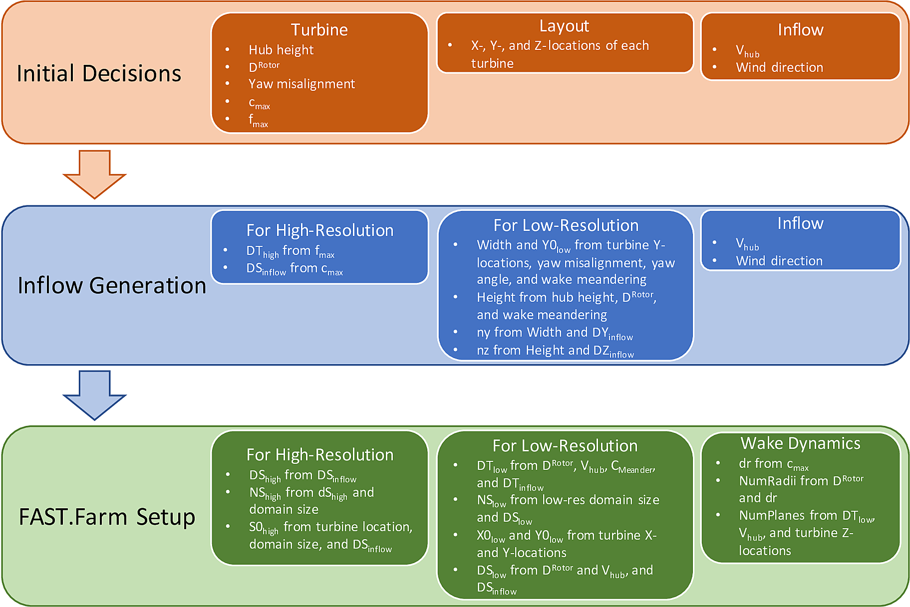
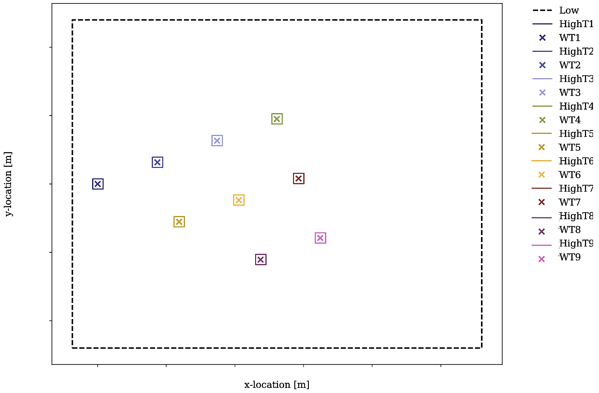

.. _FF:ModGuidance:

建模指南
=========

本章包含设置和运行 FAST.Farm 仿真的建模指南，包括入流风生成、低分辨率和高分辨率网格离散化、参数选择以及常见错误的解决方案。

.. _FF:sec:setup:

FAST.Farm 设置概述
------------------------

本节概述了如何设置环境入流和 FAST.Farm 仿真，以及计算各种参数所需的信息，如 :numref:`FF:FFarmSetup` 所示。

   设置入流生成和 FAST.Farm 仿真的信息流程图。此处 *S* = *X*、*Y* 或 *Z*。

请注意，该示意图仅包含与 FAST.Farm 仿真相关的信息。通常，生成入流和 OpenFAST 模型需要额外的入流信息。计算输入参数应使用的具体公式将在 :numref:`FF:sec:paramselect` 中讨论。强烈建议在设置新的入流或 FAST.Farm 案例时使用 FAST.Farm `工具仓库 <https://github.com/OpenFAST/python-toolbox/tree/main/pyFAST/fastfarm>`__ 中提供的 Python 笔记本。参数设置不当会导致常见错误和/或过度插值，应避免这种情况。请注意，本章假设风向为 :math:`0^\circ` —— 即环境风沿全局惯性坐标系的 *+X* 轴传播。

在生成 FAST.Farm 仿真设置和相应的入流时，规划非常重要。规划不当可能导致 FAST.Farm 错误和/或需要重新生成入流。应预先知晓的数值包括：

   - 风力机转子直径 (:math:`D^\text{Rotor}`)；
   - 风力机轮毂高度；
   - 风力机最大弦长 (:math:`c_\text{max}`)；
   - 风力机最大固有频率 (:math:`f_\text{max}`)；
   - 风电场中所有风力机的 *X*、*Y* 和 *Z* 坐标；
   - 期望的平均入流轮毂高度风速；以及
   - 平均入流风向。

使用这些信息必须计算的数值包括：

   - 入流和 FAST.Farm 域大小（高度、宽度和长度）；
   - FAST.Farm 高分辨率和低分辨率域原点位置（**S0_High** 和 **S0_Low**，其中 *S* = *X*、*Y* 或 *Z*）；
   - 高分辨率和低分辨率时间离散化数值（**DT_High** 和 **DT_Low**）；
   - 高分辨率和低分辨率空间离散化数值（**DS_High** 和 **DS_Low**）；
   - 高分辨率和低分辨率域中的网格点数（**NS_High** 和 **NS_Low**）；
   - 实际平均入流轮毂高度风速 (:math:`V_\text{hub}`)；
   - 额外的尾流动力学属性（**dr**、**NumRadii** 和 **NumPlanes**）。

有了这些信息，就可以开始生成入流。虽然不是必需的，但建议在设置 FAST.Farm 仿真之前完成入流生成。这是因为实际的空间离散化数值和/或平均轮毂高度风速可能与期望的不同。这些参数的正确值可以减少 FAST.Farm 仿真中风数据的插值，否则插值会降低环境湍流强度。

设置入流生成时，应使用推荐的空间和时间离散化方法，如 :numref:`FF:sec:DiscRecs` 中所述。如果使用：

   - **Mod_AmbWind** = 1，必须生成高保真实况，所有离散化数值可以精确指定为期望值。
   - **Mod_AmbWind** = 2，必须使用本文推荐的高分辨率离散化数值生成单个合成入流（TurbSim 或 Mann 模型）。
   - **Mod_AmbWind** = 3，必须生成多个合成入流。在这种情况下，所有生成的高分辨率入流都应使用推荐的高分辨率离散化方法。对于低分辨率入流生成，应使用推荐的高分辨率时间离散化和低分辨率空间离散化方法。

如果使用合成入流（TurbSim 或 Mann 模型），入流流向空间离散化 **DX_Inflow** 不是由用户指定的，而是基于泰勒冻结湍流假设。由于 FAST.Farm 域的流向离散化应基于入流流向离散化，用户应使用入流时间步长（**DT_High**）和合成风数据的平流速度 :math:`V_\text{Advect}` 来计算该值。如 :numref:`FF:sec:Synthetic` 中所述，:math:`V_\text{Advect}` 可能与轮毂高度的实际风速 :math:`V_\text{Hub}` 不同，应直接从生成的合成入流中计算。因此，在入流生成之前，无法得知 **DX_Inflow** 的确切结果。此外，**DX_Inflow** 可能远小于 **DX_Low** 和 **DX_High** 的期望值。

在设置 FAST.Farm 仿真本身时，入流生成中使用的许多数值将在此处再次用于指定 FAST.Farm 域。请注意，仅当使用合成湍流入流时才需要在 FAST.Farm 中进行此域指定。低分辨率域的原点（**X0_Low**、**Y0_Low** 和 **Z0_Low**）应基于以下因素确定：

   - 风力机最小 *X* 和 *Y* 坐标；
   - 风力机偏航误差；
   - 入流风向；以及
   - 预期的尾流蜿蜒范围。

具体而言，**X0_Low** 必须容纳所有风力机位置，并且如果需要，还应留出足够的空间来分析风电场上游的未受干扰入流。**Y0_Low** 必须容纳所有风力机位置以及水平尾流蜿蜒。使用 TurbSim 时，由于它无法生成地面高度的风，**Z0_Low** 应接近但高于地面高度。

然后使用以下因素计算 FAST.Farm 域的宽度和高度：

   - 风力机位置；
   - 计算得到的 **Y0_Low** 和 **Z0_Low** 值；
   - 水平和垂直蜿蜒距离要求；
   - 风力机偏航误差；以及
   - 入流风向。

域长度应基于风电场的流向范围，如果需要，还应留出足够的空间来分析风电场下游的受尾流影响的出流。

然后可以使用以下因素计算 FAST.Farm 中的低分辨率域（**DY_Low** 和 **DZ_Low**）以及网格点数（**NY_Low** 和 **NZ_Low**）：

   - 域宽度和高度；
   - 生成的入流的横向和垂直间距；以及
   - DY_Inflow 和 DZ_Inflow。

低分辨率时间离散化（**DT_Low**）应使用以下因素计算：

   - 风力机直径；
   - 入流轮毂高度风速；以及
   - 入流时间离散化。

流向间距和网格点数（**DX_Low** 和 **NX_Low**）也应基于 **DT_Low** 和平均风速。

最后需要计算的域参数是高分辨率域的位置（**X0_High**、**Y0_High** 和 **Z0_High**）以及构成这些域所需的网格点数（**NX_High**、**NY_High** 和 **NZ_High**）。这些数值应根据以下因素确定：

   - **DS_High** 值；
   - 风力机位置；以及
   - 高分辨率域的大小。

**DS_High** 值应基于推荐的高分辨率域离散化标准进行选择，如 :numref:`FF:sec:DiscRecs` 中所述。

指定 FAST.Farm 输入文件时需要额外的尾流动力学量，如 :numref:`FF:wake-dynamics-parameters` 中进一步讨论的。建议将 **dr** 设置为 :math:`\le D^\text{Rotor} / 15`；**NumRadii** 取决于尾流直径和 **dr**；**NumPlanes** 取决于 **DT_Low**、入流轮毂高度风速以及风力机位置之间的距离。

示例风力机布局和域位置如 :numref:`FF:FFarmLayout` 所示。

   包含低分辨率和高分辨率域以及风力机位置的 9 台风力机风电场布局示例示意图。

入流风生成
----------------------

本节包含生成用于 FAST.Farm 的湍流入流的指导原则。

高保真实前环境入流
~~~~~~~~~~~~~~~~~~~~~~

生成高保真实前环境入流有许多不同的方法。本节重点介绍使用 `SOWFA <https://github.com/NatLabRockies/SOWFA-6/blob/ee5b13875ea8f1088f4ca79ba41ff8be34870761/SOWFA_Training.NAWEA.2017_web.pdf>`__ 生成此类入流的方法。

使用 SOWFA 生成 FAST.Farm 实前入流时，需使用 *ABLSolver* 预处理器。需要注意的是，基线高保真解不会直接用作 FAST.Farm 的入流，而是在指定的域和离散化范围内进行采样。该采样通过 SOWFA 完成并在 SOWFA 输入文件中指定。入流数据以 3D 体 VTK 格式文件写出，如 :numref:`FF:AmbWindVTK` 中所述。这些是大型 ASCII 格式文件；因此，建议将精度降低到例如 3 位数字。SOWFA 仿真使用的域大小和低分辨率域离散化远大于 FAST.Farm 仿真所需的大小。因此，必须基于 :numref:`FF:sec:DiscRecs` 中详述的 FAST.Farm 离散化建议，设置采样文件以生成供 FAST.Farm 使用的边界条件。需要两个采样文件：一个用于风电场尺度域的低分辨率采样，另一个用于风力机尺度域的高分辨率采样。每个采样文件定义了将在 FAST.Farm 仿真中使用的空间和时间离散化。低分辨率域文件定义了将用于 FAST.Farm 仿真的单个低分辨率域；高分辨率域文件定义了将用于 FAST.Farm 仿真的每个高分辨率域。因此，在生成入流之前，准确了解所有风力机在 FAST.Farm 仿真中的位置非常重要。请注意，此 FAST.Farm 采样步骤的计算成本可能很高。因此，建议用户在执行 SOWFA 之前确保所有输入都是正确的，包括风力机位置和离散化级别。

FAST.Farm `工具仓库 <https://github.com/OpenFAST/python-toolbox/tree/main/pyFAST/fastfarm>`__ 中提供了一个 Python 笔记本示例，以帮助为给定的 FAST.Farm 仿真设置这些文件。

复杂地形
~~~~~~~~~~~~~~~

复杂地形，或海上系统的时变海平面高度，可以通过提供随地形变化的环境入流数据在 FAST.Farm 中建模，例如通过在 LES 实前仿真中对表面边界条件建模。FAST.Farm 使用的 VTK 格式是空间均匀的。为了用均匀网格适应复杂地形或波浪，地形表面以下点的风速应设置为 NaN。任何 NaN 值都会被 FAST.Farm 捕获并标记为域外部，因此不会被 AWAE 模块中的计算使用。当环境风入流随地形变化时，尾流自然也会随地形变化，即使 FAST.Farm 不包含任何针对复杂地形、流动再循环或分离或局部压力梯度的显式模型。

如果使用 SOWFA 入流实前仿真，复杂地形会在 SOWFA 入流实前生成中被考虑，因此在为 FAST.Farm 仿真采样时，无需修改 *vtk* 文件来考虑复杂地形。

.. _FF:sec:Synthetic:

合成湍流环境入流
~~~~~~~~~~~~~~~~~~~~~~

合成生成的湍流入流可用于 FAST.Farm 中，以准确预测不同大气条件下的风力机响应和尾流动力学。有几种方法可以实现这一点；只要生成 *InflowWind* 支持的格式的输出文件，任何方法都可以使用。接下来将讨论 TurbSim 和 Mann 模型的建模指南。

TurbSim
^^^^^^^

使用 NREL 工具 `TurbSim v2 <https://github.com/OpenFAST/openfast/tree/master/modules/turbsim>`__ 时，可以使用不同的选项来驱动合成湍流达到特定的期望结果，例如：

#. 标准或用户定义的时间平均风廓线（风切变、风转向）；

#. 三个方向（沿风向 u，横向 v 和 w）的标准或用户定义的速度谱；

#. 标准或用户定义的空间点到点相干性；以及

#. 标准或用户定义的分量间相关性（雷诺应力）。

此外，TurbSim v2 允许用户生成与一个或多个点的用户定义三分量风时间序列一致的湍流风（即约束风）。这些选项可以单独使用或组合使用（但用户定义的谱和用户定义的时间序列不能一起使用）。如果定义得当，所有这些方法都可以使 FAST.Farm 结果与参考数据集（例如与 LES 实前仿真或物理测量的入流相比）在风力机响应和尾流动力学方面具有良好的统计一致性。但是，在生成这些入流时必须注意，以确保大气条件被正确建模。

特别是，TurbSim 使用基于选定的相干模型方程及其相关参数的 u、v 和 w 空间相干模型，在整个域中横向生成风速。这些模型和参数可以在 TurbSim 中显式指定或保留为 *默认* 值。选择 IEC 空间相干模型时，空间相干性使用公式 :eq:`eq:IECCoh` 计算 (:cite:`ff-TurbSim_1`)。

.. math::
   Coh_{i,j_K}(f)=exp\left(-a_K\sqrt{\left(\frac{fr}{V_\text{Advect}}\right)^2+(rb_K)^2}~\right)
   :label: eq:IECCoh

其中 :math:`V_\text{Advect}` 是 TurbSim 中指定的轮毂高度的平均风速，也是 *InflowWind* 中的平流速度；:math:`Coh_{i,j_K}` 是速度分量 :math:`K=u,v,w` 在点 :math:`i` 和点 :math:`j` 之间的空间相干性；:math:`r` 是点 :math:`i` 和点 :math:`j` 之间的距离；:math:`a_K` 是相干递减参数；:math:`b_K` 是相干偏移参数。文献 :cite:`ff-Shaler19_1` 中发现，使用带有默认相干参数的 IEC 相干模型以及 IEC Kaimal 谱会导致尾流蜿蜒可以忽略不计。这是因为 TurbSim 中的默认 v 和 w 相干参数设置为 :math:`a_K` 是非常大的数，而 :math:`b_K=0`，实际上导致没有相干性 (:math:`Coh_{i,j_K}(f)=0`) (:cite:`ff-TurbSim_1`)。 [1]_ 这种缺乏蜿蜒的情况是非物理的，会对下游风力机的响应产生非物理影响。文献 :cite:`ff-Shaler19_1` 中没有使用默认值，而是将 v 和 w 相干参数指定为与 IEC 标准中指定的 u 相干参数完全相同，即：:math:`SCMod2=SCMod3=IEC`；:math:`a_K=12.0`，:math:`b_K=0.00035273` m\ :math:`^{-1}`；以及 :math:`CohExp=0.0` (:cite:`ff-TurbSim_1`)。正确设置横向风速分量的空间相干参数对于准确预测尾流蜿蜒是必要的。还需要注意的是，在 TurbSim 中，:math:`a_K` 和 :math:`b_K` 值必须在引号内指定（例如 ``"12.0 0.00035273"``），否则目前这些值会被设置为 :math:`0`。

使用 TurbSim 为 FAST.Farm 生成全场湍流风数据时，通常希望 TurbSim 网格延伸到轮毂高度以上很远，以捕获由湍流的 :math:`w` 分量引起的垂直尾流蜿蜒。由于 TurbSim 要求 **HubHt**\ :math:`> 0.5*`\ **GridHeight**，因此通常需要在 TurbSim 中指定一个人为偏高的 **HubHt**。为了正确设置 **HubHt** 参数，建议使用以下公式：

.. math::
   \textbf{HubHt} = z_\text{bot}+\textbf{GridHeight}-0.5D_\text{grid}

其中 :math:`z_\text{bot}` 是网格期望的底部垂直位置（刚好高于地面），:math:`D_\text{grid}=MIN\left( \textbf{GridWidth}, \textbf{GridHeight}\right)`。请注意，**HubHt** 参数在 TurbSim 中用作定义 IEC 湍流模型中的风速标准差和空间相干性的风速 (:math:`V_\text{Advect}`) 的参考高度，以及所有模型的平流速度（在 *InflowWind* 中）。因此，如果不明确考虑 TurbSim 使用的 **HubHt** 与实际风力机轮毂高度之间的风速差异，IEC 湍流模型中得到的风速标准差和空间相干性将不符合预期。*InflowWind* 中的平流速度也可能比使用实际轮毂高度风速时更快。TurbSim 中指定了一个单独的参考高度（**RefHt**），例如，参考风速就是在这个高度上强制执行的。该值还用于正确设置幂律风速廓线。未来需要开展工作来 `将 HubHt 参数与 TurbSim 网格生成解耦 <https://github.com/OpenFAST/openfast/issues/199>`__。

通常建议周期性生成全场风数据文件。这实际上可以沿风传播方向无限延伸风域。

当通过 *InflowWind* 模块的多个实例使用环境风时，即当 **Mod_AmbWind** = 3 时，仅指定一个 *InflowWind* 输入文件。但是，会使用多个风数据文件，每个文件具有不同的名称。具体而言，在这种情况下，*InflowWind* 输入文件中的文件名仅指向风文件的目录路径。风文件根名称要求：低分辨率域为 *Low*，与风力机 :math:`n_\text{t}` 相关联的高分辨率域为 *HighT<n*\ :math:`_\text{t}`>*。 [2]_ 当使用 *InflowWind* 中的稳定入流（**WindType** = 1）时，将 **Mod_AmbWind** 设置为 2 或 3 会产生相同的结果。在 **Mod_AmbWind** = 3 时使用 *InflowWind* 中的全场湍流风数据，要求：

-  全场风数据文件是周期性生成的。这实际上可以沿风传播方向无限延伸风域。

-  *InflowWind* 输入文件中的输入参数 **PropagationDir** 设置为 :math:`0` 度，以便风沿 FAST.Farm 惯性坐标系的 *X* 轴传播。

-  与高分辨率环境风相关的风数据文件与低分辨率风数据文件在空间和时间上同步。空间同步必须基于每个风力机原点相对于惯性坐标系原点的全局 *X-Y-Z* 偏移量。对于每台风力机，应从低分辨率 TurbSim 域中提取风力机位置处的速度时间序列。为了考虑风力机的下游距离，每个时间序列应根据来流速度和风力机位置在时间上进行偏移。然后，该时间序列应用于为每台风力机生成高分辨率 TurbSim 入流。TurbSim 用户手册包含有关如何使用指定时间序列生成 TurbSim 入流的详细信息 :cite:`ff-TurbSim_1`。

Mann 模型
^^^^^^^^^

使用 Mann 模型生成随机湍流时，需要 11 个用户定义的输入：**prefix**、**alpha_epsilon**、**L**、**gamma**、**seed**、**nx**、**ny**、**nz**、**dx**、**dy** 和 **dz**。此处讨论应与 FAST.Farm 参数一起选择的参数。

**dx**、**dy** 和 **dz** —— 这些参数应基于下文 :numref:`FF:sec:DiscRecs` 中讨论的高分辨率空间离散化建议进行选择。

**nx** —— 该值必须是 2 的幂。为了确保湍流盒在仿真持续时间内不重复，建议使用以下公式：

.. only:: html

   .. math::
      \textbf{nx} = 2^{CEILING\big[log_2
         \left(\frac{V_\text{Advect}\textbf{T_Max}}
            {\textbf{dx}}\right)\big]}

.. only:: not html

   .. math::
      \textbf{nx} = 2^{CEILING\big[log_2
         \left(\frac{V_\text{Advect}\textbf{T\_Max}}
            {\textbf{dx}}\right)\big]}

其中 :math:`V_\text{Advect}` 是 Mann 盒的平流速度，:math:`CEILING\big[x\big]` 将 :math:`x` 向上舍入到下一个整数。该公式确保湍流盒在仿真过程中不会重复，同时满足 2 的幂的要求。

**ny** 和 **nz** —— 这些值也必须是 2 的幂。考虑到这一要求，选择这些值时应确保捕获整个期望的域宽度 (*Y*) 和高度 (*Z*)，如下文 :numref:`FF:sec:lowres` 中所述。

*InflowWind* 输入文件有一个专门的部分用于使用 Mann 湍流盒。该部分需要输入 **nx**、**ny**、**nz**、**dx**、**dy**、**dz**、**RefHt** 和 **URef**。这些值应与生成入流时使用的值完全相同。请注意，*InflowWind* 中指定的 **dx**、**dy** 和 **dz** 应分别与 FAST.Farm 中的 **dX_High**、**dY_High** 和 **dZ_High** 相同。**RefHt** 应定义如下：

.. math::
   \textbf{RefHt} = 0.5\textbf{dz}(\textbf{nz} - 1)+z_\text{bot}

其中 **URef** 是参考高度处的平均风速，决定了 Mann 盒的平流速度，在此处标识为 :math:`V_\text{Advect}`。

使用 Mann 盒时，需要注意的是，**x 轴方向与 InflowWind 使用的惯例相反。尽管 InflowWind（包括 OpenFAST 和 FAST.Farm）中的解释与其他气动弹性软件中 Mann 盒的使用方式一致，但这种解释是非物理的。** 如果需要，用户可以调整 FAST.Farm 源代码以反向读取 x 轴。在所有使用 Mann 盒的气动弹性软件中普遍纠正这个错误是需要开展的 `未来工作 <https://github.com/OpenFAST/openfast/issues/256>`__。

.. _FF:sec:DiscRecs:

低分辨率和高分辨率域离散化
----------------------------------------------

空间和时间离散化会影响尾流蜿蜒、风力机结构响应以及由此产生的尾流和载荷计算。本节总结了基于几何形状和风速的离散化值建议，这些建议将确保解收敛，同时最大化计算效率。有关这些建议如何形成的详细信息，请参见 :cite:`ff-Shaler19_2`。尽管这些指南是为使用 FAST.Farm 而开发的，但它们可能适用于任何 DWM 类型的模型或气动弹性分析。

低分辨率域
~~~~~~~~~~~~~~~~~~~~~

FAST.Farm 中的低分辨率域主要负责尾流蜿蜒和融合。因此，通过比较下游不同距离处每台风力机尾流的水平和垂直蜿蜒尾流中心位置的标准差趋势来评估收敛性。研究发现，平均水平和垂直尾流轨迹对 **DT_Low** 或 **DS_Low** 的依赖性可以忽略不计。可以使用以下公式确保低分辨率域中尾流蜿蜒的收敛性：

.. only:: html

   .. math::
      \textbf{DT_Low} \le
         \frac{C_\text{Meander}D^\text{Wake}}{10V_\text{Hub}}

.. only:: not html

   .. math::
      \textbf{DT\_Low} \le
         \frac{C_\text{Meander}D^\text{Wake}}{10V_\text{Hub}}

该公式基于文献 :cite:`ff-Larsen08_1` 中尾流蜿蜒的低通截止频率 :math:`\left(\frac{V_\text{Hub}}{C_\text{Meander}D^\text{Wake}}\right)`（其中 :math:`C_\text{Meander}=2`，但在 FAST.Farm 中 :math:`C_\text{Meander}` 默认值为 1.9），实际上指定了尾流蜿蜒的最高频率应至少用 10 个时间步长来解析。请注意，在该计算中，:math:`D^\text{Wake}` 可以近似为 :math:`D^\text{Rotor}`。

当 **Wake_Mod=2,3** 时，为了数值稳定性，建议将时间步长设置为（近似）满足以下准则的值（参见以下 `论文 <https://doi.org/10.5194/wes-6-555-2021>`__ 的公式 20）：

.. only:: html

   .. math::
      \textbf{DT_Low}  \lessapprox \frac{dr}{2 V_\text{Hub}}

.. only:: not html

   .. math::
      \textbf{DT\_Low}  \lessapprox \frac{dr}{2 V_\text{Hub}}

空间离散化收敛性的评估方法与时间离散化相同。在所考虑的空间离散化范围内，低分辨率域对空间离散化的敏感性最小。尽管如此，建议使用以下公式来确定建议的最大 **DS_Low**，其中 *S* 指 *X*、*Y* 或 *Z*，分母的单位为 [m/s]：

.. only:: html

   .. math::
      \textbf{DS_Low} \le
         \frac{C_\text{Meander}D^\text{Wake}V_\text{Hub}}{150~\text{m/s}} =
         \begin{cases}
            \frac{\textbf{DT_Low}V_\text{Hub}^2}{15~\text{m/s}}
               & \qquad \text{for polar wake model} \\[0.5em]
            \frac{C_\text{Meander}\textbf{DT_Low}V_\text{Hub}^2}{5~\text{m/s}}
               & \qquad \text{for curled wake model}
         \end{cases}

.. only:: not html

   .. math::
      \textbf{DS\_Low} \le
         \frac{C_\text{Meander}D^\text{Wake}V_\text{Hub}}{150~\text{m/s}} =
         \begin{cases}
            \frac{\textbf{DT\_Low}V_\text{Hub}^2}{15~\text{m/s}}
               & \qquad \text{for polar wake model} \\[0.5em]
            \frac{C_\text{Meander}\textbf{DT\_Low}V_\text{Hub}^2}{5~\text{m/s}}
               & \qquad \text{for curled wake model}
         \end{cases}

对于所有合成湍流方法，建议 **DX_Low**\ :math:`= V_\text{Advect}`\ **DT_Low** 以避免在 X 方向上进行插值。请注意，计算 **DX_Low** 时使用的是平流速度 :math:`V_\text{Advect}`，而不是实际的轮毂高度风速 :math:`V_\text{Hub}`。此外，**X0_Low** 应是 **DX_Low** 的整数倍。

高分辨率域
~~~~~~~~~~~~~~~~~~~~~~

FAST.Farm 中的高分辨率风域主要负责风力机局部的环境和受尾流影响的入流。因此，通过比较每台风力机的结构运动和载荷的平均值和标准差趋势来评估收敛性。

.. only:: html

   所需的离散化级别因关注的物理量而异。因此，在选择高分辨率离散化级别时，决定要考虑哪些结构部件非常重要。最值得注意的是，塔架底部弯矩对 **DT_High** 最敏感，而发电机功率以及叶片挠度和弯矩对该值的依赖性很小。为了捕获完整的结构响应，**DT_High** 应根据影响结构激励的最高频率来选择，包括湍流的旋转采样和相关结构部件的响应（即固有频率）:math:`f_\text{max}`（单位：Hz），如公式 :eq:`eq:dtHigh:a` 所示，其中系数 2 来自奈奎斯特采样定理。这是在湍流入流激励下进行风力机气动弹性分析时常用的经验法则。

   .. math::
      \textbf{DT_High} \le \frac{1}{2f_\text{max}}
      :label: eq:dtHigh:a

   所需的 **DS_High** 大约对应于风力机的最大叶片弦长 :math:`c_\text{max}`，如公式 :eq:`eq:dsHigh:a` 所示。选择等于该值的 **DS_High** 长期以来一直是湍流入流激励下风力机气动弹性分析的经验法则。

   .. math::
      \textbf{DS_High} \le c_\text{max}
      :label: eq:dsHigh:a

.. only:: not html

   所需的离散化级别因关注的物理量而异。因此，在选择高分辨率离散化级别时，决定要考虑哪些结构部件非常重要。最值得注意的是，塔架底部弯矩对 **DT_High** 最敏感，而发电机功率以及叶片挠度和弯矩对该值的依赖性很小。为了捕获完整的结构响应，**DT_High** 应根据影响结构激励的最高频率来选择，包括湍流的旋转采样和相关结构部件的响应（即固有频率）:math:`f_\text{max}`（单位：Hz），如公式 :eq:`eq:dtHigh:b` 所示，其中系数 2 来自奈奎斯特采样定理。这是在湍流入流激励下进行风力机气动弹性分析时常用的经验法则。

   .. math::
      \textbf{DT\_High} \le \frac{1}{2f_\text{max}}
      :label: eq:dtHigh:b

   所需的 **DS_High** 大约对应于风力机的最大叶片弦长 :math:`c_\text{max}`，如公式 :eq:`eq:dsHigh:b` 所示。选择等于该值的 **DS_High** 长期以来一直是湍流入流激励下风力机气动弹性分析的经验法则。

   .. math::
      \textbf{DS\_High} \le c_\text{max}
      :label: eq:dsHigh:b

.. _FF:sec:paramselect:

参数选择
-------------------

设置 FAST.Farm 仿真可能需要指定大量参数，特别是如果使用 *InflowWind* 模块来处理环境风的话。本节总结了选择其中一些参数的最佳实践。文中提到了期望值与实际值，这些值之间的差异在 :numref:`FF:sec:setup` 中讨论。

InflowWind 域参数
~~~~~~~~~~~~~~~~~~~~~~~~~~~~

使用 *InflowWind* 环境风入流选项设置 FAST.Farm 仿真时必须小心。强烈建议在设置新案例时使用发布的 `Python 笔记本 <https://github.com/OpenFAST/python-toolbox/tree/main/pyFAST/fastfarm>`__。这些参数设置不当会导致常见错误和/或过度插值，应避免这种情况。这些 Python 笔记本中使用的方法和经验法则也在此处讨论。

.. _FF:sec:lowres:

低分辨率域
^^^^^^^^^^^^^^^^^^^^^

**NX_Low**、**NY_Low**、**NZ_Low** —— 这些数值应基于 **DS_Low** 和期望的域大小（*Sdist_Low*），其中 *S* = *X*、*Y* 或 *Z*。该整数值应计算为：

.. only:: html

   .. math::
      \textbf{NS_Low} = CEILING\left(
         \frac{{Sdist\_Low}}{\textbf{DS_Low}}\right)+1

.. only:: not html

   .. math::
      \textbf{NS\_Low} = CEILING\left(
         \frac{{Sdist\_Low}}{\textbf{DS\_Low}}\right)+1

**X0_Low** —— 该数值必须小于最上游风力机的 *X* 坐标。建议将该值设置在更上游的位置，以便能够分析环境入流。如果使用 Mann 盒，该值应为 0。

**Y0_Low** —— 该数值必须小于任何风力机的最小 *Y* 坐标（**WT_Y_**）。需要额外的余量来适应尾流蜿蜒、尾流偏转以及 *AWAE* 模块中使用的空间平均。该值可以计算为：

.. only:: html

   .. math::
      \textbf{Y0_Low} \le \textbf{WT_Y_min}-3D^\text{Rotor}

.. only:: not html

   .. math::
      \textbf{Y0\_Low} \le \textbf{WT\_Y\_min}-3D^\text{Rotor}

对于明显的尾流蜿蜒和/或偏航，应允许额外的余量。当 **Mod_AmbWind** = 2 时，合成入流数据以 Y=0 为中心。因此，**Y0_Low** 应等于 -*Ydist_Low*/2。对于 **Mod_AmbWind** = 3 的低分辨率域，情况也是如此。

**Z0_Low** —— 建议将该值设置为接近但高于地面高度。使用 TurbSim 时，该值不能等于或低于地面高度，因为 TurbSim 无法生成这些位置的风。

**DX_Low**、**DY_Low**、**DZ_Low** —— 此处不讨论期望的空间值，因为它们在 :numref:`FF:sec:DiscRecs` 中有详细介绍。但是，如 :numref:`FF:sec:Synthetic` 中所述，使用合成入流时，实际使用的数值可能与期望值不同。为了确定实际数值，使用合成入流时建议使用以下公式：

.. only:: html

   .. math::
      \textbf{DS_Low} = FLOOR\left( \frac{{DS\_Low\_Desired}}
         {\textbf{DS_High}} \right)*\textbf{DS_High}

.. only:: not html

   .. math::
      \textbf{DS\_Low} = FLOOR\left( \frac{{DS\_Low\_Desired}}
         {\textbf{DS_High}} \right)*\textbf{DS_High}

使用该公式是确保 **DS_Low** 是 **DS_High** 的整数倍的最佳方法，可以减少插值平滑。

.. _FF:high-resolution-domain-1:

高分辨率域
^^^^^^^^^^^^^^^^^^^^^^

*Xdist_High*、*Ydist_High*、*Zdist_High* —— 虽然不是直接输入，但这些高分辨率域的长度、宽度和高度应根据风力机的大小和位置来选择。建议使用以下数值：

.. only:: html

   .. math::
      \textbf{Xdist_High} = \textbf{Ydist_High}
         = \textbf{Zdist_High} \ge 1.1 D^\text{Rotor}

.. only:: nohtml

   .. math::
      \textbf{Xdist\_High} = \textbf{Ydist\_High}
         = \textbf{Zdist\_High} \ge 1.1 D^\text{Rotor}

如果需要塔架气动载荷，高分辨率域应覆盖整个塔架和转子：

.. only:: html

   .. math::
      \textbf{Zdist_High} = \textbf{HubHt}
         + \frac{1.1\ D^\text{Rotor}}{2}

.. only:: not html

   .. math::
      \textbf{Zdist\_High} = \textbf{HubHt}
         + \frac{1.1\ D^\text{Rotor}}{2}

这些参数可能需要增加，以适应较大的结构运动，例如浮式海上风电应用。

**NX_High**、**NY_High**、**NZ_High** —— 这些数值应基于 **DS_High** 和期望的域大小（*Sdist_High*），其中 *S* = *X*、*Y* 或 *Z*。该整数值应计算为：

.. only:: html

   .. math::
      \textbf{NS_High} = \text{CEILING}\left(
         \frac{{Sdist\_High}}{\textbf{DS_High}}\right)+1

.. only:: nohtml

   .. math::
      \textbf{NS\_High} = \text{CEILING}\left(
         \frac{\textbf{Sdist\_High}}{\textbf{DS_High}}\right)+1

**X0_High**、**Y0_High**、**Z0_High** —— 这些数值是为每台风力机设置的。它们应基于风力机位置，并设置为使风力机包含在高分辨率域内。建议将 **X0_High** 和 **Y0_High** 设置为比风力机位置低大约 :math:`1.1D^\text{Rotor}/2`。对于 **Mod_AmbWind** = 3 的高分辨率域，合成入流数据以每台风力机为中心，基于 **WT_X/Y/Z**。

**DX_High**、**DY_High**、**DZ_High** —— 此处不讨论期望的空间值，因为它们在 :numref:`FF:sec:DiscRecs` 中有详细介绍。

.. _FF:wake-dynamics-parameters:

尾流动力学参数
~~~~~~~~~~~~~~~~~~~~~~~~~

尾流动力学参数定义了用于每个尾流平面的轴对称有限差分网格。这些平面由以下参数定义：

-  **dr** —— 设置该值时应确保 FAST.Farm 能够充分解析每个平面内的尾流亏损。建议使用以下数值：

   .. math::
      \textbf{dr} \le D^\text{Rotor} / 15

当 **Wake_Mod=2,3** 时，为了数值稳定性，建议将间距设置为（近似）满足以下准则的值（参见以下 `论文 <https://doi.org/10.5194/wes-6-555-2021>`__ 的公式 20）：

   .. math::
      \textbf{dr} \le D^\text{Rotor} / 15

-  **NumRadii** —— 为了确保 FAST.Farm 准确计算尾流亏损，**NumRadii** 应设置为使每个尾流平面的直径 2(**NumRadii** - 1)\ **dr** 相对于转子直径足够大。建议使用以下数值：

   .. math::
      \textbf{NumRadii} \ge \frac{3D^{Rotor}}{2\ \textbf{dr}}+1

-  **NumPlanes** —— 为了确保 FAST.Farm 准确捕获尾流亏损，**NumPlanes** 应设置为使尾流平面向下游传播足够的距离，最好直到尾流亏损衰减消失 (:math:`x_\text{dist}`)，典型值在 :math:`10-20\times D^{Rotor}` 之间。建议使用以下数值：

   .. only:: html

      .. math::
         \textbf{NumPlanes} \ge \frac{x_\text{dist}}
            {\textbf{DT_Low}\overline{V}}

   .. only:: not html

      .. math::
         \textbf{NumPlanes} \ge \frac{x_\text{dist}}
            {\textbf{DT\_Low}\overline{V}}

   其中 :math:`\overline{V}` 是尾流的平均对流速度，可以近似为

   .. math::
      \overline{V} = V_\text{Hub}\left( 1-\frac{\overline{a}}{2}\right)

   其中 :math:`\overline{a}` 是转子盘处轴向诱导因子的时间和时空平均值。在额定风速以下（为了最佳气动效率），:math:`\overline{a}` 预计约为 1/3，在额定风速以上会减小，在切出风速前接近零。

.. only:: html

   请注意，由于仿真开始时每个时间步都会添加新的尾流平面，因此增加 **NumPlanes** 也会增加仿真的初始瞬态时间。启动瞬态时间由公式 :eq:`eq:startup:a` 估算。

   .. math::
      t_\text{startup}=\textbf{DT_Low}(\textbf{NumPlanes}-2)
      :label: eq:startup:a

.. only:: not html

   请注意，由于仿真开始时每个时间步都会添加新的尾流平面，因此增加 **NumPlanes** 也会增加仿真的初始瞬态时间。启动瞬态时间由公式 :eq:`eq:startup:b` 估算。

   .. math::
      t_\text{startup}=\textbf{DT\_Low}(\textbf{NumPlanes}-2)
      :label: eq:startup:b

-  **Mod_WakeDiam** —— 建议值为 **1**。有关该参数选项的更多详细信息，请参见公式 :eq:`eq:DWake`。

-  **Mod_Meander** —— 建议值为 **3**。有关该参数选项的更多详细信息，请参见公式 :eq:`eq:wn`。

其余 20 个输入是用户指定的校准参数和影响尾流动力学计算的选项。这些参数可能取决于例如风力机运行或大气条件，可以进行校准以更好地匹配实验数据或使用 HFM 基准。每个校准参数的默认值是基于 NREL 5MW 风力机的 `SOWFA <https://nwtc.nrel.gov/SOWFA>`__ 仿真得出的 (:cite:`ff-Doubrawa18_1`)，但用户可以覆盖这些默认值。

常见错误
---------------------------

本节介绍了用户在 FAST.Farm 的开发、验证和使用过程中常见的错误。如有其他错误或问题，请提交到 `NWTC 论坛 <https://wind.nrel.gov/forum/wind/>`__。

InflowWind 错误
~~~~~~~~~~~~~~~~~~~~~~~~

*InflowWind* 错误通常与高分辨率或低分辨率域大小设置不当有关。这里详细介绍两种常见错误。

风力机离开域
^^^^^^^^^^^^^^^^^^^^^^^^^

通常会遇到以下错误：

::

   T<n_t>:<routine name>:FAST_Solution0:CalcOutputs_And_SolveForInputs:
   SolveOption2:InflowWind_CalcOutput:CalcOutput:IfW_4Dext_CalcOutput
   [position=(-1.8753, 0, 32.183) in wind-file coordinates]:Interp4D:Outside
   the grid bounds.

当风力机离开指定的高分辨率域时会发生此错误。这通常是由于域指定不当或叶片挠度/结构运动过大引起的。请注意，此错误中的坐标是在风力机的局部参考系中，并且因案例而异。

如果原因是域指定不当，错误将在仿真的初始化阶段触发（*<routine name>=FARM_InitialCO:FWrap_t0*）。在这种情况下，建议检查 FAST.Farm 主输入文件。特别是 **NX_High**、**NY_High**、**NZ_High**、**X0_High**、**Y0_High**、**Z0_High**、**dX_High**、**dY_High** 和 **dZ_High** 的值，因为这些参数定义了高分辨率域的大小和位置。请注意，错误会指定发生错误的风力机（T<*n*\ :math:`_\text{t}`>*），这将有助于调试错误位置。

如果原因是叶片挠度大或结构运动大，错误将在仿真过程中的某个时刻触发（*<routine name>=FARM_UpdateStates:FWrap_t0*）。在这种情况下，增加高分辨率域的整体大小可以缓解这个问题。但是，用户应首先确认如此大的挠度/运动是预期的和现实的，而不是由于风力机建模错误引起的。

未定义的位置
^^^^^^^^^^^^^^^^^^

通常会遇到以下错误：

::

   Farm_Initialize:InflowWind_CalcOutput:CalcOutput:IfW_TSFFWind_CalcOutput
   [position=(5, 565, 5) in wind-file coordinates]: FF wind array boundaries
   violated: Grid too small in Y direction. Y=565; Y boundaries =
   [-555, 555]

当 FAST.Farm 尝试访问低分辨率域中不包含在环境风文件中的点时，会发生此错误。请注意，此错误中的坐标是在全局参考系中，并且因案例而异。对于此错误，建议检查 FAST.Farm 主输入文件。特别是 **NX_Low**、**NY_Low**、**NZ_Low**、**X0_Low**、**Y0_Low**、**Z0_Low**、**dX_Low**、**dY_Low** 和 **dZ_Low** 的值，因为这些参数定义了低分辨率域的大小和位置。错误会指定发生错误的轴，有助于调试。

.. [1]
   TurbSim 在默认 IEC 情况下实际上忽略了空间 v 和 w 相干性，因为 IEC 设计标准没有规定这些。

.. [2]
   当使用 HAWC 格式（**WindType** = 5）时，必须在文件名后附加 `_u`、`_v`、`_w`。
