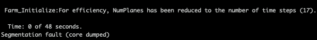

.. _FF:Running:

运行 FAST.Farm
=============

由于 FAST.Farm 是 OpenFAST 的一个模块，下载、编译和运行 FAST.Farm 的过程与 OpenFAST 相同。相关说明可在 :ref:`installation` 文档中找到。

.. note::
   为了提高启用了 FAST.Farm 的 OpenFAST 编译版本的运行速度，用户可能希望使用 `OpenMP` 在单精度下编译。为此，在 CMake 中添加 `-DDOUBLE_PRECISION:BOOL=OFF -DOPENMP=ON` 选项。

.. note::
   FAST.Farm 中尚未实现检查点-重启功能。

故障排除
--------

启动时的段错误
~~~~~~~~~~~~~~

如果为 OpenMP 预留的栈内存不足，超大规模的 FAST.Farm 仿真可能会遇到段错误。这种情况可能出现在包含 50 台以上风力机、分布在数十公里范围内的仿真中。如果是这种情况，错误很可能在屏幕显示 T=0 时间步后立即发生。

要增加基于 Linux 机器上 OpenMP 进程分配的栈大小，可以将环境变量 `OMP_STACKSIZE` 从默认的 4 MB（Intel 编译）增加到 32 MB（或更大），命令如下：

.. code-block::

      export OMP_STACKSIZE="32 M"

如果这解决了段错误问题，那么根本原因是 OpenMP 并行化没有足够的栈预留空间。如果这不能解决问题，则可能存在其他问题，应该报告这些问题。

有关 OpenMP 段错误的进一步阅读，请参阅 `stackoverflow 评论 <https://stackoverflow.com/questions/13264274/why-segmentation-fault-is-happening-in-this-openmp-code/13266595#13266595>`_ 和 `Intel OpenMP 文档 <https://www.intel.com/content/www/us/en/developer/articles/troubleshooting/openmp-stacksize-common-error.html>`_。
